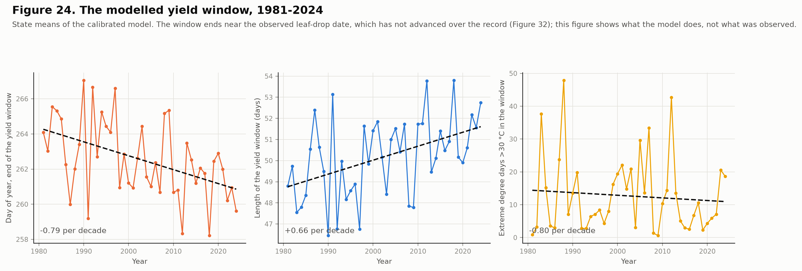
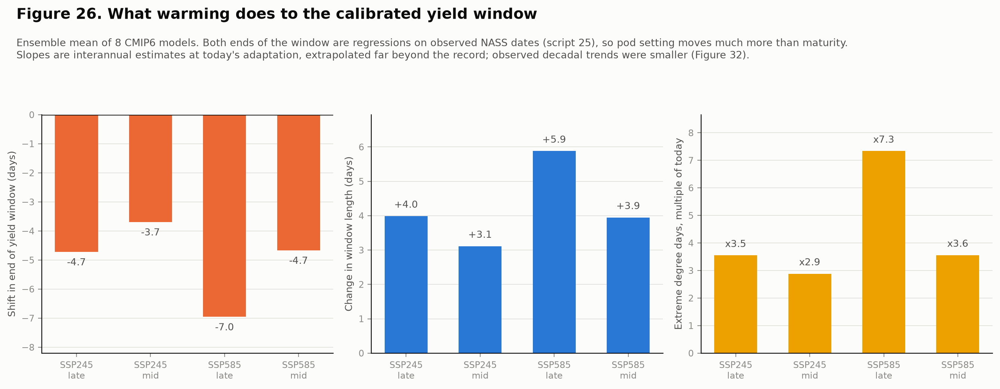

# Soybean Yield and Climate Variability in Illinois

**A county × year panel testing how growing-season heat and moisture relate to soybean yield, 1980 to 2025, with Champaign County as the focal unit.**


---

## The problem this study has to solve first

Illinois soybean yield rose from **33.5 bu/acre in 1980 to 62.5 in 2025**. Almost all of that is technology, roughly 0.65 bu/acre per year from cultivar improvement and agronomy.

That trend is an order of magnitude larger than any climate signal in the sample. Because temperature also trended over the same period, a model that leaves the trend in will credit warming with the genetics and **return a positive temperature coefficient**, predicting that a hotter Illinois yields more.

This pipeline removes the trend county by county, because county trends themselves span 0.290 to 0.846 bu/acre per year. Everything downstream targets the residual.

```
yield_anom = yield_bu_ac - (a_county + b_county * year)
```

---

## Four findings

### 1. Heat is nearly harmless when there is water

The temperature effect is **conditional on moisture, not additive with it**. Mean yield anomaly in bu/acre against county trend:

|          | Wet       | Dry       |
| -------- | --------- | --------- |
| **Cool** | **+1.44** | −1.17     |
| **Hot**  | **+1.45** | **−5.26** |

Hot-and-wet performs identically to cool-and-wet. Together, heat and drought cost roughly double what their separate effects predict.

The regression agrees. The marginal effect of temperature is:

| Moisture condition        | dYield / dTemperature |
| ------------------------- | --------------------- |
| Dry (10th pct, 4.3 in)    | **−0.887** bu/acre/°F |
| At sample means (7.7 in)  | −0.664                |
| Wet (90th pct, 11.4 in)   | **−0.429**            |

An additive model understates warming risk systematically.

### 2. Detrending doubles the signal

| Predictor                   | r vs detrended | r vs raw yield |
| --------------------------- | -------------- | -------------- |
| **Palmer Z-index, Jul-Aug** | **0.490**      | 0.311          |
| Jul-Aug precipitation       | 0.464          | 0.296          |
| August max temperature      | −0.469         | −0.286         |
| Palmer PDSI, August         | 0.349          | 0.243          |

Climate has no trend and yield does, so the trend acts as pure noise in the raw correlation.

The **Palmer Z-index outperforms both raw precipitation and PDSI**. It is the current-month moisture departure accounting for antecedent soil water. PDSI carries too much memory from months that no longer affect the crop.

### 3. Timing beats magnitude

June rainfall is worth nothing. August rainfall is worth everything.

| Month, precipitation | r with anomaly |
| -------------------- | -------------- |
| April                | −0.134         |
| May                  | −0.091         |
| June                 | 0.076          |
| July                 | 0.317          |
| **August**           | **0.342**      |
| September            | −0.020         |

The critical window is July and August, growth stages R3 through R6, pod set and seed fill. April is mildly negative because wet springs delay planting. September is noise; the crop is already made.

Aggregating over the full April-September season weakens the relationship to **0.177**. Choosing the wrong window destroys the signal.

The response is also nonlinear, with an interior optimum near **12.5 inches** over July-August and a decline beyond it. The drought penalty is roughly three times the wet-year bonus.


### 4. Vulnerability concentrates where the buffer is thinnest

County sensitivity to August moisture varies **more than sevenfold**, from 0.47 bu/acre per standard deviation in Mercer County to 3.60 in Clay County. The pattern tracks soil water-holding capacity rather than rainfall.

Two cross-sectional relationships sharpen the point:

- Structurally hotter counties respond more steeply to moisture, `r = +0.606`
- **Higher-yielding counties are less climate-exposed**, `r = −0.512`

Advantage compounds. The best ground both yields more and varies less. A single pooled climate coefficient averages a county where August moisture explains 48% of the variance with one where it explains 3%.

---

## Simulated warming and drying

**These are sensitivity experiments, not climate projections.** They apply uniform shifts to observed climate, use no CMIP6 or IPCC pattern, carry no probability information, and assume no agronomic adaptation, cultivar change, or planting-date shift. For scenarios grounded in named SSP pathways, see [CMIP6 scenario projections](#cmip6-scenario-projections) below; these uniform shifts are retained as a robustness check.

| Scenario                | Δ bu/acre | Δ %    | Counties down |
| ----------------------- | --------- | ------ | ------------- |
| +1 °C                   | −0.31     | −0.68  | 89 / 91       |
| −10% precipitation      | −0.27     | −0.59  | 88 / 91       |
| **+1 °C and −10%**      | **−0.73** | −1.62  | **91 / 91**   |
| +2 °C                   | −0.64     | −1.42  | 91 / 91       |
| +2 °C and −20%          | **−2.03** | −4.48  | 91 / 91       |

The combination exceeds the sum of its parts, which is finding 1 expressing itself again.


Losses concentrate in the southwest, where baseline yields are already the lowest in the state. The few counties showing small positive responses sit in the cool northeast, below the estimated temperature optimum.

---

## CMIP6 scenario projections

> **First-generation scenarios, superseded.** This section describes script `13`, which applied CMIP6 deltas to monthly aggregates with July and August fixed. It is kept for the extrapolation lesson it taught, that boosted trees return their smallest loss for the hottest scenario, and for the comparison it allows. The current projections are in [Scenarios on a calibrated yield window](#scenarios-on-a-calibrated-yield-window).

Scripts `12` and `13` replace the uniform shifts above with change factors taken from CMIP6 under named SSP pathways. Monthly means (`Amon`) for `tas`, `tasmax` and `pr` come from the AWS Open Data registry (`s3://cmip6-pds`, anonymous access) for **8 models**: ACCESS-ESM1-5, CanESM5, EC-Earth3, GFDL-ESM4, INM-CM5-0, MIROC6, MPI-ESM1-2-LR, MRI-ESM2-0.

Raw model output is never fed to the yield model — it carries systematic bias, and the yield model was fitted on nClimDiv scales. Instead each GCM's **change** between a 1985-2014 baseline and the target window is applied to the observed county record (additive for temperature, multiplicative for precipitation), bilinearly interpolated to all 102 county centroids, and every derived feature is rebuilt exactly as script `04` builds it.

### The result is bracketed, not pinned down

| Scenario | Horizon | Δ Tmax Jul-Aug | Beyond record | Boosted trees | Quadratic panel |
| -------- | ------- | -------------- | ------------- | ------------- | --------------- |
| SSP2-4.5 | 2040-69 | +2.54 °C       | 9%            | −0.30         | −2.06           |
| SSP2-4.5 | 2070-99 | +3.08 °C       | 13%           | −0.23         | −2.48           |
| SSP5-8.5 | 2040-69 | +3.04 °C       | 14%           | −0.22         | −2.58           |
| SSP5-8.5 | 2070-99 | **+5.44 °C**   | **49%**       | −0.17         | **−8.70**       |

Δ in bu/acre, ensemble median across the 8 models. "Beyond record" is the share of county-years whose July-August maximum temperature exceeds the hottest ever observed (95.0 °F).

**The two estimators disagree by a factor of thirty, and that gap is the honest answer.** Boosted trees win on in-sample skill, but a tree predicts a constant outside its training range: warm the record past 95 °F and the heat signal simply stops. Under SSP5-8.5 late-century, half the county-years sit there, which is why the tree estimate is *smallest* for the *hottest* scenario — an artefact, not a result. The quadratic panel specification extrapolates and restores the expected ordering, but assumes its fitted curve still holds far outside the observed range.

Read the quadratic column for the hot scenarios, the tree column for the near-term ones, and neither as a forecast.


### What these projections do not include

- **Palmer drought indices are held at observed values.** CMIP6 supplies no PDSI, and deriving it needs a water-balance model. Since `zndx08` is among the strongest predictors, drought-driven losses are understated.
- **`tas` stands in for the `tmin` delta**; `tasmin` was not retrieved.
- **Monthly means only**, so no change in within-month extremes, heatwave duration, or rainfall intensity.
- **One realisation per model**, so internal variability is not sampled.
- **No adaptation**: no cultivar change, no planting-date shift, no CO₂ fertilisation.

---

## Soil: where the good ground is

Scripts `14`-`16` add county soil properties from USDA-NRCS SSURGO, pulled through the public Soil Data Access service (no API key). 83,063 horizon records across 10,200 map units and all 102 counties are aggregated into 25 county features over two depth bands, 0-30 cm and 30-100 cm, weighted by horizon overlap, component percentage and map-unit acreage.

Soil answers three different questions with three very different answers, and reporting them separately matters.

| Question | What is explained | R2 |
| -------- | ----------------- | -- |
| Does soil explain the **level** of county yield? | County mean yield 1980-2025 | **0.82** |
| Does soil explain **climate sensitivity**? | Composite sensitivity index from script 09 | **0.55** |
| Does soil improve **prediction** of `yield_anom`? | Expanding-window RMSE, 2001-2025 | **+0.3%** |

**Soil explains 82% of the variance in county mean yield.** Mollisol share alone correlates at r = +0.81: each additional percentage point of prairie soil is worth about +0.26 bu/acre. Texture points the expected way too, since more clay *or* more sand at the expense of silt lowers yield, which is the silt loam optimum showing up in the coefficients.


**But soil barely improves the model, and that is arithmetic rather than disappointment.** The modelling target is `yield_anom`, the residual of each county's own linear trend, so its county mean is zero *by construction*. A static county attribute has almost no main effect left to explain, and the best soil feature ranks 16th of 45. The 0.3% gain is an interaction term earning its keep, nothing more.

The useful finding sits in the middle row. Soil explains **55%** of how sharply a county's yield responds to climate, and **51%** of its response to heat, where topsoil organic matter is the strongest single predictor. Soil does not tell you what this year's anomaly will be. It tells you which counties suffer most when one arrives, which is exactly what the CMIP6 scenarios above need.

---

## The crop does not follow the calendar

Scripts `17`-`19` replace two assumptions the pipeline inherited without testing. Both break under a changed climate.

**July and August are not the critical window. R3 to R7 is**, pod set through the end of seed accumulation. Those stages fall in July and August in today's Illinois, which is why the fixed window worked, but a calendar window cannot move with the crop and it does not travel: July and August are winter in Brazil.

**Monthly means erase the extremes that do the damage.** Schlenker & Roberts (2009) show soybean yield rising with temperature to about 30 °C then falling steeply, with damage tracking the *distribution* of daily temperature. In a monthly dataset, an August averaging 30 °C with no day above 34 and one with five days at 38 are the same number.

Script `17` pulls daily NASA POWER for all 102 county centroids, 1981-2024, 1.64 million records. Script `18` derives degree days by single-sine integration (Snyder 1985), giving GDD(10,30) and EDD(>30) separately, plus vapour pressure deficit and a daily soil water balance driven by FAO-56 Penman-Monteith ET₀, with the bucket size taken from SSURGO. Everything is computable from temperature, dewpoint, precipitation and latitude, so the same code runs on Brazilian municipalities.

**How the window is defined turned out to matter more than anything else here, and the first two versions were wrong.** See the next section: it is now calibrated to the observed NASS record, not to remembered dates or to thermal-time maturity.

### Does it predict better? Mostly no

| Feature set | n | RMSE | R² | vs calendar |
| ----------- | - | ---- | -- | ----------- |
| Both | 38 | 4.857 | 0.279 | **+0.14%** |
| Calendar (script 08) | 20 | 4.863 | 0.277 | — |
| Process (script 18) | 18 | 5.273 | 0.150 | **−8.43%** |

Expanding window, rolling origin, 2001-2024, 2,082 test observations. The process features lose on their own and add almost nothing in combination.

They do supply the strongest single predictors. Correlation with the yield anomaly: hot days **−0.496**, season water-balance deficit **−0.496**, extreme degree days −0.487, peak VPD −0.471, against +0.467 for the best calendar variable. The season deficit read −0.566 under the earlier, uncalibrated window, so that figure belonged to a window that has since been replaced.

**This comparison is confounded and should not be read as settled.** The process features come from NASA POWER at roughly half a degree; the calendar features come from nClimDiv county polygons. Part of the gap is data source, not formulation. A clean test needs the calendar features rebuilt from POWER, which has not been done. The case for the phenological window was never hindcast accuracy. It is that it can represent a moving window and a threshold heat response, and the calendar version structurally cannot.



---

## Validated against observed crop progress

Script `23` pulls the actual weekly Illinois soybean progress and condition series from NASS Quick Stats (the key-free bulk file, 1.05 GB streamed and filtered from 23.9 million rows to 11,350). Scripts `24` and `25` test the phenology against it and calibrate it. **The series are state-level only**: the bulk file has no district or county progress. Planting runs from 1980, blooming, setting pods, leaf drop and harvest from 1981, condition from 1986.

### What the first check found

The thermal-time thresholds had been described as calibrated to NASS norms. They were not: the dates were written from memory and never downloaded, so the stage dates agreed with them by construction. Against the real series (mean day of year, 1981-2024):

| Stage | Written from memory | Observed | Error |
| ----- | ------------------- | -------- | ----- |
| Planted (50%) | 20 May | 21 May | −1.7 d |
| Blooming (50%) | 10 July | 16 July | **−6.4 d** |
| Setting pods (50%) | 28 July | 1 August | −4.6 d |
| Dropping leaves (50%) | ~20 Sept, called "maturity" | 19 Sept | +0.5 d |

NASS has no "maturity" or "full seed" stage. Leaf drop corresponds to roughly R7, and the "full seed, ~5 September" date had no source.

The thresholds themselves were within about 5% of the observed thermal requirement (GDD from each year's observed planting date: blooming **651**, setting pods **883**, leaf drop **1504**). The real problems were elsewhere:

- **Modelled planting ran 15.5 days early** and tracked real planting at r = 0.18, because farmers plant when fields are workable, not when a running temperature mean crosses a threshold. R1 and R3 ran 12 and 10 days early. An earlier assessment that these dates were "close to Illinois norms" was wrong.
- **Thermal time predicts late-season timing worse than the average date.** Given observed planting, it predicts flowering (r = 0.86, RMSE 4.1 days) and pod set (r = 0.83, RMSE 4.6) well, but leaf drop with an RMSE of **19.5 days against an observed sd of 4.8**, a skill of −305% against guessing the mean. Soybean is a photoperiod-sensitive short-day plant, so maturity is set partly by day length, which a thermal-time model lacks. That is agronomic background rather than something tested here, but it fits the data.
- **The observed window barely varies.** The interval from pod setting to leaf drop averages 49.1 days with a standard deviation of **3.5 days** and a minimum of 40.3.

### What was changed (script 25)

- **Planting** is anchored to the observed mean: a 19 °C seven-day-mean threshold gives a bias of −1.4 days where the old 15 °C planted 15.5 days early. Year-to-year skill also improved (r = 0.45 against 0.26). A 19 °C running mean is a statistical device, not a physiological threshold.
- **R1, R3 and R7 thresholds** are the observed medians above, not remembered numbers.
- **Both ends of the yield window** are regressions on the observed pod-setting and leaf-drop dates, moved by a county-relative driver anomaly. Thermal-time R7 was tried first and abandoned: under the corrected, later planting it was never reached in **614 of 4,004 county-years (15.3%)**, concentrated in a few cool counties (8 of 91 reached it in under half of years), and dropping them was not random. It skewed the surviving planting mean four days early. Thermal R3 as the window start was also abandoned, because a single statewide GDD threshold put it as late as day 285 in cool county-years (Cook, Boone, Stephenson and Winnebago in 1992, 2009 and 1994 among them), leaving windows of 2 to 8 days.

Four always-defined drivers were compared for predicting observed leaf drop, leave-one-out over 44 years:

| Driver | RMSE (days) | Skill vs the mean date |
| ------ | ----------- | ---------------------- |
| Climatology (the mean, every year) | 5.42 | −2% |
| Thermal R7 anomaly (imputed) | 4.72 | 11% |
| **Thermal R3 anomaly** (default) | 4.77 | 10% |
| GDD planting to day 250 | 4.77 | 10% |
| **GDD 1 May to 15 Sept** (alternative) | 4.71 | 11% |

Every driver beats the plain average by about the same modest margin, so **the record cannot choose between them**. They extrapolate differently, so the scenarios run two.

### What the record says about the window's length

Both drivers agree on the sign, and it is the opposite of what the earlier version reported. Warm seasons advance pod setting *more* than they advance maturity, so the window gets slightly **longer**, not shorter:

| Driver | Pod-set slope | Leaf-drop slope | Window-length slope | Out-of-sample skill |
| ------ | ------------- | --------------- | ------------------- | ------------------- |
| R3 anomaly (days) | +0.49 ± 0.09 | +0.27 ± 0.09 | **−0.22 ± 0.06**, p < 0.001 | 10% |
| GDD 1 May-15 Sept | −0.030 ± 0.007 | −0.021 ± 0.006 | **+0.0097 ± 0.0049**, p = 0.055 | **0%** |

Read this as small and weakly supported. Only the R3 driver has real out-of-sample skill for window length, and the GDD driver adds none. The earlier finding that warming shortens seed fill came from thermal-time maturity, which the record rejects.

### Where it stands after recalibration

| Observed | Model | Bias | RMSE | Year-to-year r | Trend, observed | Trend, model | Gap |
| -------- | ----- | ---- | ---- | -------------- | --------------- | ------------ | --- |
| Planted | temperature rule | −1.4 d | 9.6 d | 0.45 | −1.69 ± 1.15 | −2.24 | 0.4 SE |
| Blooming | thermal R1 | −1.6 d | 6.4 d | 0.62 | −0.54 ± 0.87 | **−3.17** | **2.3 SE** |
| Setting pods | thermal R3 | −0.8 d | 6.0 d | 0.66 | −0.98 ± 0.72 | **−3.53** | **2.3 SE** |
| Setting pods | window start* | 0.0 d | 4.4 d | 0.66 | −0.98 ± 0.72 | −1.73 | 0.9 SE |
| Leaf drop | window end* | 0.0 d | 4.6 d | 0.49 | +0.61 ± 0.64 | −0.78 | **2.1 SE** |

Trends in days per decade, 1981-2024. *Fitted to these same observations, so bias and RMSE are in-sample and agreement on mean dates is by construction. What is not by construction is the year-to-year correlation and the trends.

**The planting trend is reproduced without being fitted**, which is a real check. **The flowering and pod-set trends are not**: the model advances them about 2.3 standard errors faster than observed, and even the empirical window end trends earlier (−0.8) where leaf drop actually moved slightly later (+0.6 ± 0.6). Interannual slopes overstate the response over decades. The real system adapted through planting date and variety across the record, and a fixed rule contains none of that.


**Farmers' assessment corroborates the stress variables.** August "good + excellent" ratings, 39 years: **+0.66** with the state yield anomaly, **−0.69** with extreme degree days, **+0.51** with minimum soil water fraction, **+0.28** with window precipitation. The precipitation correlation fell from +0.51 when the window was recalibrated, and is now the weakest of the four.

### Still unresolved

- **County level is unvalidated.** NASS publishes nothing finer, and the county-relative anomalies mean every county's average window sits on the same dates, which is surely wrong for a state spanning three degrees of latitude.
- **The trend overstatement above**, which the scenarios inherit.
- **R5, R6 and R8 have no NASS counterpart** and remain unvalidated; they survive only for script `21`.

---

## Scenarios on a calibrated yield window

Script `20` reruns the CMIP6 scenarios on the daily record and recomputes the whole phenology through the same `_pheno` module script `18` uses on observed weather. Scenario windows are measured against the *observed-climate* baseline, otherwise warming would cancel itself out of the anomaly.

### What warming does to the calendar

| Scenario | Horizon | Δ Tmax Jul-Aug | Planting | R3 | Window end | Window length | Extreme degree days | Beyond record |
| -------- | ------- | -------------- | -------- | -- | ---------- | ------------- | ------------------- | ------------- |
| SSP2-4.5 | 2040-69 | +2.54 °C | −7.7 d | −13.8 d | −3.7 d | +3.1 d | ×2.9 | 9% |
| SSP2-4.5 | 2070-99 | +3.08 °C | −10.2 d | −17.7 d | −4.7 d | +4.0 d | ×3.5 | 13% |
| SSP5-8.5 | 2040-69 | +3.04 °C | −10.2 d | −17.5 d | −4.7 d | +3.9 d | ×3.6 | 14% |
| SSP5-8.5 | 2070-99 | +5.44 °C | −14.6 d | −26.1 d | −7.0 d | +5.9 d | **×7.3** | **49%** |

Pod setting advances up to 26 days, maturity up to 7, so the window lengthens by 3 to 6 days and accumulates more hot days. The alternative GDD driver moves the window end further (−5.6 to −11.6 days) and the length by nearly the same amount (+2.7 to +5.5).



### The climate effect is larger than earlier versions, and the range is enormous

Schlenker-Roberts specification, EDD entering linearly, water balance included. Fitted coefficients, now identified from real variation: **−0.116 bu/acre per degree-day above 30 °C**, +4.24 per unit of soil water fraction, +0.010 per GDD. R² = 0.336, n = 3,902.

| Scenario | Horizon | Median, r3 driver | Range across 8 models | Median, GDD driver | Boosted trees |
| -------- | ------- | ----------------- | --------------------- | ------------------ | ------------- |
| SSP2-4.5 | 2040-69 | −1.48 | −8.17 to −0.48 | −1.38 | +0.34 |
| SSP2-4.5 | 2070-99 | −2.04 | −8.91 to −0.94 | −1.95 | +0.79 |
| SSP5-8.5 | 2040-69 | −2.39 | −10.40 to −0.71 | −2.25 | +0.84 |
| SSP5-8.5 | 2070-99 | **−8.56** | **−24.89 to −6.07** | −7.99 | −0.36 |

Bu/acre. **Do not quote the median alone.** Under SSP5-8.5 late-century the eight models span a fourfold range, and CanESM5's −24.9 comes with extreme degree days at ×12.7 today's level, far outside anything in the 1981-2024 record (49% of county-years exceed the observed maximum). The two window drivers give medians within 0.6 bu/acre of each other everywhere, so **the choice that the record could not make does not matter for yield**. The boosted trees still saturate out of range and move little, as before.

**This is larger than the previous version** (−1.3 to −4.7), and the reason is the finding above: with the window no longer shortening, warming buys more hot days inside it.

**Two corrections to earlier versions.** The earlier `season_gdd` coefficient (+0.0335, p = 0.038) was fitted to daily-discretisation noise. Under the thermal end rule `season_gdd` had a standard deviation of **4.25 GDD** around 1,396 and 97.8% of values sat within ±15 of the R6 threshold, because season length was defined by that threshold. It was constant by construction. It now has a standard deviation of 201 GDD. And the earlier EDD coefficients (−0.084, later −0.077) are superseded by −0.116.

### CO₂ still changes the sign

| Scenario | Horizon | Climate | No CO₂ | Saturating | FACE |
| -------- | ------- | ------- | ------ | ---------- | ---- |
| SSP2-4.5 | 2040-69 | −1.48 | −1.48 | +4.02 | +4.02 |
| SSP2-4.5 | 2070-99 | −2.04 | −2.04 | +4.76 | +5.67 |
| SSP5-8.5 | 2040-69 | −2.39 | −2.39 | +4.41 | +5.32 |
| SSP5-8.5 | 2070-99 | **−8.56** | **−8.56** | **−1.76** | **+6.50** |


Under SSP5-8.5 late-century the answer runs from −8.6 to +6.5 depending on the CO₂ assumption alone, and the saturating variant, the more defensible non-zero option because the FACE curve is extrapolated to 890 ppm far beyond its data, now gives a **net loss**. Whether climate change is bad for Illinois soybean cannot be answered from this pipeline without committing to a CO₂ response, and it does not know one.

### What these scenarios still do not include

- **Adaptation.** The observed record shows earlier planting and no advance in maturity, so adaptation is already in the data. The window slopes are interannual estimates at today's level of adaptation, extrapolated far beyond it, and the model's flowering and pod-set trends already overshoot observation by 2.3 standard errors. **The losses above are probably too large for that reason.**
- **Extrapolation of EDD.** Up to half of county-years in the hottest scenario lie beyond the observed maximum, where the linear EDD term is an assumption, not a measurement.
- **The CO₂ response is a flat multiplier**, though FACE shows it shrinks under heat and interacts with drought. CO₂ concentrations are round numbers, not the published CMIP6 series.
- **Ozone**, whose confounding with heat cannot be separated here (see below).
- **Dewpoint** is rebuilt from projected relative humidity, and a monthly precipitation ratio cannot change wet-day frequency.

---

## Adaptation: what the grower can do, and what this model cannot say

Every scenario assumes a grower changes nothing. Script `21` asks what a longer maturity group does, and runs into the limit of the whole approach.

> **Caveat, read first.** Every phenological number here comes from thermal-time *maturity*, which the validation above shows to be unreliable for late-season timing, and this script deliberately keeps that rule because its frost arithmetic needs a thermal-time R8. Its conclusions inherit that weakness. It also runs on the corrected planting, about two weeks later than the version first reported.

### Frost stops being the constraint under warming

| Climate | Longest viable MG | Frost margin at MG 3.5 | Mature before frost at MG 3.5 | Seed fill at MG 3.5 | at longest |
| ------- | ----------------- | ---------------------- | ----------------------------- | ------------------- | ---------- |
| Today | **2.5** | 45 d | 84% | 24.5 d | 21.4 d |
| SSP2-4.5 mid | ≥5.0 | 74 d | 99% | 19.4 d | 22.4 d |
| SSP2-4.5 late | ≥5.0 | 81 d | 100% | 18.8 d | 21.3 d |
| SSP5-8.5 mid | ≥5.0 | 81 d | 100% | 18.6 d | 21.1 d |
| SSP5-8.5 late | ≥5.0 | 107 d | 99% | 17.0 d | 19.0 d |

"Longest viable" is the longest group maturing before the killing frost in 90% of years; 5.0 is censored at the top of the tested range. The qualitative conclusion holds: under any scenario frost stops binding and even MG 5.0 matures almost every year.

**A result I reported earlier does not survive.** With the corrected planting the frost constraint binds at **MG 2.5** today, not 3.5. The earlier claim that it "lands on what Illinois growers actually plant" was presented as a coherence check, but the figure for what growers plant was never sourced, and the check is gone. It should not be cited.

### Why no maturity group is recommended, and a correction to why

Predicted yield across MG 2.0 to 5.0 at today's climate is now nearly flat: **+0.08, +0.04, +0.02, −0.04, −0.08, −0.13, −0.24**. It used to rise a clean +1.7 per half group. Both were artefacts of the same defect: under the thermal end rule the season length is *defined* by the R6 threshold, so `season_gdd` is constant by construction (sd 4.25 GDD). The coefficient was fitted to noise, and the earlier explanation, that the coefficient is identified from seasons varying at one maturity group, was wrong. The variable barely varied at all.

The conclusion stands and is stronger: **no maturity-group optimum can be obtained from this regression.** The phenological consequences of a variety choice are computable. Converting them to a yield optimum needs a model carrying yield potential, which is the argument Peng et al. (2020) make for process-based crop models.

---

## Checked against the literature

The analysis was audited against published work rather than recollection. Four things held; three needed changing.

**Held.** The 30 °C soybean threshold is Schlenker & Roberts' own figure (29 °C maize, 30 °C soybean, 32 °C cotton), and they build degree days from the within-day temperature distribution, which the single-sine integration approximates. The CO₂ curve turned out better calibrated than claimed: it was fitted to one point (+15% at 550 ppm) but SoyFACE measured 2.5 kg/ha/ppm from 373→550 ppm, ≈ +15% on Illinois yields, and Ainsworth's meta-analysis gives +24% at 689 ppm against the curve's +23.5%. And Lobell's group attributes warming loss *mainly to a shortened growing season* — the mechanism scripts `18` and `20` implement and script `13` structurally could not.

**Changed: humidity was being assumed away.** At 2 °C warming the loss attributable to the associated VPD rise (12.9 ± 1.8%) exceeds the loss from warming itself (8.5 ± 1.4%), and CMIP6 projects relative humidity *declining* over North America. Script `12` now pulls `hurs`; July–August RH falls **2.8 to 5.4 percentage points**. Dewpoint is rebuilt from the projected humidity against the warmed temperature range, instead of being shifted with temperature.

**Changed: ET₀ could not see humidity.** The water balance used Hargreaves, which is temperature-only — so even with humidity projected, nothing downstream responded. It is now FAO-56 Penman–Monteith. A Champaign July gives 4.66 mm/day, and a 5-point RH drop raises ET₀ 3.6% where Hargreaves moves 0.0%.

**Changed: the water balance was missing from the specification.** The first attempt at the humidity fix returned a climate effect *identical to four decimals*, because `season_gdd + season_edd + precipitation` reads no water balance at all. The circuit was open. `wb_min_water_frac` now closes it.

### VPD was tried as a regressor and rejected

Entered alongside EDD it takes a **positive** coefficient, +7.05 bu/acre per kPa — backwards. VPD and EDD correlate at **+0.912** and are not separable. The better-fitting `wb_season_deficit_mm` was rejected for a related reason: it correlates +0.789 with EDD and drives the EDD coefficient from −0.084 to −0.018, absorbing the heat channel it should sit beside. `wb_min_water_frac` is bounded on [0,1], correlates −0.484, and leaves EDD at −0.077 with every sign physiological.

### The correction made losses smaller, not larger

> **Superseded.** This table describes the state of the pipeline after the humidity correction but before the phenology was validated and recalibrated against NASS. The current scenario numbers are in [Scenarios on a calibrated yield window](#scenarios-on-a-calibrated-yield-window); the SSP5-8.5 late-century parametric estimate is now −8.56 bu/acre.

| Scenario | Horizon | SR before | SR after | GBM before | GBM after |
| -------- | ------- | --------- | -------- | ---------- | --------- |
| SSP2-4.5 | 2040-69 | −1.54 | −1.26 | −0.33 | −0.42 |
| SSP2-4.5 | 2070-99 | −1.93 | −1.58 | −0.39 | −0.49 |
| SSP5-8.5 | 2040-69 | −2.07 | −1.75 | −0.13 | −0.20 |
| SSP5-8.5 | 2070-99 | **−5.28** | **−4.69** | −0.41 | **−1.36** |

This was the opposite of the prediction. Opening the dominant damage channel was expected to deepen the losses; instead the parametric estimate lightened by 0.3-0.6 bu/acre, because splitting damage into heat *and* water reassigns some of what EDD had been absorbing alone. The boosted trees, which read the water-balance features directly, moved the other way and more than tripled their SSP5-8.5 loss.

Both are honest readings of the same correction. The SR figure is the one to quote, and it is now built on a specification where humidity reaches yield through evaporative demand rather than through a collinear regressor.

### Still missing after the audit

- **Ozone.** Current Midwest soybean yields are suppressed roughly **10%** by tropospheric O₃. At SoyFACE, elevated O₃ cost 10 ± 11% at 370 ppm CO₂ but only 5 ± 4% at 550 ppm — elevated CO₂ partly *protects* by closing stomata. So the observed yields fitted here already embed ozone damage, and part of the measured FACE "CO₂ benefit" is ozone protection rather than fertilisation. Treating it as pure fertilisation on top of unchanged ozone risks double counting.
- **CO₂ × water.** The crop-modelling literature finds CO₂ fertilisation insufficient to overcome moisture limitation. The flat multiplier here applies the full benefit in the driest scenarios, which is where it should be smallest.

---

## Ozone: it survives detrending, and still cannot be separated

Script `22` asks of ozone the question that ended the soil work. Soil was absorbed by the county trend because a static attribute cannot explain a target whose county mean is zero. Ozone has the mirror risk: US ozone fell after 1980, so a trend is absorbed too, and what is left is year-to-year variation, which hot stagnant summers drive. It may only restate the heat signal.

Data is EPA AirData, 45 years (1980-2024), Illinois 8-hour ozone, 102-144 monitors covering 18-23 of 102 counties.

**It does survive detrending, unlike soil.** The trend explains only 34-38% of the peak metrics and essentially none of the annual mean, so a residual standard deviation of 4-6 ppb remains. Detrended, the correlation with the yield anomaly *strengthens* rather than vanishing.

| Metric | Trend explains | Detrended r with yield anomaly (44 years) |
| ------ | -------------- | ------------------------------------------ |
| 4th-highest 8-h value | 38% | −0.41 |
| 90th-percentile 8-h value | 34% | **−0.52** |
| Annual mean | 0.2% | −0.48 |

**But it is not separable from heat and water.** Detrended ozone correlates **+0.62 to +0.74** with extreme degree days and **−0.46 to −0.57** with the water balance, which is unsurprising, since hot dry stagnant summers produce both. Added to the specification it contributes almost nothing.

| Metric | Coefficient, bu/acre per ppb | p | Effect of 1 sd | ΔR² |
| ------ | ---------------------------- | - | -------------- | --- |
| 4th-highest | −0.046 | 0.64 | −0.28 | +0.002 |
| 90th percentile | −0.156 | 0.24 | −0.68 | +0.008 |
| Annual mean | −0.139 | 0.57 | −0.34 | +0.002 |

A year-level regression with no county replication, 44 observations, gives coefficients of +0.003 to −0.076 with p between 0.67 and 0.98.


### A null here does not mean ozone does nothing

The detectable-effect floor is about **0.21 bu/acre per ppb**. The literature implies roughly **0.13 to 0.38**, from two rough anchors: a 10% suppression over 25-35 ppb above background, and SoyFACE's +25% ozone treatment costing 10 ± 11%, which is itself consistent with zero. The range straddles the floor, so this design cannot tell "ozone does nothing" from "ozone does what the literature says".

Read the sign and the scale as consistent with the literature and the significance as inconclusive.

### What it means for the projections

Ozone is **not built into script 20**, because there is no independent coefficient to put there. The consequence runs the other way. Because ozone tracks heat and drought, part of what the fitted **EDD and water coefficients** measure may be ozone damage. If ozone concentrations in a warmer future do not scale with heat as they did historically, extrapolating those coefficients would misattribute the loss. This is a hypothesis this data cannot test, and it applies equally to the FACE CO₂ benefit, whose ozone-protection component cannot be separated from fertilisation here.

Two things would settle it: county-varying, growing-season ozone exposure (AOT40 or W126, from the hourly EPA files, roughly ten times heavier than the annual summaries used here), and an ozone-explicit process crop model.

**Limits of this screen.** Annual metrics rather than growing-season exposure; monitors urban-biased and covering under a quarter of counties; the honest sample size is 44 years, not the 3,779 county-years.

---

## County-level validation, as far as the data allow

**County-level validation of the phenology is not possible.** NASS publishes Illinois soybean progress at state level only, so the county dimension of the yield window rests on an assumption nothing here can confirm: every county's window sits on the same dates, with only year-to-year anomalies varying by county. Everything downstream of the phenology can be checked against county yields, and script 26 does that (tables 35 to 38, figure 33).

- **Transfer to unseen districts: no measurable loss.** Each crop-reporting district is predicted from a model trained on the other eight and only earlier years. Calendar model RMSE 4.863 against 4.864; process model +1.0%; per district −1.9% to +2.2%. Adjacent districts share weather, and nine units is few.
- **A small north-south residual.** County-mean residuals fall with latitude (−0.14 bu/acre per degree, r = −0.40), about 0.8 bu/acre across the state against an RMSE near 5.
- **The uniform-window assumption cannot be discriminated by yield.** Retaining the north-south gradient improves RMSE by 1.4%, but it wins in only 14 of 24 test years and the paired bootstrap interval (−4.6% to +1.5%) includes zero. Neither confirmed nor refuted.
- **The heat penalty does not differ by latitude** (pooled test, Wald p = 0.35), which supports the single pooled coefficient the scenarios use. Separately fitted terciles suggested otherwise and overstated it.

The full write-up, with the Word version, is in [`results/FINAL_REPORT.md`](results/FINAL_REPORT.md) (version 2.0) and [`results/Illinois_Soybean_Climate_Report.docx`](results/Illinois_Soybean_Climate_Report.docx). Both are generated by `scripts/27_build_reports.py` from the results files, so they cannot drift from the analysis again. The original v1.0 report is kept unchanged in `results/archive/`. The Word file was validated against the OOXML schema, but its page layout has not been viewed.

---

## Does climate actually predict?

Validation is strictly temporal. **No random splits anywhere.** They fail twice over here: they admit future information, and because counties within a year share weather, they place near-duplicates of test rows into training.

- **Fixed split**: train 1980-2013, validate 2014-2018, test 2019-2025
- **Expanding window**: rolling origin, one test year at a time, 2001-2025, 2,317 test observations

The comparison that matters is not algorithm versus algorithm. It is a **trend-only baseline against models that see climate**.

| Model                    | RMSE      | MAE   | R²        | Skill vs baseline |
| ------------------------ | --------- | ----- | --------- | ----------------- |
| **Gradient Boosting**    | **4.844** | 3.680 | **0.284** | **+15.7%**        |
| HistGBM                  | 4.870     | 3.706 | 0.276     | +15.3%            |
| Random Forest            | 4.895     | 3.723 | 0.269     | +14.8%            |
| Linear Regression        | 5.090     | 3.892 | 0.209     | +11.5%            |
| Ridge                    | 5.095     | 3.896 | 0.208     | +11.4%            |
| Baseline: trend only     | 5.748     | 4.424 | −0.008    | 0.0               |

Climate wins by **15.7%**, which establishes that it carries real predictive content.

But gradient boosting beats ridge regression by only **4.9%**. Most of the available signal is linear once the quadratic and the interaction are specified. That is the honest headline, stated before a reviewer asks.

---

## What this study cannot answer

### 2003 defeats the climate model

Decomposing predictions by year: 1988 is explained to **88%**, 2012 to **41%**, and 2003 to only **15%**. At **−3.43 bu/acre**, 2003 is the **largest unexplained shortfall of all 46 years, rank 1 of 46**.

Statewide August PDSI in 2003 was slightly positive and rainfall near normal, yet yield fell 8.5 bu/acre below trend. 2003 contributed 14 of the 39 observations exceeding three standard deviations in the entire panel.

**The obvious hypothesis fails its test.** 2003 was a documented severe soybean aphid outbreak year in the North Central region, with populations exceeding 1,000 per plant and 40% yield loss recorded at those densities ([Ragsdale et al., *J. Integr. Pest Manag.* 2012](https://academic.oup.com/jipm/article/3/1/E1/808601)). The aphid overwinters on buckthorn, which is concentrated **north of 41°N** ([Tilmon et al., *J. Integr. Pest Manag.* 2011](https://academic.oup.com/jipm/article/2/2/A1/860557)). Illinois straddles that line, which makes the hypothesis falsifiable. It does not survive:

| Test | Result | Verdict |
| --- | --- | --- |
| Raw 2003 anomaly vs county latitude | r = **−0.775** | Strong northern concentration |
| **Residual** after climate is removed vs latitude | r = **−0.124** | Gradient is climate, not residual |
| 2003 rank by \|r(lat, residual)\| | **33 of 46** | Unremarkable |
| North (≥41°N) minus South residual gap, 2003 | **+1.72** | **Wrong sign.** North did better |
| Same raw gradient in 1988, before the aphid existed in North America | r = −0.655 | Not diagnostic |
| Aphid-era shift in N-S residual gap, pre vs post 2000 | t = 0.205, **p = 0.84** | No effect |

The northern concentration in 2003 is real but **fully accounted for by climate**: northwestern Illinois had a genuine August moisture deficit that year. What remains unexplained is spatially uniform, which is the opposite of what a northern-origin pest would produce.

So the finding is narrower and sharper than a pest attribution: **2003 is the largest unexplained shortfall in the record, and the most plausible explanation does not fit its geography.** The cause remains open. Test details in [`results/table10_aphid_hypothesis_test.csv`](results/table10_aphid_hypothesis_test.csv) and [`results/12_aphid_hypothesis_test.json`](results/12_aphid_hypothesis_test.json).

### Other limitations

- **Monthly resolution cannot resolve frost or daily extremes.** The coldest monthly mean minimum in the record is 32.3 °F. No degree-days above a threshold, no dry-spell length, no rainfall intensity, no vapour pressure deficit. This is the largest methodological gap. gridMET 4 km daily is the upgrade path.
- **County coverage collapses after 2018**, from 102 counties reporting to 62, and survival is not random. The recent panel skews toward large producers exactly where out-of-sample validation happens.
- **Planting date is missing**, and 2019 shows why. It is the one year where adding climate makes predictions *worse*, because the rain arrived in spring and delayed planting in a way seasonal aggregates cannot see.
- **No causal identification.** Fixed effects absorb time-invariant county traits and statewide annual shocks, not county-specific time-varying confounders such as drainage, cultivar turnover, pest pressure, or land-use change.

The correct statement of the result is therefore: higher July-August temperatures and lower July-August moisture were **statistically associated** with lower yield after controlling for county and year fixed effects, robustly across thirteen specifications. Not: temperature caused yield to decline.

---

## Champaign County

| Metric                              | Champaign | State panel |
| ----------------------------------- | --------- | ----------- |
| Mean yield, 2015-2025               | 64.3      | 58.7        |
| Technology trend, bu/acre/yr        | 0.660     | 0.627       |
| Moisture sensitivity, bu/acre per SD| 1.740     | 0.47 - 3.60 |
| Sensitivity rank                    | 53 / 91   | —           |
| **Simulated Δ under +1 °C, −10%**   | **−0.24** | −0.73       |

High-yielding, near-median sensitivity, and **less exposed than the state average** under every perturbation. Champaign has 44 observations, 1980 to 2023; it was suppressed out of the 2024 and 2025 county data. Its worst recorded year is 2003 at 13.99 bu/acre below trend, the year the climate model cannot explain.

---

## Data and verification

| Source | Access | Retrieved |
| --- | --- | --- |
| USDA NASS Quick Stats | Query-tool CSV export, **no API key** | 2026-08-31 |
| NOAA NCEI nClimDiv | `ncei.noaa.gov/pub/data/cirs/climdiv/`, `*cy-v1.0.0-20260806` | 2026-08-31 |

Both are United States federal works in the public domain.

| Verification | Result |
| --- | --- |
| County sums vs published state totals, 46 years, 3 measures | **Exact, 0.000% error** |
| `production_bu / acres_harvested == yield_bu_ac` | 4,459 of 4,459, max residual 0.25 |
| `acres_harvested <= acres_planted` | No violations |
| Duplicate county-year keys | 0 |
| Climate join completeness | 4,459 of 4,459, zero nulls |
| Independent cross-check vs external NASS query | 21 of 21 values match |

The first check matters more than it sounds. Internal consistency tests pass even on a file that has silently lost rows, and an earlier build of this panel had done exactly that. **Only reconciliation against an independently published aggregate catches it.**

---

## Four traps this pipeline handles

1. **NASS publishes its suppressed-county bucket once per Agricultural Statistics District, not once per state.** In 2019 there are nine, all with a blank county ANSI. The raw key is `county_ansi + ag_district_code + year`. Keying on county and year alone silently collapses up to nine rows per year.
2. **Read `county_ansi` as text.** Integer casting turns `001` into `1` and drops Adams County from every join.
3. **Join on FIPS, never on name.** NASS writes `DU PAGE`, `ST CLAIR`, `JO DAVIESS`; Census writes `DuPage`, `St. Clair`, `Jo Daviess`.
4. **Never sum county rows to a state total after 2018.** 2025 county sums give 6.30M planted acres against an actual 10.30M. Use `data/raw/nass_il_state_totals.csv`.

---

## Quick start

```bash
pip install -r requirements.txt
cd scripts

python 01_download_production.py     # provenance + staging check
python 02_clean_production.py        # -> data/processed/production_clean.csv
python 03_download_climate.py        # provenance + staging check
python 04_process_climate.py         # -> data/processed/climate_features.csv
python 05_merge_data.py              # -> data/final/soybean_illinois_climate_1980_2025.csv
python 06_eda.py                     # figures 1-9,  tables 1-3
python 07_statistical_models.py      # tables 4, 4b
python 08_machine_learning.py        # figures 10-12, tables 5-6
python 09_sensitivity_analysis.py    # figures 13-16, tables 7, 8a, 8b
python 10_generate_results.py        # figures 17-18, manifest, column profile
python 11_robustness.py              # table 9
```

That reproduces the original study in a few minutes. Random seed fixed at 42 in `00_config.py`. The extensions add public downloads, which are the slow part and need a network connection; none needs an API key:

```bash
python 12_cmip6_deltas.py            # CMIP6 deltas, AWS Open Data (~20 min)
python 13_cmip6_scenarios.py         # first-generation scenarios (superseded by 20)
python 14_download_soil.py           # SSURGO via Soil Data Access (~3 min)
python 15_soil_features.py
python 16_soil_models.py
python 17_download_daily_weather.py  # NASA POWER daily, 102 counties (~3.5 min)
python 23_download_crop_progress.py  # NASS bulk file, 1.05 GB streamed (~6 min)
python 24_validate_phenology.py      # first pass: checks the phenology against NASS
python 25_calibrate_phenology.py     # planting anchor and window calibration
python 18_phenology_features.py      # phenology, VPD, water balance
python 24_validate_phenology.py      # second pass: against the recalibrated model
python 19_phenology_vs_calendar.py
python 20_cmip6_phenology_scenarios.py                 # default window driver
END_DRIVER=gdd python 20_cmip6_phenology_scenarios.py  # sensitivity, no figures
python 21_adaptation.py
python 22_ozone_screen.py            # EPA AirData, 45 annual files (~20 min)
python 26_county_validation.py       # district holdout, window test, heat by latitude
python 27_build_reports.py           # FINAL_REPORT.md and the Word report
```

**Order matters and is slightly circular.** Script `24` reads observed data to produce the thermal requirements script `25` needs, and reads the modelled phenology from script `18` for its comparisons, so it runs once before calibration and once after. Script `25` checks that the constants in `scripts/_pheno.py` agree with what it recomputes, and reports a mismatch if they have drifted.

---

## Project structure

```
soybean_climate_illinois/
├── data/
│   ├── raw/          NASS export, nClimDiv extracts, state totals, county boundaries
│   ├── processed/    production_clean.csv, climate_features.csv
│   └── final/        soybean_illinois_climate_1980_2025.csv   <- ANALYTICAL PANEL
├── scripts/          00_config.py, _cfg.py, _viz.py, _pheno.py, _mdocx.py, 01..27
├── figures/          fig01 .. fig33 (PNG, 200 dpi)
├── models/           regenerable, gitignored
├── results/          FINAL_REPORT.md (v2.0), Illinois_Soybean_Climate_Report.docx, archive/ (v1.0),
│                     DATA_DICTIONARY.md, table1..table38, provenance JSON
└── README.md
```

**Start here:**

| File | What it is |
| --- | --- |
| [`results/FINAL_REPORT.md`](results/FINAL_REPORT.md) | The paper. Abstract through conclusions |
| [`results/DATA_DICTIONARY.md`](results/DATA_DICTIONARY.md) | Every column, unit, range, derivation |
| [`data/final/soybean_illinois_climate_1980_2025.csv`](data/final/) | The analytical panel, 4,459 rows × 90 columns |
| [`results/table7_county_climate_sensitivity.csv`](results/) | County dimension table: identity, coverage, trend, sensitivity |

---

## Methodology in brief

**Growing season.** April-September, planting through maturity.
**Critical window.** July-August, R3-R6, pod set and seed fill. Chosen agronomically and fixed before modelling, then supported empirically by finding 3.

**Inclusion rule.** Counties with at least 42 of 46 years. 91 counties, 4,051 rows. Fixed before modelling, not tuned on results.

**Panel.** Standard errors clustered on county throughout. Seven specifications escalating to two-way county and year fixed effects.

**Robustness.** Thirteen specifications. The temperature effect is negative and significant at 5% in **all thirteen**, with magnitude stable between −0.52 and −0.70. Dropping 1988, 2003 and 2012 halves it to −0.334, which is expected for a nonlinear damage function and reported as such.

---

## Design lineage

This is a structural translation of a Brazil state-level IBGE + ERA5 study design:

| Brazil design | This pipeline |
| --- | --- |
| IBGE production, state × year, 1974-2023 | USDA NASS, county × year, 1980-2025 |
| 27 states | 102 counties, 91 in balanced panel |
| ERA5 reanalysis, gridded t2m + tp | NOAA NCEI nClimDiv, county monthly |
| State boundaries | Census county FIPS + NASS Ag Districts |
| State + year fixed effects | County + year fixed effects |
| State climate-sensitivity ranking | County climate-sensitivity ranking |
| `production_tonnes` | **`yield_anom`**, detrended yield |

**On the target variable.** Production confounds area expansion, which the source design itself lists as a confounder. This pipeline targets the county-detrended yield anomaly to isolate the climate signal. `production_tonnes` and `yield_kg_ha` are carried in the final dataset for international comparability.

**On the climate source.** nClimDiv plays the ERA5 role, with one structural difference stated plainly: NCEI performs the gridding and polygon aggregation upstream, so this pipeline executes no area-weighting step of its own. That removes a source of analyst error but also removes a documented methodological choice, and it fixes the temporal resolution at monthly.

---

## License

MIT for the code and documentation. Underlying data are United States federal works in the public domain. See [`LICENSE`](LICENSE).

Citation metadata in [`CITATION.cff`](CITATION.cff).
