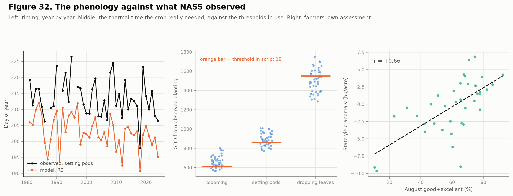
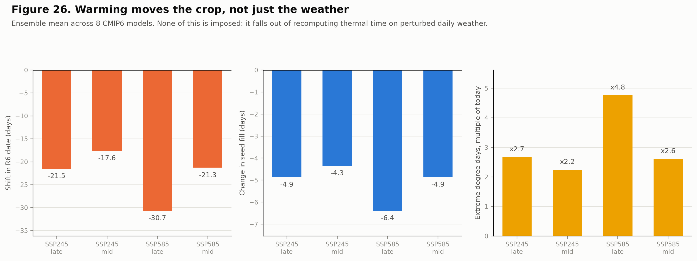
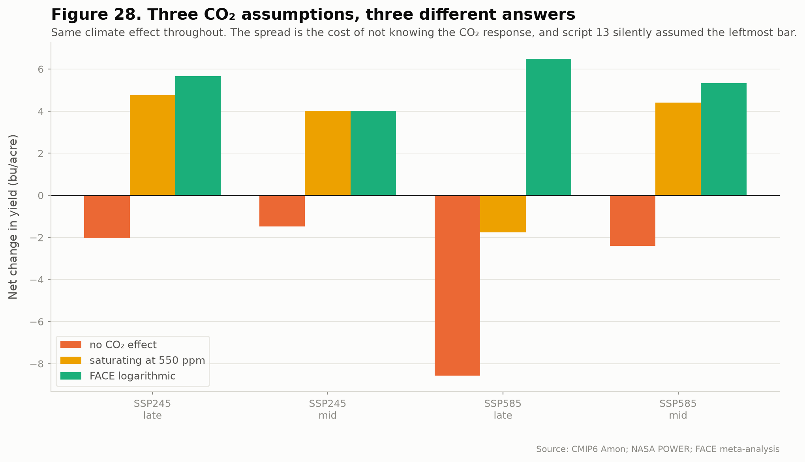
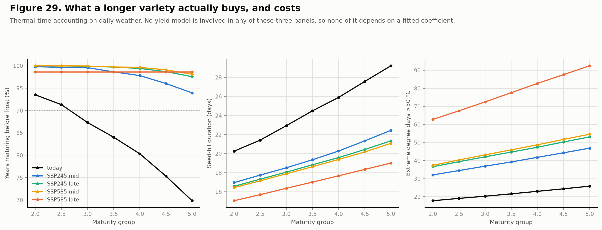
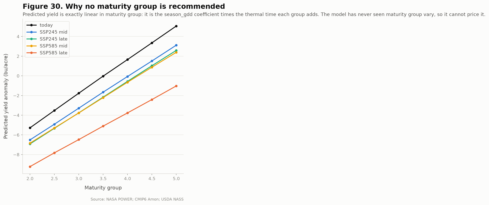
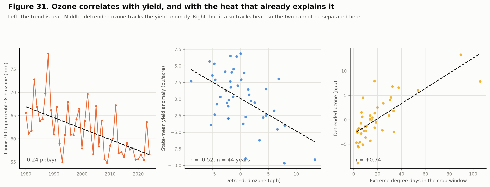

# Soybean Yield and Climate Variability in Illinois

**A county × year panel testing how growing-season heat and moisture relate to soybean yield, 1980 to 2025, with Champaign County as the focal unit.**


---

## The problem this study has to solve first

Illinois soybean yield rose from **33.5 bu/acre in 1980 to 62.5 in 2025**. Almost all of that is technology, roughly 0.65 bu/acre per year from cultivar improvement and agronomy.

That trend is an order of magnitude larger than any climate signal in the sample. Because temperature also trended over the same period, a model that leaves the trend in will credit warming with the genetics and **return a positive temperature coefficient**, predicting that a hotter Illinois yields more.

This pipeline removes the trend county by county, because county trends themselves span 0.290 to 0.846 bu/acre per year. Everything downstream targets the residual.

```
yield_anom = yield_bu_ac - (a_county + b_county * year)
```

---

## Four findings

### 1. Heat is nearly harmless when there is water

The temperature effect is **conditional on moisture, not additive with it**. Mean yield anomaly in bu/acre against county trend:

|          | Wet       | Dry       |
| -------- | --------- | --------- |
| **Cool** | **+1.44** | −1.17     |
| **Hot**  | **+1.45** | **−5.26** |

Hot-and-wet performs identically to cool-and-wet. Together, heat and drought cost roughly double what their separate effects predict.

The regression agrees. The marginal effect of temperature is:

| Moisture condition        | dYield / dTemperature |
| ------------------------- | --------------------- |
| Dry (10th pct, 4.3 in)    | **−0.887** bu/acre/°F |
| At sample means (7.7 in)  | −0.664                |
| Wet (90th pct, 11.4 in)   | **−0.429**            |

An additive model understates warming risk systematically.

### 2. Detrending doubles the signal

| Predictor                   | r vs detrended | r vs raw yield |
| --------------------------- | -------------- | -------------- |
| **Palmer Z-index, Jul-Aug** | **0.490**      | 0.311          |
| Jul-Aug precipitation       | 0.464          | 0.296          |
| August max temperature      | −0.469         | −0.286         |
| Palmer PDSI, August         | 0.349          | 0.243          |

Climate has no trend and yield does, so the trend acts as pure noise in the raw correlation.

The **Palmer Z-index outperforms both raw precipitation and PDSI**. It is the current-month moisture departure accounting for antecedent soil water. PDSI carries too much memory from months that no longer affect the crop.

### 3. Timing beats magnitude

June rainfall is worth nothing. August rainfall is worth everything.

| Month, precipitation | r with anomaly |
| -------------------- | -------------- |
| April                | −0.134         |
| May                  | −0.091         |
| June                 | 0.076          |
| July                 | 0.317          |
| **August**           | **0.342**      |
| September            | −0.020         |

The critical window is July and August, growth stages R3 through R6, pod set and seed fill. April is mildly negative because wet springs delay planting. September is noise; the crop is already made.

Aggregating over the full April-September season weakens the relationship to **0.177**. Choosing the wrong window destroys the signal.

The response is also nonlinear, with an interior optimum near **12.5 inches** over July-August and a decline beyond it. The drought penalty is roughly three times the wet-year bonus.


### 4. Vulnerability concentrates where the buffer is thinnest

County sensitivity to August moisture varies **more than sevenfold**, from 0.47 bu/acre per standard deviation in Mercer County to 3.60 in Clay County. The pattern tracks soil water-holding capacity rather than rainfall.

Two cross-sectional relationships sharpen the point:

- Structurally hotter counties respond more steeply to moisture, `r = +0.606`
- **Higher-yielding counties are less climate-exposed**, `r = −0.512`

Advantage compounds. The best ground both yields more and varies less. A single pooled climate coefficient averages a county where August moisture explains 48% of the variance with one where it explains 3%.

---

## Simulated warming and drying

**These are sensitivity experiments, not climate projections.** They apply uniform shifts to observed climate, use no CMIP6 or IPCC pattern, carry no probability information, and assume no agronomic adaptation, cultivar change, or planting-date shift. For scenarios grounded in named SSP pathways, see [CMIP6 scenario projections](#cmip6-scenario-projections) below; these uniform shifts are retained as a robustness check.

| Scenario                | Δ bu/acre | Δ %    | Counties down |
| ----------------------- | --------- | ------ | ------------- |
| +1 °C                   | −0.31     | −0.68  | 89 / 91       |
| −10% precipitation      | −0.27     | −0.59  | 88 / 91       |
| **+1 °C and −10%**      | **−0.73** | −1.62  | **91 / 91**   |
| +2 °C                   | −0.64     | −1.42  | 91 / 91       |
| +2 °C and −20%          | **−2.03** | −4.48  | 91 / 91       |

The combination exceeds the sum of its parts, which is finding 1 expressing itself again.


Losses concentrate in the southwest, where baseline yields are already the lowest in the state. The few counties showing small positive responses sit in the cool northeast, below the estimated temperature optimum.

---

## CMIP6 scenario projections

Scripts `12` and `13` replace the uniform shifts above with change factors taken from CMIP6 under named SSP pathways. Monthly means (`Amon`) for `tas`, `tasmax` and `pr` come from the AWS Open Data registry (`s3://cmip6-pds`, anonymous access) for **8 models**: ACCESS-ESM1-5, CanESM5, EC-Earth3, GFDL-ESM4, INM-CM5-0, MIROC6, MPI-ESM1-2-LR, MRI-ESM2-0.

Raw model output is never fed to the yield model — it carries systematic bias, and the yield model was fitted on nClimDiv scales. Instead each GCM's **change** between a 1985-2014 baseline and the target window is applied to the observed county record (additive for temperature, multiplicative for precipitation), bilinearly interpolated to all 102 county centroids, and every derived feature is rebuilt exactly as script `04` builds it.

### The result is bracketed, not pinned down

| Scenario | Horizon | Δ Tmax Jul-Aug | Beyond record | Boosted trees | Quadratic panel |
| -------- | ------- | -------------- | ------------- | ------------- | --------------- |
| SSP2-4.5 | 2040-69 | +2.54 °C       | 9%            | −0.30         | −2.06           |
| SSP2-4.5 | 2070-99 | +3.08 °C       | 13%           | −0.23         | −2.48           |
| SSP5-8.5 | 2040-69 | +3.04 °C       | 14%           | −0.22         | −2.58           |
| SSP5-8.5 | 2070-99 | **+5.44 °C**   | **49%**       | −0.17         | **−8.70**       |

Δ in bu/acre, ensemble median across the 8 models. "Beyond record" is the share of county-years whose July-August maximum temperature exceeds the hottest ever observed (95.0 °F).

**The two estimators disagree by a factor of thirty, and that gap is the honest answer.** Boosted trees win on in-sample skill, but a tree predicts a constant outside its training range: warm the record past 95 °F and the heat signal simply stops. Under SSP5-8.5 late-century, half the county-years sit there, which is why the tree estimate is *smallest* for the *hottest* scenario — an artefact, not a result. The quadratic panel specification extrapolates and restores the expected ordering, but assumes its fitted curve still holds far outside the observed range.

Read the quadratic column for the hot scenarios, the tree column for the near-term ones, and neither as a forecast.


### What these projections do not include

- **Palmer drought indices are held at observed values.** CMIP6 supplies no PDSI, and deriving it needs a water-balance model. Since `zndx08` is among the strongest predictors, drought-driven losses are understated.
- **`tas` stands in for the `tmin` delta**; `tasmin` was not retrieved.
- **Monthly means only**, so no change in within-month extremes, heatwave duration, or rainfall intensity.
- **One realisation per model**, so internal variability is not sampled.
- **No adaptation**: no cultivar change, no planting-date shift, no CO₂ fertilisation.

---

## Soil: where the good ground is

Scripts `14`-`16` add county soil properties from USDA-NRCS SSURGO, pulled through the public Soil Data Access service (no API key). 83,063 horizon records across 10,200 map units and all 102 counties are aggregated into 25 county features over two depth bands, 0-30 cm and 30-100 cm, weighted by horizon overlap, component percentage and map-unit acreage.

Soil answers three different questions with three very different answers, and reporting them separately matters.

| Question | What is explained | R2 |
| -------- | ----------------- | -- |
| Does soil explain the **level** of county yield? | County mean yield 1980-2025 | **0.82** |
| Does soil explain **climate sensitivity**? | Composite sensitivity index from script 09 | **0.55** |
| Does soil improve **prediction** of `yield_anom`? | Expanding-window RMSE, 2001-2025 | **+0.3%** |

**Soil explains 82% of the variance in county mean yield.** Mollisol share alone correlates at r = +0.81: each additional percentage point of prairie soil is worth about +0.26 bu/acre. Texture points the expected way too, since more clay *or* more sand at the expense of silt lowers yield, which is the silt loam optimum showing up in the coefficients.


**But soil barely improves the model, and that is arithmetic rather than disappointment.** The modelling target is `yield_anom`, the residual of each county's own linear trend, so its county mean is zero *by construction*. A static county attribute has almost no main effect left to explain, and the best soil feature ranks 16th of 45. The 0.3% gain is an interaction term earning its keep, nothing more.

The useful finding sits in the middle row. Soil explains **55%** of how sharply a county's yield responds to climate, and **51%** of its response to heat, where topsoil organic matter is the strongest single predictor. Soil does not tell you what this year's anomaly will be. It tells you which counties suffer most when one arrives, which is exactly what the CMIP6 scenarios above need.

---

## The crop does not follow the calendar

Scripts `17`-`19` replace two assumptions the pipeline inherited without testing. Both break under a changed climate.

**July and August are not the critical window. R3 to R6 is.** Those stages happen to fall in July and August in today's Illinois, which is why the fixed window has worked. Under warming, thermal time accumulates faster, the crop reaches R6 earlier, and seed fill is shorter. A calendar window represents neither effect, so the CMIP6 scenarios in script `13` are asking the wrong question. It also does not travel: July and August are winter in Brazil.

**Monthly means erase the extremes that do the damage.** Schlenker & Roberts (2009) show soybean yield rising with temperature to about 30 °C then falling steeply, with damage tracking the *distribution* of daily temperature. In a monthly dataset, an August averaging 30 °C with no day above 34 and one with five days at 38 are the same number.

Script `17` pulls daily NASA POWER for all 102 county centroids, 1981-2024, 1.64 million records. Script `18` derives degree days by single-sine integration (Snyder 1985), giving GDD(10,30) and EDD(>30) separately, plus vapour pressure deficit and a daily soil water balance whose bucket size is the SSURGO available water from script `15`. Everything is computable from temperature, dewpoint, precipitation and latitude alone, so the same code runs on Brazilian municipalities.

### The window has already moved

> **Correction, see [Validated against observed crop progress](#validated-against-observed-crop-progress).** The trends below are what the *model* produces. Against the observed NASS record, leaf drop has not advanced (+0.61 ± 0.64 days per decade against the model's −2.5), planting moved about 1.7 days per decade earlier where this model says it barely moved, and only maturity is clearly contradicted.

| | 1981-1990 | 2015-2024 | Trend |
| --- | --- | --- | --- |
| Day of year reaching R6 | 246.6 | 239.4 | **−2.60 / decade** |
| Seed-fill duration (days) | 24.1 | 22.3 | **−0.71 / decade** |
| Planting day of year | 125.6 | 126.0 | +0.4 total |

Maturity has advanced a week over the record while planting barely moved, so this is summer warming accelerating development *after* sowing, not earlier sowing.


**But extreme heat in the crop window has gone down, not up** (−0.66 EDD per decade). That is the US Corn Belt summer "warming hole", and it deserves emphasis: the CMIP6 scenarios project large increases in exactly the variable that has been falling here for forty years.

### Does it predict better? Mostly no

| Feature set | n | RMSE | R² | vs calendar |
| ----------- | - | ---- | -- | ----------- |
| Both | 37 | 4.761 | 0.305 | **+0.78%** |
| Calendar (script 08) | 20 | 4.798 | 0.294 | — |
| Process (script 18) | 17 | 5.133 | 0.192 | **−6.98%** |

Expanding window, rolling origin, 2001-2024, 2,048 test observations.

The process features **lose** on their own and add almost nothing in combination. One result does stand out: the season water-balance deficit correlates with yield anomaly at **r = −0.533**, the strongest single predictor anywhere in this study, ahead of the previous best, July-August precipitation at +0.481.

**This comparison is confounded and should not be read as settled.** The process features come from NASA POWER at roughly half a degree; the calendar features come from nClimDiv county polygons. Part of what the table measures is POWER versus nClimDiv, not phenology versus calendar. A clean test needs the calendar features rebuilt from POWER, which has not been done.

The case for the phenological window was never that it predicts the past better. It is that it can represent a moving, shortening window and a threshold heat response, and the calendar version structurally cannot. That matters for projection, not for hindcast.

---

## Validated against observed crop progress

Script `23` pulls the actual weekly Illinois soybean progress and condition series from NASS Quick Stats (the key-free bulk file, streamed and filtered from 23.9 million rows). Script `24` compares the phenology against it. **The series are state-level only**: the bulk file has no district or county progress. Planting runs from 1980, blooming, setting pods, leaf drop and harvest from 1981, condition from 1986.

### The dates written from memory were close, and the label on one was wrong

The thermal-time thresholds in script `18` were described as calibrated to NASS norms. They were not: the dates were written from memory and never downloaded. Checked against the real series (mean day of year, 1981-2024):

| Stage | Written from memory | Observed | Error |
| ----- | ------------------- | -------- | ----- |
| Planted (50%) | 20 May | 21 May | −1.7 d |
| Blooming (50%) | 10 July | 16 July | **−6.4 d** |
| Setting pods (50%) | 28 July | 1 August | −4.6 d |
| Dropping leaves (50%) | ~20 Sept, called "maturity" | 19 Sept | +0.5 d |

NASS has no "maturity" or "full seed" stage. Leaf drop corresponds to roughly R7, and the "full seed, ~5 September" date had no source at all.

### The thresholds turned out to be about right

Accumulating GDD from each year's *observed* planting date to each observed stage gives the thermal time the crop actually needed:

| Stage | Observed median GDD | Spread across years (CV) | Threshold in use | Error |
| ----- | ------------------- | ------------------------ | ---------------- | ----- |
| Blooming | 651 | 8.8% | 610 | −41 |
| Setting pods | 883 | 7.6% | 860 | −23 |
| Dropping leaves | 1504 | 8.1% | 1550 | +46 |

All within about 5%, so the calibration survived being checked against data it was not built from.

### But the model runs 10 to 19 days early, and the cause is the planting rule

| Observed | Model | Bias | RMSE | Year-to-year correlation |
| -------- | ----- | ---- | ---- | ------------------------ |
| Planted | temperature rule | **−15.5 d** | 18.3 d | **0.18** |
| Blooming | R1 | −12.3 d | 13.5 d | 0.59 |
| Setting pods | R3 | −10.3 d | 11.3 d | 0.63 |
| Dropping leaves | R6 / R8 | −19.2 / −7.1 d | 20.5 / 10.3 d | 0.53 / 0.48 |

This corrects an earlier assessment of the pipeline, that the modelled dates (planting 6 May, R1 on 3 July, R3 on 21 July) were close to Illinois norms. Planting was 15 days early, and the temperature rule barely tracks real planting from year to year (r = 0.18), because farmers plant when fields are workable, not when a running mean crosses 15 °C.

Feeding the model the *observed* planting date removes the bias, which isolates the fault:

| Stage | Bias | RMSE | Observed sd | Correlation | Skill vs the mean date |
| ----- | ---- | ---- | ----------- | ----------- | ---------------------- |
| Blooming | −0.1 d | 4.1 d | 6.8 d | 0.86 | +40% |
| Setting pods | +0.2 d | 4.6 d | 5.9 d | 0.83 | +21% |
| Dropping leaves | +4.4 d | **19.5 d** | 4.8 d | 0.55 | **−305%** |

**Given the planting date, thermal time predicts flowering and pod set well. It predicts leaf drop worse than simply guessing the average date.** Observed leaf drop varies by only about 5 days from year to year, while accumulated thermal time swings it by nearly 20. Soybean is a photoperiod-sensitive short-day plant, so maturity is set partly by day length, which a thermal-time model does not have. That is agronomic background rather than something tested here, but it fits the data.



### The window has not moved the way the model says

Trends in days per decade, 1981-2024:

| Stage | Observed | Model | Gap |
| ----- | -------- | ----- | --- |
| Planting | −1.69 ± 1.15 | −0.25 | 1.2 SE |
| Blooming | −0.54 ± 0.87 | −1.93 | 1.4 SE |
| Setting pods | −0.98 ± 0.72 | −2.07 | 1.2 SE |
| **Leaf drop** | **+0.61 ± 0.64** | **−2.5** | **2.7-2.8 SE** |

Only maturity is clearly contradicted, but it is contradicted: observed leaf drop has not advanced, and if anything is a fraction later, while the model has R6 arriving 2.5 days earlier per decade. Observed planting moved earlier by about 7 days over the record. The real system has been adapting through planting date and variety, which offsets warming-driven acceleration, and the model, with a fixed rule and fixed thresholds, contains none of it.

### Farmers' own assessment agrees with the stress variables

August "good + excellent" condition ratings, 39 years: **+0.66** with the state yield anomaly, **−0.69** with extreme degree days, **+0.55** with minimum soil water fraction, **+0.51** with R3-R6 precipitation. The heat and water variables built in this pipeline track an independent human judgement of crop stress.

### What this changes

- **"The crop window has already moved" (Figure 24) is a modelled result, not an observed one.** The observed record shows earlier planting and no advance in maturity.
- **The size of the scenario shifts in Figure 26 is unvalidated and probably too large**, particularly R6 arriving up to 31 days earlier and seed fill shortening by up to 6.4 days. Those come from thermal time alone, which fails for late-season timing and has no photoperiod control. The early-season part (R1, R3) is supported.
- **The "no adaptation" assumption is now shown to be strongly biased toward loss**, because adaptation is already visible in the historical record.
- **What it does not change:** the yield response to heat and water, which the condition ratings corroborate.

### Not yet fixed

The planting rule should be anchored to the observed mean, R1 and R3 thresholds set to 651 and 883, and the end of the yield window defined without leaning on thermal-time maturity. Scripts `18` to `21` would then need rerunning, and their scenario numbers will change.

---

## Scenarios on a moving crop window

Script `20` reruns the CMIP6 scenarios, but applies the deltas to the **daily** record and recomputes the entire phenology through the same `_pheno` module script `18` uses on observed weather. Warming now does what warming does.

### None of this was imposed

> **Caveat, see the validation section above.** The mechanism is real, but the *size* of the late-season shifts is unvalidated. Thermal time predicts flowering and pod set well and leaf drop worse than the average date, and it has no photoperiod control. Treat the R1 and R3 shifts as supported and the R6 shifts, and the seed-fill shortening derived from them, as probably too large.

| Scenario | Horizon | Δ Tmax | R6 date | Seed fill | Extreme degree days |
| -------- | ------- | ------ | ------- | --------- | ------------------- |
| SSP2-4.5 | 2040-69 | +2.54 °C | **−17.6 d** | **−4.3 d** | **×2.2** |
| SSP2-4.5 | 2070-99 | +3.08 °C | −21.5 d | −4.9 d | ×2.7 |
| SSP5-8.5 | 2040-69 | +3.04 °C | −21.3 d | −4.9 d | ×2.6 |
| SSP5-8.5 | 2070-99 | +5.44 °C | **−30.7 d** | **−6.4 d** | **×4.8** |

The crop reaches full seed up to a month earlier and fills for six fewer days. Nothing in the code instructs it to; it falls out of thermal time accumulating faster. Script `13` could not represent any of this, because July and August stay where they are no matter how hot it gets.



### The extrapolation problem is largely solved

The estimator is the Schlenker-Roberts specification: yield on GDD, EDD, precipitation and its square, with county fixed effects. **EDD enters linearly**, which is the entire point of the construction — the nonlinearity lives in the degree-day accounting, not the functional form. Extrapolating is then a straight line in a variable with a physical threshold, rather than a fitted curve in raw temperature.

Fitted on observed data, the coefficient is **−0.0836 bu/acre per degree-day above 30 °C** (p ≈ 4e-93).

Out-of-range county-years fall from **49% in script 13 to 5-22%** here. The boosted trees still saturate (−0.13 to −0.41 bu/acre regardless of scenario), which confirms the original diagnosis rather than fixing it.

| | Script 13, fixed window | Script 20, moving window |
| --- | --- | --- |
| SSP5-8.5 late, trees | −0.17 | −0.41 |
| SSP5-8.5 late, parametric | −8.70 (quadratic) | **−5.28** (Schlenker-Roberts) |

The climate effect across scenarios is **−1.5 to −5.3 bu/acre**, inside the range script 13 bracketed but on far weaker assumptions.

### CO₂ changes the sign, and that is the result

Soybean is a C3 legume and the most CO₂-responsive major crop. SoyFACE, the free-air enrichment facility behind the definitive soybean numbers, sits in Champaign County, this study's focal unit. Script `13` held CO₂ at present levels without saying so.

| Scenario | Horizon | Climate | No CO₂ | Saturating | FACE |
| -------- | ------- | ------- | ------ | ---------- | ---- |
| SSP2-4.5 | 2040-69 | −1.54 | −1.54 | +3.97 | +3.97 |
| SSP2-4.5 | 2070-99 | −1.93 | −1.93 | +4.88 | +5.80 |
| SSP5-8.5 | 2040-69 | −2.07 | −2.07 | +4.74 | +5.65 |
| SSP5-8.5 | 2070-99 | **−5.28** | **−5.28** | **+1.53** | **+9.81** |



**Do not read +9.81 as a projection.** Read the spread. Under SSP5-8.5 late-century the answer runs from −5.3 to +9.8 bu/acre depending on nothing but the CO₂ assumption, a range wider than the climate signal itself. Whether climate change is bad for Illinois soybean cannot be answered from this pipeline without committing to a CO₂ response, and the honest statement is that this study does not know it.

The logarithmic FACE curve is extrapolated to 890 ppm, far beyond the ~550-600 ppm where FACE experiments have data, which is why the saturating variant is the more defensible of the two non-zero options.

### What these scenarios still do not include

- **The CO₂ response is applied as a flat multiplier.** FACE work shows it shrinks under heat and interacts with drought. Neither is represented, and both would reduce the benefit precisely in the scenarios where it is largest.
- **CO₂ concentrations are round numbers**, not the published CMIP6 GHG concentration series. Replace them before quoting anything.
- **Dewpoint is shifted with temperature**, holding relative humidity roughly constant. Models projecting declining land humidity would give a larger VPD rise, so this is conservative.
- **A monthly precipitation ratio scales every wet day equally.** Rainfall intensity changes; wet-day frequency cannot. No delta method can change the shape of the rainfall distribution.
- **No adaptation.** No shift in maturity group, planting date or cultivar — and a farmer facing a month-earlier R6 would change all three. This is the largest remaining omission.

---

## Adaptation: what the grower can do, and what this model cannot say

Every scenario above assumes a grower watches R6 arrive a month earlier, every season for seventy-five years, and changes nothing. Script `21` removes that assumption, and in doing so runs into the limit of the whole statistical approach.

### Frost stops being the constraint

| Climate | Longest viable MG | Frost margin at MG 3.5 | Seed fill at MG 3.5 | Seed fill at longest | EDD at MG 3.5 | EDD at longest |
| ------- | ----------------- | ---------------------- | ------------------- | -------------------- | ------------- | -------------- |
| Today | **3.5** | 51 d | 23.2 d | 23.2 d | 19 | 19 |
| SSP2-4.5 mid | ≥5.0 | 79 d | 19.2 d | 21.8 d | 36 | 44 |
| SSP2-4.5 late | ≥5.0 | 85 d | 18.7 d | 21.0 d | 42 | 51 |
| SSP5-8.5 mid | ≥5.0 | 85 d | 18.5 d | 20.8 d | 43 | 52 |
| SSP5-8.5 late | ≥5.0 | 110 d | 17.0 d | 18.9 d | 75 | 90 |

"Longest viable" is the longest maturity group still reaching R8 before the killing frost in 90% of years. Values of 5.0 are censored at the top of the tested range; the true ceiling is higher.

Today the frost constraint binds at **MG 3.5**, which is what Illinois growers actually plant. That the frost rule lands on the observed practice, using only daily temperature and thermal time, is a coherence check worth noting — nothing in the calculation was told what growers do.

Under every scenario frost essentially stops binding. The margin at the current maturity grows from 51 days to 85-110, and even MG 5.0 matures in 97-100% of years.



### Adaptation recovers about half the lost seed fill, and buys more heat

Warming cuts seed fill at MG 3.5 from 23.2 days to 17.0-19.2. Moving to the longest viable variety returns it to 18.9-21.8 — roughly half the loss, never all of it. Under SSP5-8.5 late-century even MG 5.0 fills for 18.9 days against today's 23.2.

The price is exposure. Extreme degree days rise about 20% on top of the climate signal: under SSP5-8.5 late, from 75 at MG 3.5 to 90 at MG 5.0. A longer variety keeps the crop in the field through the hottest, driest end of summer. That is a real trade-off, and it is visible without any yield model, because all three panels above come from thermal-time accounting on daily weather.

### Why no maturity group is recommended

The first version of this script did pick one. The answer was worthless, and it is worth showing why.

Predicted yield across MG 2.0 to 5.0 at today's climate: **−5.28, −3.52, −1.77, −0.03, +1.66, +3.36, +5.07.** First differences: +1.76, +1.76, +1.74, +1.69, +1.70, +1.71 — standard deviation 0.029. A straight line.

It is the fitted `season_gdd` coefficient multiplied by the thermal time each group adds, and nothing else. The "optimum" was always the longest variety frost permitted, which is a property of the regression rather than of soybean.

The reason is identification. `season_gdd` varies in the training data because *seasons* vary, at one maturity group. Nothing in the record varies maturity group while holding season fixed, so that coefficient cannot be read as the value of a longer variety.



**This is where the statistical approach runs out of road.** The phenological consequences of a variety choice are computable and trustworthy. Converting them into a yield optimum needs a model that carries yield potential — light interception, biomass accumulation, partitioning — which is exactly the argument Peng et al. (2020) make for process-based crop models. APSIM or DSSAT answers this question; a regression fitted to one maturity group cannot.

---

## Checked against the literature

The analysis was audited against published work rather than recollection. Four things held; three needed changing.

**Held.** The 30 °C soybean threshold is Schlenker & Roberts' own figure (29 °C maize, 30 °C soybean, 32 °C cotton), and they build degree days from the within-day temperature distribution, which the single-sine integration approximates. The CO₂ curve turned out better calibrated than claimed: it was fitted to one point (+15% at 550 ppm) but SoyFACE measured 2.5 kg/ha/ppm from 373→550 ppm, ≈ +15% on Illinois yields, and Ainsworth's meta-analysis gives +24% at 689 ppm against the curve's +23.5%. And Lobell's group attributes warming loss *mainly to a shortened growing season* — the mechanism scripts `18` and `20` implement and script `13` structurally could not.

**Changed: humidity was being assumed away.** At 2 °C warming the loss attributable to the associated VPD rise (12.9 ± 1.8%) exceeds the loss from warming itself (8.5 ± 1.4%), and CMIP6 projects relative humidity *declining* over North America. Script `12` now pulls `hurs`; July–August RH falls **2.8 to 5.4 percentage points**. Dewpoint is rebuilt from the projected humidity against the warmed temperature range, instead of being shifted with temperature.

**Changed: ET₀ could not see humidity.** The water balance used Hargreaves, which is temperature-only — so even with humidity projected, nothing downstream responded. It is now FAO-56 Penman–Monteith. A Champaign July gives 4.66 mm/day, and a 5-point RH drop raises ET₀ 3.6% where Hargreaves moves 0.0%.

**Changed: the water balance was missing from the specification.** The first attempt at the humidity fix returned a climate effect *identical to four decimals*, because `season_gdd + season_edd + precipitation` reads no water balance at all. The circuit was open. `wb_min_water_frac` now closes it.

### VPD was tried as a regressor and rejected

Entered alongside EDD it takes a **positive** coefficient, +7.05 bu/acre per kPa — backwards. VPD and EDD correlate at **+0.912** and are not separable. The better-fitting `wb_season_deficit_mm` was rejected for a related reason: it correlates +0.789 with EDD and drives the EDD coefficient from −0.084 to −0.018, absorbing the heat channel it should sit beside. `wb_min_water_frac` is bounded on [0,1], correlates −0.484, and leaves EDD at −0.077 with every sign physiological.

### The correction made losses smaller, not larger

| Scenario | Horizon | SR before | SR after | GBM before | GBM after |
| -------- | ------- | --------- | -------- | ---------- | --------- |
| SSP2-4.5 | 2040-69 | −1.54 | −1.26 | −0.33 | −0.42 |
| SSP2-4.5 | 2070-99 | −1.93 | −1.58 | −0.39 | −0.49 |
| SSP5-8.5 | 2040-69 | −2.07 | −1.75 | −0.13 | −0.20 |
| SSP5-8.5 | 2070-99 | **−5.28** | **−4.69** | −0.41 | **−1.36** |

This was the opposite of the prediction. Opening the dominant damage channel was expected to deepen the losses; instead the parametric estimate lightened by 0.3-0.6 bu/acre, because splitting damage into heat *and* water reassigns some of what EDD had been absorbing alone. The boosted trees, which read the water-balance features directly, moved the other way and more than tripled their SSP5-8.5 loss.

Both are honest readings of the same correction. The SR figure is the one to quote, and it is now built on a specification where humidity reaches yield through evaporative demand rather than through a collinear regressor.

### Still missing after the audit

- **Ozone.** Current Midwest soybean yields are suppressed roughly **10%** by tropospheric O₃. At SoyFACE, elevated O₃ cost 10 ± 11% at 370 ppm CO₂ but only 5 ± 4% at 550 ppm — elevated CO₂ partly *protects* by closing stomata. So the observed yields fitted here already embed ozone damage, and part of the measured FACE "CO₂ benefit" is ozone protection rather than fertilisation. Treating it as pure fertilisation on top of unchanged ozone risks double counting.
- **CO₂ × water.** The crop-modelling literature finds CO₂ fertilisation insufficient to overcome moisture limitation. The flat multiplier here applies the full benefit in the driest scenarios, which is where it should be smallest.

---

## Ozone: it survives detrending, and still cannot be separated

Script `22` asks of ozone the question that ended the soil work. Soil was absorbed by the county trend because a static attribute cannot explain a target whose county mean is zero. Ozone has the mirror risk: US ozone fell after 1980, so a trend is absorbed too, and what is left is year-to-year variation, which hot stagnant summers drive. It may only restate the heat signal.

Data is EPA AirData, 45 years (1980-2024), Illinois 8-hour ozone, 102-144 monitors covering 18-23 of 102 counties.

**It does survive detrending, unlike soil.** The trend explains only 34-38% of the peak metrics and essentially none of the annual mean, so a residual standard deviation of 4-6 ppb remains. Detrended, the correlation with the yield anomaly *strengthens* rather than vanishing.

| Metric | Trend explains | Detrended r with yield anomaly (44 years) |
| ------ | -------------- | ------------------------------------------ |
| 4th-highest 8-h value | 38% | −0.41 |
| 90th-percentile 8-h value | 34% | **−0.52** |
| Annual mean | 0.2% | −0.48 |

**But it is not separable from heat and water.** Detrended ozone correlates **+0.62 to +0.74** with extreme degree days and **−0.46 to −0.57** with the water balance, which is unsurprising, since hot dry stagnant summers produce both. Added to the specification it contributes almost nothing.

| Metric | Coefficient, bu/acre per ppb | p | Effect of 1 sd | ΔR² |
| ------ | ---------------------------- | - | -------------- | --- |
| 4th-highest | −0.046 | 0.64 | −0.28 | +0.002 |
| 90th percentile | −0.156 | 0.24 | −0.68 | +0.008 |
| Annual mean | −0.139 | 0.57 | −0.34 | +0.002 |

A year-level regression with no county replication, 44 observations, gives coefficients of +0.003 to −0.076 with p between 0.67 and 0.98.



### A null here does not mean ozone does nothing

The detectable-effect floor is about **0.21 bu/acre per ppb**. The literature implies roughly **0.13 to 0.38**, from two rough anchors: a 10% suppression over 25-35 ppb above background, and SoyFACE's +25% ozone treatment costing 10 ± 11%, which is itself consistent with zero. The range straddles the floor, so this design cannot tell "ozone does nothing" from "ozone does what the literature says".

Read the sign and the scale as consistent with the literature and the significance as inconclusive.

### What it means for the projections

Ozone is **not built into script 20**, because there is no independent coefficient to put there. The consequence runs the other way. Because ozone tracks heat and drought, part of what the fitted **EDD and water coefficients** measure may be ozone damage. If ozone concentrations in a warmer future do not scale with heat as they did historically, extrapolating those coefficients would misattribute the loss. This is a hypothesis this data cannot test, and it applies equally to the FACE CO₂ benefit, whose ozone-protection component cannot be separated from fertilisation here.

Two things would settle it: county-varying, growing-season ozone exposure (AOT40 or W126, from the hourly EPA files, roughly ten times heavier than the annual summaries used here), and an ozone-explicit process crop model.

**Limits of this screen.** Annual metrics rather than growing-season exposure; monitors urban-biased and covering under a quarter of counties; the honest sample size is 44 years, not the 3,779 county-years.

---

## Does climate actually predict?

Validation is strictly temporal. **No random splits anywhere.** They fail twice over here: they admit future information, and because counties within a year share weather, they place near-duplicates of test rows into training.

- **Fixed split**: train 1980-2013, validate 2014-2018, test 2019-2025
- **Expanding window**: rolling origin, one test year at a time, 2001-2025, 2,317 test observations

The comparison that matters is not algorithm versus algorithm. It is a **trend-only baseline against models that see climate**.

| Model                    | RMSE      | MAE   | R²        | Skill vs baseline |
| ------------------------ | --------- | ----- | --------- | ----------------- |
| **Gradient Boosting**    | **4.844** | 3.680 | **0.284** | **+15.7%**        |
| HistGBM                  | 4.870     | 3.706 | 0.276     | +15.3%            |
| Random Forest            | 4.895     | 3.723 | 0.269     | +14.8%            |
| Linear Regression        | 5.090     | 3.892 | 0.209     | +11.5%            |
| Ridge                    | 5.095     | 3.896 | 0.208     | +11.4%            |
| Baseline: trend only     | 5.748     | 4.424 | −0.008    | 0.0               |

Climate wins by **15.7%**, which establishes that it carries real predictive content.

But gradient boosting beats ridge regression by only **4.9%**. Most of the available signal is linear once the quadratic and the interaction are specified. That is the honest headline, stated before a reviewer asks.

---

## What this study cannot answer

### 2003 defeats the climate model

Decomposing predictions by year: 1988 is explained to **88%**, 2012 to **41%**, and 2003 to only **15%**. At **−3.43 bu/acre**, 2003 is the **largest unexplained shortfall of all 46 years, rank 1 of 46**.

Statewide August PDSI in 2003 was slightly positive and rainfall near normal, yet yield fell 8.5 bu/acre below trend. 2003 contributed 14 of the 39 observations exceeding three standard deviations in the entire panel.

**The obvious hypothesis fails its test.** 2003 was a documented severe soybean aphid outbreak year in the North Central region, with populations exceeding 1,000 per plant and 40% yield loss recorded at those densities ([Ragsdale et al., *J. Integr. Pest Manag.* 2012](https://academic.oup.com/jipm/article/3/1/E1/808601)). The aphid overwinters on buckthorn, which is concentrated **north of 41°N** ([Tilmon et al., *J. Integr. Pest Manag.* 2011](https://academic.oup.com/jipm/article/2/2/A1/860557)). Illinois straddles that line, which makes the hypothesis falsifiable. It does not survive:

| Test | Result | Verdict |
| --- | --- | --- |
| Raw 2003 anomaly vs county latitude | r = **−0.775** | Strong northern concentration |
| **Residual** after climate is removed vs latitude | r = **−0.124** | Gradient is climate, not residual |
| 2003 rank by \|r(lat, residual)\| | **33 of 46** | Unremarkable |
| North (≥41°N) minus South residual gap, 2003 | **+1.72** | **Wrong sign.** North did better |
| Same raw gradient in 1988, before the aphid existed in North America | r = −0.655 | Not diagnostic |
| Aphid-era shift in N-S residual gap, pre vs post 2000 | t = 0.205, **p = 0.84** | No effect |

The northern concentration in 2003 is real but **fully accounted for by climate**: northwestern Illinois had a genuine August moisture deficit that year. What remains unexplained is spatially uniform, which is the opposite of what a northern-origin pest would produce.

So the finding is narrower and sharper than a pest attribution: **2003 is the largest unexplained shortfall in the record, and the most plausible explanation does not fit its geography.** The cause remains open. Test details in [`results/table10_aphid_hypothesis_test.csv`](results/table10_aphid_hypothesis_test.csv) and [`results/12_aphid_hypothesis_test.json`](results/12_aphid_hypothesis_test.json).

### Other limitations

- **Monthly resolution cannot resolve frost or daily extremes.** The coldest monthly mean minimum in the record is 32.3 °F. No degree-days above a threshold, no dry-spell length, no rainfall intensity, no vapour pressure deficit. This is the largest methodological gap. gridMET 4 km daily is the upgrade path.
- **County coverage collapses after 2018**, from 102 counties reporting to 62, and survival is not random. The recent panel skews toward large producers exactly where out-of-sample validation happens.
- **Planting date is missing**, and 2019 shows why. It is the one year where adding climate makes predictions *worse*, because the rain arrived in spring and delayed planting in a way seasonal aggregates cannot see.
- **No causal identification.** Fixed effects absorb time-invariant county traits and statewide annual shocks, not county-specific time-varying confounders such as drainage, cultivar turnover, pest pressure, or land-use change.

The correct statement of the result is therefore: higher July-August temperatures and lower July-August moisture were **statistically associated** with lower yield after controlling for county and year fixed effects, robustly across thirteen specifications. Not: temperature caused yield to decline.

---

## Champaign County

| Metric                              | Champaign | State panel |
| ----------------------------------- | --------- | ----------- |
| Mean yield, 2015-2025               | 64.3      | 58.7        |
| Technology trend, bu/acre/yr        | 0.660     | 0.627       |
| Moisture sensitivity, bu/acre per SD| 1.740     | 0.47 - 3.60 |
| Sensitivity rank                    | 53 / 91   | —           |
| **Simulated Δ under +1 °C, −10%**   | **−0.24** | −0.73       |

High-yielding, near-median sensitivity, and **less exposed than the state average** under every perturbation. Champaign has 44 observations, 1980 to 2023; it was suppressed out of the 2024 and 2025 county data. Its worst recorded year is 2003 at 13.99 bu/acre below trend, the year the climate model cannot explain.

---

## Data and verification

| Source | Access | Retrieved |
| --- | --- | --- |
| USDA NASS Quick Stats | Query-tool CSV export, **no API key** | 2026-08-31 |
| NOAA NCEI nClimDiv | `ncei.noaa.gov/pub/data/cirs/climdiv/`, `*cy-v1.0.0-20260806` | 2026-08-31 |

Both are United States federal works in the public domain.

| Verification | Result |
| --- | --- |
| County sums vs published state totals, 46 years, 3 measures | **Exact, 0.000% error** |
| `production_bu / acres_harvested == yield_bu_ac` | 4,459 of 4,459, max residual 0.25 |
| `acres_harvested <= acres_planted` | No violations |
| Duplicate county-year keys | 0 |
| Climate join completeness | 4,459 of 4,459, zero nulls |
| Independent cross-check vs external NASS query | 21 of 21 values match |

The first check matters more than it sounds. Internal consistency tests pass even on a file that has silently lost rows, and an earlier build of this panel had done exactly that. **Only reconciliation against an independently published aggregate catches it.**

---

## Four traps this pipeline handles

1. **NASS publishes its suppressed-county bucket once per Agricultural Statistics District, not once per state.** In 2019 there are nine, all with a blank county ANSI. The raw key is `county_ansi + ag_district_code + year`. Keying on county and year alone silently collapses up to nine rows per year.
2. **Read `county_ansi` as text.** Integer casting turns `001` into `1` and drops Adams County from every join.
3. **Join on FIPS, never on name.** NASS writes `DU PAGE`, `ST CLAIR`, `JO DAVIESS`; Census writes `DuPage`, `St. Clair`, `Jo Daviess`.
4. **Never sum county rows to a state total after 2018.** 2025 county sums give 6.30M planted acres against an actual 10.30M. Use `data/raw/nass_il_state_totals.csv`.

---

## Quick start

```bash
pip install -r requirements.txt
cd scripts

python 01_download_production.py     # provenance + staging check
python 02_clean_production.py        # -> data/processed/production_clean.csv
python 03_download_climate.py        # provenance + staging check
python 04_process_climate.py         # -> data/processed/climate_features.csv
python 05_merge_data.py              # -> data/final/soybean_illinois_climate_1980_2025.csv
python 06_eda.py                     # figures 1-9,  tables 1-3
python 07_statistical_models.py      # tables 4, 4b
python 08_machine_learning.py        # figures 10-12, tables 5-6
python 09_sensitivity_analysis.py    # figures 13-16, tables 7, 8a, 8b
python 10_generate_results.py        # figures 17-18, manifest, column profile
python 11_robustness.py              # table 9
```

Runs end to end in a few minutes. Random seed fixed at 42 in `00_config.py`.

---

## Project structure

```
soybean_climate_illinois/
├── data/
│   ├── raw/          NASS export, nClimDiv extracts, state totals, county boundaries
│   ├── processed/    production_clean.csv, climate_features.csv
│   └── final/        soybean_illinois_climate_1980_2025.csv   <- ANALYTICAL PANEL
├── scripts/          00_config.py, _cfg.py, _viz.py, 01..11
├── figures/          fig01 .. fig18 (PNG, 200 dpi)
├── models/           regenerable, gitignored
├── results/          FINAL_REPORT.md, DATA_DICTIONARY.md, table1..table9, provenance JSON
└── README.md
```

**Start here:**

| File | What it is |
| --- | --- |
| [`results/FINAL_REPORT.md`](results/FINAL_REPORT.md) | The paper. Abstract through conclusions |
| [`results/DATA_DICTIONARY.md`](results/DATA_DICTIONARY.md) | Every column, unit, range, derivation |
| [`data/final/soybean_illinois_climate_1980_2025.csv`](data/final/) | The analytical panel, 4,459 rows × 90 columns |
| [`results/table7_county_climate_sensitivity.csv`](results/) | County dimension table: identity, coverage, trend, sensitivity |

---

## Methodology in brief

**Growing season.** April-September, planting through maturity.
**Critical window.** July-August, R3-R6, pod set and seed fill. Chosen agronomically and fixed before modelling, then supported empirically by finding 3.

**Inclusion rule.** Counties with at least 42 of 46 years. 91 counties, 4,051 rows. Fixed before modelling, not tuned on results.

**Panel.** Standard errors clustered on county throughout. Seven specifications escalating to two-way county and year fixed effects.

**Robustness.** Thirteen specifications. The temperature effect is negative and significant at 5% in **all thirteen**, with magnitude stable between −0.52 and −0.70. Dropping 1988, 2003 and 2012 halves it to −0.334, which is expected for a nonlinear damage function and reported as such.

---

## Design lineage

This is a structural translation of a Brazil state-level IBGE + ERA5 study design:

| Brazil design | This pipeline |
| --- | --- |
| IBGE production, state × year, 1974-2023 | USDA NASS, county × year, 1980-2025 |
| 27 states | 102 counties, 91 in balanced panel |
| ERA5 reanalysis, gridded t2m + tp | NOAA NCEI nClimDiv, county monthly |
| State boundaries | Census county FIPS + NASS Ag Districts |
| State + year fixed effects | County + year fixed effects |
| State climate-sensitivity ranking | County climate-sensitivity ranking |
| `production_tonnes` | **`yield_anom`**, detrended yield |

**On the target variable.** Production confounds area expansion, which the source design itself lists as a confounder. This pipeline targets the county-detrended yield anomaly to isolate the climate signal. `production_tonnes` and `yield_kg_ha` are carried in the final dataset for international comparability.

**On the climate source.** nClimDiv plays the ERA5 role, with one structural difference stated plainly: NCEI performs the gridding and polygon aggregation upstream, so this pipeline executes no area-weighting step of its own. That removes a source of analyst error but also removes a documented methodological choice, and it fixes the temporal resolution at monthly.

---

## License

MIT for the code and documentation. Underlying data are United States federal works in the public domain. See [`LICENSE`](LICENSE).

Citation metadata in [`CITATION.cff`](CITATION.cff).
