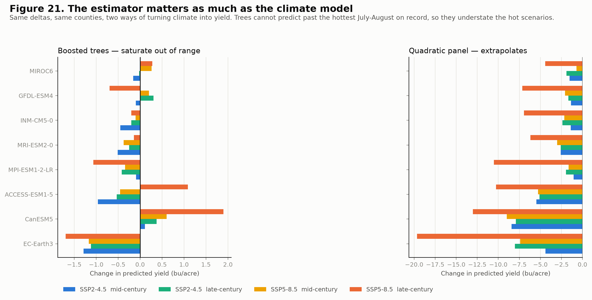
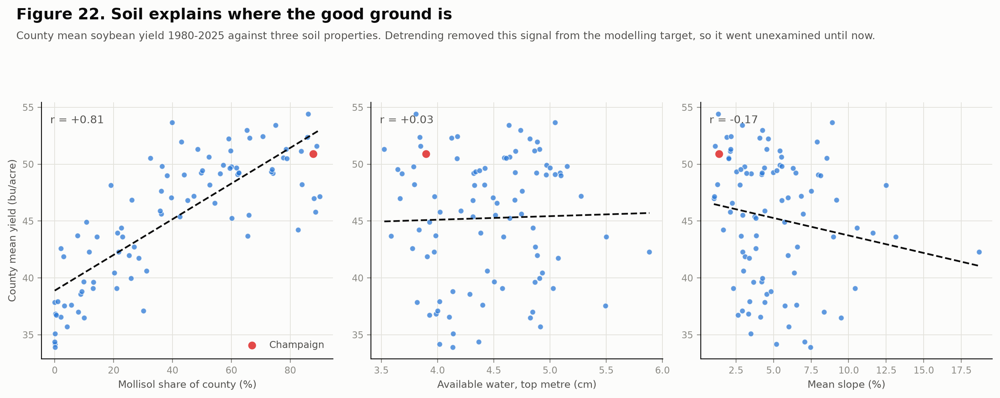
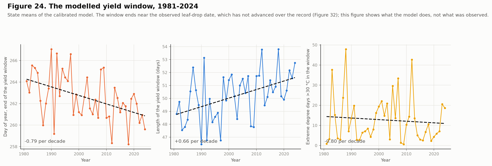
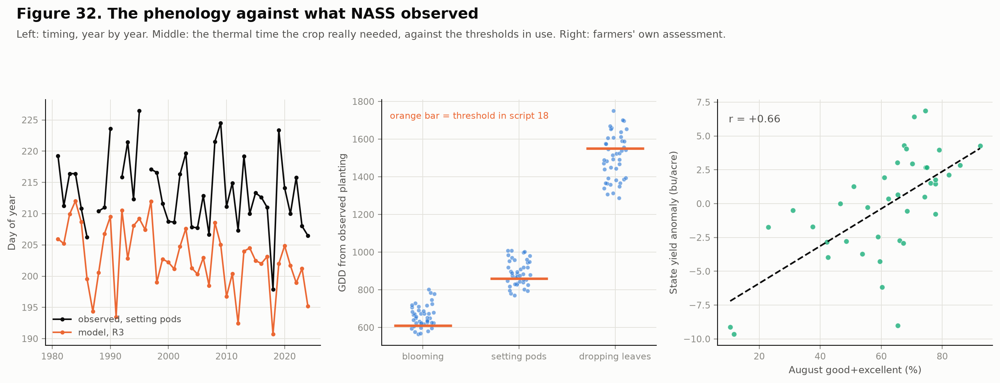
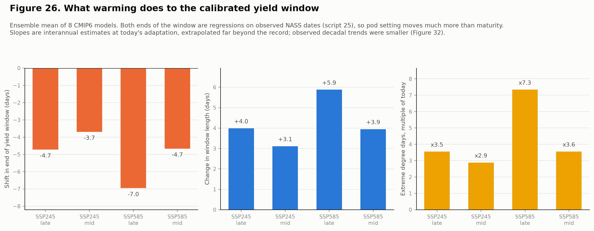
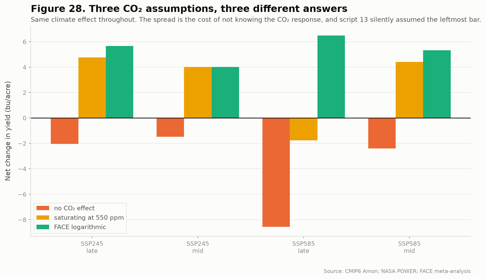
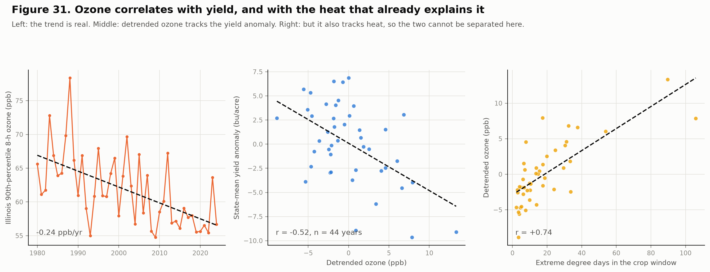

# Soybean Yield and Climate Variability in Illinois

**A county × year panel testing how growing-season heat and moisture relate to soybean yield, 1980 to 2025, with Champaign County as the focal unit.**


---

## The problem this study has to solve first

Illinois soybean yield rose from **33.5 bu/acre in 1980 to 62.5 in 2025**. Almost all of that is technology, roughly 0.65 bu/acre per year from cultivar improvement and agronomy.

That trend is an order of magnitude larger than any climate signal in the sample. Because temperature also trended over the same period, a model that leaves the trend in will credit warming with the genetics and **return a positive temperature coefficient**, predicting that a hotter Illinois yields more.

This pipeline removes the trend county by county, because county trends themselves span 0.290 to 0.846 bu/acre per year. Everything downstream targets the residual.

```
yield_anom = yield_bu_ac - (a_county + b_county * year)
```

---

## Four findings

### 1. Heat is nearly harmless when there is water

The temperature effect is **conditional on moisture, not additive with it**. Mean yield anomaly in bu/acre against county trend:

|          | Wet       | Dry       |
| -------- | --------- | --------- |
| **Cool** | **+1.44** | −1.17     |
| **Hot**  | **+1.45** | **−5.26** |

Hot-and-wet performs identically to cool-and-wet. Together, heat and drought cost roughly double what their separate effects predict.

The regression agrees. The marginal effect of temperature is:

| Moisture condition        | dYield / dTemperature |
| ------------------------- | --------------------- |
| Dry (10th pct, 4.3 in)    | **−0.887** bu/acre/°F |
| At sample means (7.7 in)  | −0.664                |
| Wet (90th pct, 11.4 in)   | **−0.429**            |

An additive model understates warming risk systematically.

### 2. Detrending doubles the signal

| Predictor                   | r vs detrended | r vs raw yield |
| --------------------------- | -------------- | -------------- |
| **Palmer Z-index, Jul-Aug** | **0.490**      | 0.311          |
| Jul-Aug precipitation       | 0.464          | 0.296          |
| August max temperature      | −0.469         | −0.286         |
| Palmer PDSI, August         | 0.349          | 0.243          |

Climate has no trend and yield does, so the trend acts as pure noise in the raw correlation.

The **Palmer Z-index outperforms both raw precipitation and PDSI**. It is the current-month moisture departure accounting for antecedent soil water. PDSI carries too much memory from months that no longer affect the crop.

### 3. Timing beats magnitude

June rainfall is worth nothing. August rainfall is worth everything.

| Month, precipitation | r with anomaly |
| -------------------- | -------------- |
| April                | −0.134         |
| May                  | −0.091         |
| June                 | 0.076          |
| July                 | 0.317          |
| **August**           | **0.342**      |
| September            | −0.020         |

The critical window is July and August, growth stages R3 through R6, pod set and seed fill. April is mildly negative because wet springs delay planting. September is noise; the crop is already made.

Aggregating over the full April-September season weakens the relationship to **0.177**. Choosing the wrong window destroys the signal.

The response is also nonlinear, with an interior optimum near **12.5 inches** over July-August and a decline beyond it. The drought penalty is roughly three times the wet-year bonus.


### 4. Vulnerability concentrates where the buffer is thinnest

County sensitivity to August moisture varies **more than sevenfold**, from 0.47 bu/acre per standard deviation in Mercer County to 3.60 in Clay County. The pattern tracks soil water-holding capacity rather than rainfall.

Two cross-sectional relationships sharpen the point:

- Structurally hotter counties respond more steeply to moisture, `r = +0.606`
- **Higher-yielding counties are less climate-exposed**, `r = −0.512`

Advantage compounds. The best ground both yields more and varies less. A single pooled climate coefficient averages a county where August moisture explains 48% of the variance with one where it explains 3%.

---

## Simulated warming and drying

**These are sensitivity experiments, not climate projections.** They apply uniform shifts to observed climate, use no CMIP6 or IPCC pattern, carry no probability information, and assume no agronomic adaptation, cultivar change, or planting-date shift. For scenarios grounded in named SSP pathways, see [CMIP6 scenario projections](#cmip6-scenario-projections) below; these uniform shifts are retained as a robustness check.

| Scenario                | Δ bu/acre | Δ %    | Counties down |
| ----------------------- | --------- | ------ | ------------- |
| +1 °C                   | −0.31     | −0.68  | 89 / 91       |
| −10% precipitation      | −0.27     | −0.59  | 88 / 91       |
| **+1 °C and −10%**      | **−0.73** | −1.62  | **91 / 91**   |
| +2 °C                   | −0.64     | −1.42  | 91 / 91       |
| +2 °C and −20%          | **−2.03** | −4.48  | 91 / 91       |

The combination exceeds the sum of its parts, which is finding 1 expressing itself again.


Losses concentrate in the southwest, where baseline yields are already the lowest in the state. The few counties showing small positive responses sit in the cool northeast, below the estimated temperature optimum.

---

## CMIP6 scenario projections

> **First-generation scenarios, superseded.** This section describes script `13`, which applied CMIP6 deltas to monthly aggregates with July and August fixed. It is kept for the extrapolation lesson it taught, that boosted trees return their smallest loss for the hottest scenario, and for the comparison it allows. The current projections are in [Scenarios on a calibrated yield window](#scenarios-on-a-calibrated-yield-window).

Scripts `12` and `13` replace the uniform shifts above with change factors taken from CMIP6 under named SSP pathways. Monthly means (`Amon`) for `tas`, `tasmax` and `pr` come from the AWS Open Data registry (`s3://cmip6-pds`, anonymous access) for **8 models**: ACCESS-ESM1-5, CanESM5, EC-Earth3, GFDL-ESM4, INM-CM5-0, MIROC6, MPI-ESM1-2-LR, MRI-ESM2-0.

Raw model output is never fed to the yield model — it carries systematic bias, and the yield model was fitted on nClimDiv scales. Instead each GCM's **change** between a 1985-2014 baseline and the target window is applied to the observed county record (additive for temperature, multiplicative for precipitation), bilinearly interpolated to all 102 county centroids, and every derived feature is rebuilt exactly as script `04` builds it.

### The result is bracketed, not pinned down

| Scenario | Horizon | Δ Tmax Jul-Aug | Beyond record | Boosted trees | Quadratic panel |
| -------- | ------- | -------------- | ------------- | ------------- | --------------- |
| SSP2-4.5 | 2040-69 | +2.54 °C       | 9%            | −0.30         | −2.06           |
| SSP2-4.5 | 2070-99 | +3.08 °C       | 13%           | −0.23         | −2.48           |
| SSP5-8.5 | 2040-69 | +3.04 °C       | 14%           | −0.22         | −2.58           |
| SSP5-8.5 | 2070-99 | **+5.44 °C**   | **49%**       | −0.17         | **−8.70**       |

Δ in bu/acre, ensemble median across the 8 models. "Beyond record" is the share of county-years whose July-August maximum temperature exceeds the hottest ever observed (95.0 °F).

**The two estimators disagree by a factor of thirty, and that gap is the honest answer.** Boosted trees win on in-sample skill, but a tree predicts a constant outside its training range: warm the record past 95 °F and the heat signal simply stops. Under SSP5-8.5 late-century, half the county-years sit there, which is why the tree estimate is *smallest* for the *hottest* scenario — an artefact, not a result. The quadratic panel specification extrapolates and restores the expected ordering, but assumes its fitted curve still holds far outside the observed range.

Read the quadratic column for the hot scenarios, the tree column for the near-term ones, and neither as a forecast.



### What these projections do not include

- **Palmer drought indices are held at observed values.** CMIP6 supplies no PDSI, and deriving it needs a water-balance model. Since `zndx08` is among the strongest predictors, drought-driven losses are understated.
- **`tas` stands in for the `tmin` delta**; `tasmin` was not retrieved.
- **Monthly means only**, so no change in within-month extremes, heatwave duration, or rainfall intensity.
- **One realisation per model**, so internal variability is not sampled.
- **No adaptation**: no cultivar change, no planting-date shift, no CO₂ fertilisation.

---

## Soil: where the good ground is

Scripts `14`-`16` add county soil properties from USDA-NRCS SSURGO, pulled through the public Soil Data Access service (no API key). 83,063 horizon records across 10,200 map units and all 102 counties are aggregated into 25 county features over two depth bands, 0-30 cm and 30-100 cm, weighted by horizon overlap, component percentage and map-unit acreage.

Soil answers three different questions with three very different answers, and reporting them separately matters.

| Question | What is explained | R2 |
| -------- | ----------------- | -- |
| Does soil explain the **level** of county yield? | County mean yield 1980-2025 | **0.82** |
| Does soil explain **climate sensitivity**? | Composite sensitivity index from script 09 | **0.55** |
| Does soil improve **prediction** of `yield_anom`? | Expanding-window RMSE, 2001-2025 | **+0.3%** |

**Soil explains 82% of the variance in county mean yield.** Mollisol share alone correlates at r = +0.81: each additional percentage point of prairie soil is worth about +0.26 bu/acre. Texture points the expected way too, since more clay *or* more sand at the expense of silt lowers yield, which is the silt loam optimum showing up in the coefficients.



**But soil barely improves the model, and that is arithmetic rather than disappointment.** The modelling target is `yield_anom`, the residual of each county's own linear trend, so its county mean is zero *by construction*. A static county attribute has almost no main effect left to explain, and the best soil feature ranks 16th of 45. The 0.3% gain is an interaction term earning its keep, nothing more.

The useful finding sits in the middle row. Soil explains **55%** of how sharply a county's yield responds to climate, and **51%** of its response to heat, where topsoil organic matter is the strongest single predictor. Soil does not tell you what this year's anomaly will be. It tells you which counties suffer most when one arrives, which is exactly what the CMIP6 scenarios above need.

**Irrigation, checked the same way (scripts `29`-`30`).** Illinois soybean is 98%+ rainfed statewide (NASS Census of Agriculture, 2017 and 2022 — the only two years it is published), but the small irrigated share concentrates on the Illinois River sand-plain counties, up to 43% of harvested acres in the highest one. Regressed against the script 09 sensitivity coefficients, more-irrigated counties respond significantly less to natural moisture variation (coefficient −0.26, p = 0.013, R² = 0.07 — small but the expected sign, and it survives restricting to the 59 counties whose irrigated-acreage figure was never Census-disclosure-suppressed). No relationship with heat sensitivity or the yield level. Not built into the CMIP6 scenarios, which apply one pooled moisture response to every county — a minor, one-directional overstatement of loss for the acreage that is irrigated today.

---

## The crop does not follow the calendar

Scripts `17`-`19` replace two assumptions the pipeline inherited without testing. Both break under a changed climate.

**July and August are not the critical window. R3 to R7 is**, pod set through the end of seed accumulation. Those stages fall in July and August in today's Illinois, which is why the fixed window worked, but a calendar window cannot move with the crop and it does not travel: July and August are winter in Brazil.

**Monthly means erase the extremes that do the damage.** Schlenker & Roberts (2009) show soybean yield rising with temperature to about 30 °C then falling steeply, with damage tracking the *distribution* of daily temperature. In a monthly dataset, an August averaging 30 °C with no day above 34 and one with five days at 38 are the same number.

Script `17` pulls daily NASA POWER for all 102 county centroids, 1981-2024, 1.64 million records. Script `18` derives degree days by single-sine integration (Snyder 1985), giving GDD(10,30) and EDD(>30) separately, plus vapour pressure deficit and a daily soil water balance driven by FAO-56 Penman-Monteith ET₀, with the bucket size taken from SSURGO. Everything is computable from temperature, dewpoint, precipitation and latitude, so the same code runs on Brazilian municipalities.

**How the window is defined turned out to matter more than anything else here, and the first two versions were wrong.** See the next section: it is now calibrated to the observed NASS record, not to remembered dates or to thermal-time maturity.

### Does it predict better? Mostly no

| Feature set | n | RMSE | R² | vs calendar |
| ----------- | - | ---- | -- | ----------- |
| Both | 38 | 4.857 | 0.279 | **+0.14%** |
| Calendar (script 08) | 20 | 4.863 | 0.277 | — |
| Process (script 18) | 18 | 5.273 | 0.150 | **−8.43%** |

Expanding window, rolling origin, 2001-2024, 2,082 test observations. The process features lose on their own and add almost nothing in combination.

They do supply the strongest single predictors. Correlation with the yield anomaly: hot days **−0.496**, season water-balance deficit **−0.496**, extreme degree days −0.487, peak VPD −0.471, against +0.467 for the best calendar variable. The season deficit read −0.566 under the earlier, uncalibrated window, so that figure belonged to a window that has since been replaced.

**This comparison is confounded and should not be read as settled.** The process features come from NASA POWER at roughly half a degree; the calendar features come from nClimDiv county polygons. Part of the gap is data source, not formulation. A clean test needs the calendar features rebuilt from POWER, which has not been done. The case for the phenological window was never hindcast accuracy. It is that it can represent a moving window and a threshold heat response, and the calendar version structurally cannot.



---

## Validated against observed crop progress

Script `23` pulls the actual weekly Illinois soybean progress and condition series from NASS Quick Stats (the key-free bulk file, 1.05 GB streamed and filtered from 23.9 million rows to 11,350). Scripts `24` and `25` test the phenology against it and calibrate it. **The series are state-level only**: the bulk file has no district or county progress. Planting runs from 1980, blooming, setting pods, leaf drop and harvest from 1981, condition from 1986.

### What the first check found

The thermal-time thresholds had been described as calibrated to NASS norms. They were not: the dates were written from memory and never downloaded, so the stage dates agreed with them by construction. Against the real series (mean day of year, 1981-2024):

| Stage | Written from memory | Observed | Error |
| ----- | ------------------- | -------- | ----- |
| Planted (50%) | 20 May | 21 May | −1.7 d |
| Blooming (50%) | 10 July | 16 July | **−6.4 d** |
| Setting pods (50%) | 28 July | 1 August | −4.6 d |
| Dropping leaves (50%) | ~20 Sept, called "maturity" | 19 Sept | +0.5 d |

NASS has no "maturity" or "full seed" stage. Leaf drop corresponds to roughly R7, and the "full seed, ~5 September" date had no source.

The thresholds themselves were within about 5% of the observed thermal requirement (GDD from each year's observed planting date: blooming **651**, setting pods **883**, leaf drop **1504**). The real problems were elsewhere:

- **Modelled planting ran 15.5 days early** and tracked real planting at r = 0.18, because farmers plant when fields are workable, not when a running temperature mean crosses a threshold. R1 and R3 ran 12 and 10 days early. An earlier assessment that these dates were "close to Illinois norms" was wrong.
- **Thermal time predicts late-season timing worse than the average date.** Given observed planting, it predicts flowering (r = 0.86, RMSE 4.1 days) and pod set (r = 0.83, RMSE 4.6) well, but leaf drop with an RMSE of **19.5 days against an observed sd of 4.8**, a skill of −305% against guessing the mean. Soybean is a photoperiod-sensitive short-day plant, so maturity is set partly by day length, which a thermal-time model lacks. That is agronomic background rather than something tested here, but it fits the data.
- **The observed window barely varies.** The interval from pod setting to leaf drop averages 49.1 days with a standard deviation of **3.5 days** and a minimum of 40.3.

### What was changed (script 25)

- **Planting** is anchored to the observed mean: a 19 °C seven-day-mean threshold gives a bias of −1.4 days where the old 15 °C planted 15.5 days early. Year-to-year skill also improved (r = 0.45 against 0.26). A 19 °C running mean is a statistical device, not a physiological threshold.
- **R1, R3 and R7 thresholds** are the observed medians above, not remembered numbers.
- **Both ends of the yield window** are regressions on the observed pod-setting and leaf-drop dates, moved by a county-relative driver anomaly. Thermal-time R7 was tried first and abandoned: under the corrected, later planting it was never reached in **614 of 4,004 county-years (15.3%)**, concentrated in a few cool counties (8 of 91 reached it in under half of years), and dropping them was not random. It skewed the surviving planting mean four days early. Thermal R3 as the window start was also abandoned, because a single statewide GDD threshold put it as late as day 285 in cool county-years (Cook, Boone, Stephenson and Winnebago in 1992, 2009 and 1994 among them), leaving windows of 2 to 8 days.

Four always-defined drivers were compared for predicting observed leaf drop, leave-one-out over 44 years:

| Driver | RMSE (days) | Skill vs the mean date |
| ------ | ----------- | ---------------------- |
| Climatology (the mean, every year) | 5.42 | −2% |
| Thermal R7 anomaly (imputed) | 4.72 | 11% |
| **Thermal R3 anomaly** (default) | 4.77 | 10% |
| GDD planting to day 250 | 4.77 | 10% |
| **GDD 1 May to 15 Sept** (alternative) | 4.71 | 11% |

Every driver beats the plain average by about the same modest margin, so **the record cannot choose between them**. They extrapolate differently, so the scenarios run two.

### What the record says about the window's length

Both drivers agree on the sign, and it is the opposite of what the earlier version reported. Warm seasons advance pod setting *more* than they advance maturity, so the window gets slightly **longer**, not shorter:

| Driver | Pod-set slope | Leaf-drop slope | Window-length slope | Out-of-sample skill |
| ------ | ------------- | --------------- | ------------------- | ------------------- |
| R3 anomaly (days) | +0.49 ± 0.09 | +0.27 ± 0.09 | **−0.22 ± 0.06**, p < 0.001 | 10% |
| GDD 1 May-15 Sept | −0.030 ± 0.007 | −0.021 ± 0.006 | **+0.0097 ± 0.0049**, p = 0.055 | **0%** |

Read this as small and weakly supported. Only the R3 driver has real out-of-sample skill for window length, and the GDD driver adds none. The earlier finding that warming shortens seed fill came from thermal-time maturity, which the record rejects.

### Where it stands after recalibration

| Observed | Model | Bias | RMSE | Year-to-year r | Trend, observed | Trend, model | Gap |
| -------- | ----- | ---- | ---- | -------------- | --------------- | ------------ | --- |
| Planted | temperature rule | −1.4 d | 9.6 d | 0.45 | −1.69 ± 1.15 | −2.24 | 0.4 SE |
| Blooming | thermal R1 | −1.6 d | 6.4 d | 0.62 | −0.54 ± 0.87 | **−3.17** | **2.3 SE** |
| Setting pods | thermal R3 | −0.8 d | 6.0 d | 0.66 | −0.98 ± 0.72 | **−3.53** | **2.3 SE** |
| Setting pods | window start* | 0.0 d | 4.4 d | 0.66 | −0.98 ± 0.72 | −1.73 | 0.9 SE |
| Leaf drop | window end* | 0.0 d | 4.6 d | 0.49 | +0.61 ± 0.64 | −0.78 | **2.1 SE** |

Trends in days per decade, 1981-2024. *Fitted to these same observations, so bias and RMSE are in-sample and agreement on mean dates is by construction. What is not by construction is the year-to-year correlation and the trends.

**The planting trend is reproduced without being fitted**, which is a real check. **The flowering and pod-set trends are not**: the model advances them about 2.3 standard errors faster than observed, and even the empirical window end trends earlier (−0.8) where leaf drop actually moved slightly later (+0.6 ± 0.6). Interannual slopes overstate the response over decades. The real system adapted through planting date and variety across the record, and a fixed rule contains none of that.



**Farmers' assessment corroborates the stress variables.** August "good + excellent" ratings, 39 years: **+0.66** with the state yield anomaly, **−0.69** with extreme degree days, **+0.51** with minimum soil water fraction, **+0.28** with window precipitation. The precipitation correlation fell from +0.51 when the window was recalibrated, and is now the weakest of the four.

### Still unresolved

- **County level is unvalidated.** NASS publishes nothing finer, and the county-relative anomalies mean every county's average window sits on the same dates, which is surely wrong for a state spanning three degrees of latitude.
- **The trend overstatement above**, which the scenarios inherit.
- **R5, R6 and R8 have no NASS counterpart** and remain unvalidated; they survive only for script `21`.

---

## Scenarios on a calibrated yield window

Script `20` reruns the CMIP6 scenarios on the daily record and recomputes the whole phenology through the same `_pheno` module script `18` uses on observed weather. Scenario windows are measured against the *observed-climate* baseline, otherwise warming would cancel itself out of the anomaly.

### What warming does to the calendar

| Scenario | Horizon | Δ Tmax Jul-Aug | Planting | R3 | Window end | Window length | Extreme degree days | Beyond record |
| -------- | ------- | -------------- | -------- | -- | ---------- | ------------- | ------------------- | ------------- |
| SSP2-4.5 | 2040-69 | +2.54 °C | −7.7 d | −13.8 d | −3.7 d | +3.1 d | ×2.9 | 9% |
| SSP2-4.5 | 2070-99 | +3.08 °C | −10.2 d | −17.7 d | −4.7 d | +4.0 d | ×3.5 | 13% |
| SSP5-8.5 | 2040-69 | +3.04 °C | −10.2 d | −17.5 d | −4.7 d | +3.9 d | ×3.6 | 14% |
| SSP5-8.5 | 2070-99 | +5.44 °C | −14.6 d | −26.1 d | −7.0 d | +5.9 d | **×7.3** | **49%** |

Pod setting advances up to 26 days, maturity up to 7, so the window lengthens by 3 to 6 days and accumulates more hot days. The alternative GDD driver moves the window end further (−5.6 to −11.6 days) and the length by nearly the same amount (+2.7 to +5.5).



### The climate effect is larger than earlier versions, and the range is enormous

Schlenker-Roberts specification, EDD entering linearly, water balance included. Fitted coefficients, now identified from real variation: **−0.116 bu/acre per degree-day above 30 °C**, +4.24 per unit of soil water fraction, +0.010 per GDD. R² = 0.336, n = 3,902.

| Scenario | Horizon | Median, r3 driver | Range across 8 models | Median, GDD driver | Boosted trees |
| -------- | ------- | ----------------- | --------------------- | ------------------ | ------------- |
| SSP2-4.5 | 2040-69 | −1.48 | −8.17 to −0.48 | −1.38 | +0.34 |
| SSP2-4.5 | 2070-99 | −2.04 | −8.91 to −0.94 | −1.95 | +0.79 |
| SSP5-8.5 | 2040-69 | −2.39 | −10.40 to −0.71 | −2.25 | +0.84 |
| SSP5-8.5 | 2070-99 | **−8.56** | **−24.89 to −6.07** | −7.99 | −0.36 |

Bu/acre. **Do not quote the median alone.** Under SSP5-8.5 late-century the eight models span a fourfold range, and CanESM5's −24.9 comes with extreme degree days at ×12.7 today's level, far outside anything in the 1981-2024 record (49% of county-years exceed the observed maximum). The two window drivers give medians within 0.6 bu/acre of each other everywhere, so **the choice that the record could not make does not matter for yield**. The boosted trees still saturate out of range and move little, as before.

**This is larger than the previous version** (−1.3 to −4.7), and the reason is the finding above: with the window no longer shortening, warming buys more hot days inside it.

**Two corrections to earlier versions.** The earlier `season_gdd` coefficient (+0.0335, p = 0.038) was fitted to daily-discretisation noise. Under the thermal end rule `season_gdd` had a standard deviation of **4.25 GDD** around 1,396 and 97.8% of values sat within ±15 of the R6 threshold, because season length was defined by that threshold. It was constant by construction. It now has a standard deviation of 201 GDD. And the earlier EDD coefficients (−0.084, later −0.077) are superseded by −0.116.

### CO₂ still changes the sign

| Scenario | Horizon | Climate | No CO₂ | Saturating | FACE |
| -------- | ------- | ------- | ------ | ---------- | ---- |
| SSP2-4.5 | 2040-69 | −1.48 | −1.48 | +4.02 | +4.02 |
| SSP2-4.5 | 2070-99 | −2.04 | −2.04 | +4.76 | +5.67 |
| SSP5-8.5 | 2040-69 | −2.39 | −2.39 | +4.41 | +5.32 |
| SSP5-8.5 | 2070-99 | **−8.56** | **−8.56** | **−1.76** | **+6.50** |



Under SSP5-8.5 late-century the answer runs from −8.6 to +6.5 depending on the CO₂ assumption alone, and the saturating variant, the more defensible non-zero option because the FACE curve is extrapolated to 890 ppm far beyond its data, now gives a **net loss**. Whether climate change is bad for Illinois soybean cannot be answered from this pipeline without committing to a CO₂ response, and it does not know one.

### What these scenarios still do not include

- **Adaptation.** The observed record shows earlier planting and no advance in maturity, so adaptation is already in the data. The window slopes are interannual estimates at today's level of adaptation, extrapolated far beyond it, and the model's flowering and pod-set trends already overshoot observation by 2.3 standard errors. **The losses above are probably too large for that reason.**
- **Extrapolation of EDD.** Up to half of county-years in the hottest scenario lie beyond the observed maximum, where the linear EDD term is an assumption, not a measurement.
- **The CO₂ response is a flat multiplier**, though FACE shows it shrinks under heat and interacts with drought. CO₂ concentrations are round numbers, not the published CMIP6 series.
- **Ozone**, whose confounding with heat cannot be separated here (see below).
- **Dewpoint** is rebuilt from projected relative humidity, and a monthly precipitation ratio cannot change wet-day frequency.

---

## Adaptation: what the grower can do, and what this model cannot say

Every scenario assumes a grower changes nothing. Script `21` asks what a longer maturity group does, and runs into the limit of the whole approach.

> **Caveat, read first.** Every phenological number here comes from thermal-time *maturity*, which the validation above shows to be unreliable for late-season timing, and this script deliberately keeps that rule because its frost arithmetic needs a thermal-time R8. Its conclusions inherit that weakness. It also runs on the corrected planting, about two weeks later than the version first reported.

### Frost stops being the constraint under warming

| Climate | Longest viable MG | Frost margin at MG 3.5 | Mature before frost at MG 3.5 | Seed fill at MG 3.5 | at longest |
| ------- | ----------------- | ---------------------- | ----------------------------- | ------------------- | ---------- |
| Today | **2.5** | 45 d | 84% | 24.5 d | 21.4 d |
| SSP2-4.5 mid | ≥5.0 | 74 d | 99% | 19.4 d | 22.4 d |
| SSP2-4.5 late | ≥5.0 | 81 d | 100% | 18.8 d | 21.3 d |
| SSP5-8.5 mid | ≥5.0 | 81 d | 100% | 18.6 d | 21.1 d |
| SSP5-8.5 late | ≥5.0 | 107 d | 99% | 17.0 d | 19.0 d |

"Longest viable" is the longest group maturing before the killing frost in 90% of years; 5.0 is censored at the top of the tested range. The qualitative conclusion holds: under any scenario frost stops binding and even MG 5.0 matures almost every year.

**A result I reported earlier does not survive.** With the corrected planting the frost constraint binds at **MG 2.5** today, not 3.5. The earlier claim that it "lands on what Illinois growers actually plant" was presented as a coherence check, but the figure for what growers plant was never sourced, and the check is gone. It should not be cited.

### Why no maturity group is recommended, and a correction to why

Predicted yield across MG 2.0 to 5.0 at today's climate is now nearly flat: **+0.08, +0.04, +0.02, −0.04, −0.08, −0.13, −0.24**. It used to rise a clean +1.7 per half group. Both were artefacts of the same defect: under the thermal end rule the season length is *defined* by the R6 threshold, so `season_gdd` is constant by construction (sd 4.25 GDD). The coefficient was fitted to noise, and the earlier explanation, that the coefficient is identified from seasons varying at one maturity group, was wrong. The variable barely varied at all.

The conclusion stands and is stronger: **no maturity-group optimum can be obtained from this regression.** The phenological consequences of a variety choice are computable. Converting them to a yield optimum needs a model carrying yield potential, which is the argument Peng et al. (2020) make for process-based crop models.

---

## Checked against the literature

The analysis was audited against published work rather than recollection. Four things held; three needed changing.

**Held.** The 30 °C soybean threshold is Schlenker & Roberts' own figure (29 °C maize, 30 °C soybean, 32 °C cotton), and they build degree days from the within-day temperature distribution, which the single-sine integration approximates. The CO₂ curve turned out better calibrated than claimed: it was fitted to one point (+15% at 550 ppm) but SoyFACE measured 2.5 kg/ha/ppm from 373→550 ppm, ≈ +15% on Illinois yields, and Ainsworth's meta-analysis gives +24% at 689 ppm against the curve's +23.5%. And Lobell's group attributes warming loss *mainly to a shortened growing season* — the mechanism scripts `18` and `20` implement and script `13` structurally could not.

**Changed: humidity was being assumed away.** At 2 °C warming the loss attributable to the associated VPD rise (12.9 ± 1.8%) exceeds the loss from warming itself (8.5 ± 1.4%), and CMIP6 projects relative humidity *declining* over North America. Script `12` now pulls `hurs`; July–August RH falls **2.8 to 5.4 percentage points**. Dewpoint is rebuilt from the projected humidity against the warmed temperature range, instead of being shifted with temperature.

**Changed: ET₀ could not see humidity.** The water balance used Hargreaves, which is temperature-only — so even with humidity projected, nothing downstream responded. It is now FAO-56 Penman–Monteith. A Champaign July gives 4.66 mm/day, and a 5-point RH drop raises ET₀ 3.6% where Hargreaves moves 0.0%.

**Changed: the water balance was missing from the specification.** The first attempt at the humidity fix returned a climate effect *identical to four decimals*, because `season_gdd + season_edd + precipitation` reads no water balance at all. The circuit was open. `wb_min_water_frac` now closes it.

### VPD was tried as a regressor and rejected

Entered alongside EDD it takes a **positive** coefficient, +7.05 bu/acre per kPa — backwards. VPD and EDD correlate at **+0.912** and are not separable. The better-fitting `wb_season_deficit_mm` was rejected for a related reason: it correlates +0.789 with EDD and drives the EDD coefficient from −0.084 to −0.018, absorbing the heat channel it should sit beside. `wb_min_water_frac` is bounded on [0,1], correlates −0.484, and leaves EDD at −0.077 with every sign physiological.

### The correction made losses smaller, not larger

> **Superseded.** This table describes the state of the pipeline after the humidity correction but before the phenology was validated and recalibrated against NASS. The current scenario numbers are in [Scenarios on a calibrated yield window](#scenarios-on-a-calibrated-yield-window); the SSP5-8.5 late-century parametric estimate is now −8.56 bu/acre.

| Scenario | Horizon | SR before | SR after | GBM before | GBM after |
| -------- | ------- | --------- | -------- | ---------- | --------- |
| SSP2-4.5 | 2040-69 | −1.54 | −1.26 | −0.33 | −0.42 |
| SSP2-4.5 | 2070-99 | −1.93 | −1.58 | −0.39 | −0.49 |
| SSP5-8.5 | 2040-69 | −2.07 | −1.75 | −0.13 | −0.20 |
| SSP5-8.5 | 2070-99 | **−5.28** | **−4.69** | −0.41 | **−1.36** |

This was the opposite of the prediction. Opening the dominant damage channel was expected to deepen the losses; instead the parametric estimate lightened by 0.3-0.6 bu/acre, because splitting damage into heat *and* water reassigns some of what EDD had been absorbing alone. The boosted trees, which read the water-balance features directly, moved the other way and more than tripled their SSP5-8.5 loss.

Both are honest readings of the same correction. The SR figure is the one to quote, and it is now built on a specification where humidity reaches yield through evaporative demand rather than through a collinear regressor.

### Still missing after the audit

- **Ozone.** Current Midwest soybean yields are suppressed roughly **10%** by tropospheric O₃. At SoyFACE, elevated O₃ cost 10 ± 11% at 370 ppm CO₂ but only 5 ± 4% at 550 ppm — elevated CO₂ partly *protects* by closing stomata. So the observed yields fitted here already embed ozone damage, and part of the measured FACE "CO₂ benefit" is ozone protection rather than fertilisation. Treating it as pure fertilisation on top of unchanged ozone risks double counting.
- **CO₂ × water.** The crop-modelling literature finds CO₂ fertilisation insufficient to overcome moisture limitation. The flat multiplier here applies the full benefit in the driest scenarios, which is where it should be smallest.

---

## Ozone: it survives detrending, and still cannot be separated

Script `22` asks of ozone the question that ended the soil work. Soil was absorbed by the county trend because a static attribute cannot explain a target whose county mean is zero. Ozone has the mirror risk: US ozone fell after 1980, so a trend is absorbed too, and what is left is year-to-year variation, which hot stagnant summers drive. It may only restate the heat signal.

Data is EPA AirData, 45 years (1980-2024), Illinois 8-hour ozone, 102-144 monitors covering 18-23 of 102 counties.

**It does survive detrending, unlike soil.** The trend explains only 34-38% of the peak metrics and essentially none of the annual mean, so a residual standard deviation of 4-6 ppb remains. Detrended, the correlation with the yield anomaly *strengthens* rather than vanishing.

| Metric | Trend explains | Detrended r with yield anomaly (44 years) |
| ------ | -------------- | ------------------------------------------ |
| 4th-highest 8-h value | 38% | −0.41 |
| 90th-percentile 8-h value | 34% | **−0.52** |
| Annual mean | 0.2% | −0.48 |

**But it is not separable from heat and water.** Detrended ozone correlates **+0.62 to +0.74** with extreme degree days and **−0.46 to −0.57** with the water balance, which is unsurprising, since hot dry stagnant summers produce both. Added to the specification it contributes almost nothing.

| Metric | Coefficient, bu/acre per ppb | p | Effect of 1 sd | ΔR² |
| ------ | ---------------------------- | - | -------------- | --- |
| 4th-highest | −0.046 | 0.64 | −0.28 | +0.002 |
| 90th percentile | −0.156 | 0.24 | −0.68 | +0.008 |
| Annual mean | −0.139 | 0.57 | −0.34 | +0.002 |

A year-level regression with no county replication, 44 observations, gives coefficients of +0.003 to −0.076 with p between 0.67 and 0.98.



### A null here does not mean ozone does nothing

The detectable-effect floor is about **0.21 bu/acre per ppb**. The literature implies roughly **0.13 to 0.38**, from two rough anchors: a 10% suppression over 25-35 ppb above background, and SoyFACE's +25% ozone treatment costing 10 ± 11%, which is itself consistent with zero. The range straddles the floor, so this design cannot tell "ozone does nothing" from "ozone does what the literature says".

Read the sign and the scale as consistent with the literature and the significance as inconclusive.

### What it means for the projections

Ozone is **not built into script 20**, because there is no independent coefficient to put there. The consequence runs the other way. Because ozone tracks heat and drought, part of what the fitted **EDD and water coefficients** measure may be ozone damage. If ozone concentrations in a warmer future do not scale with heat as they did historically, extrapolating those coefficients would misattribute the loss. This is a hypothesis this data cannot test, and it applies equally to the FACE CO₂ benefit, whose ozone-protection component cannot be separated from fertilisation here.

Two things would settle it: county-varying, growing-season ozone exposure (AOT40 or W126, from the hourly EPA files, roughly ten times heavier than the annual summaries used here), and an ozone-explicit process crop model.

**Limits of this screen.** Annual metrics rather than growing-season exposure; monitors urban-biased and covering under a quarter of counties; the honest sample size is 44 years, not the 3,779 county-years.

---

## County-level validation, as far as the data allow

**County-level validation of the phenology is not possible.** NASS publishes Illinois soybean progress at state level only, so the county dimension of the yield window rests on an assumption nothing here can confirm: every county's window sits on the same dates, with only year-to-year anomalies varying by county. Everything downstream of the phenology can be checked against county yields, and script 26 does that (tables 35 to 38, figure 33).

- **Transfer to unseen districts: no measurable loss.** Each crop-reporting district is predicted from a model trained on the other eight and only earlier years. Calendar model RMSE 4.863 against 4.864; process model +1.0%; per district −1.9% to +2.2%. Adjacent districts share weather, and nine units is few.
- **A small north-south residual.** County-mean residuals fall with latitude (−0.14 bu/acre per degree, r = −0.40), about 0.8 bu/acre across the state against an RMSE near 5.
- **The uniform-window assumption cannot be discriminated by yield.** Retaining the north-south gradient improves RMSE by 1.4%, but it wins in only 14 of 24 test years and the paired bootstrap interval (−4.6% to +1.5%) includes zero. Neither confirmed nor refuted.
- **The heat penalty does not differ by latitude** (pooled test, Wald p = 0.35), which supports the single pooled coefficient the scenarios use. Separately fitted terciles suggested otherwise and overstated it.

The full write-up, with the Word version, is in [`results/FINAL_REPORT.md`](results/FINAL_REPORT.md) (version 2.0) and [`results/Illinois_Soybean_Climate_Report.docx`](results/Illinois_Soybean_Climate_Report.docx). Both are generated by `scripts/27_build_reports.py` from the results files, so they cannot drift from the analysis again. The original v1.0 report is kept unchanged in `results/archive/`. The Word file was validated against the OOXML schema, but its page layout has not been viewed.

---

## Does climate actually predict?

Validation is strictly temporal. **No random splits anywhere.** They fail twice over here: they admit future information, and because counties within a year share weather, they place near-duplicates of test rows into training.

- **Fixed split**: train 1980-2013, validate 2014-2018, test 2019-2025
- **Expanding window**: rolling origin, one test year at a time, 2001-2025, 2,317 test observations

The comparison that matters is not algorithm versus algorithm. It is a **trend-only baseline against models that see climate**.

| Model                    | RMSE      | MAE   | R²        | Skill vs baseline |
| ------------------------ | --------- | ----- | --------- | ----------------- |
| **Gradient Boosting**    | **4.844** | 3.680 | **0.284** | **+15.7%**        |
| HistGBM                  | 4.870     | 3.706 | 0.276     | +15.3%            |
| Random Forest            | 4.895     | 3.723 | 0.269     | +14.8%            |
| Linear Regression        | 5.090     | 3.892 | 0.209     | +11.5%            |
| Ridge                    | 5.095     | 3.896 | 0.208     | +11.4%            |
| Baseline: trend only     | 5.748     | 4.424 | −0.008    | 0.0               |

Climate wins by **15.7%**, which establishes that it carries real predictive content.

But gradient boosting beats ridge regression by only **4.9%**. Most of the available signal is linear once the quadratic and the interaction are specified. That is the honest headline, stated before a reviewer asks.

---

## What this study cannot answer

### 2003 defeats the climate model

Decomposing predictions by year: 1988 is explained to **88%**, 2012 to **41%**, and 2003 to only **15%**. At **−3.43 bu/acre**, 2003 is the **largest unexplained shortfall of all 46 years, rank 1 of 46**.

Statewide August PDSI in 2003 was slightly positive and rainfall near normal, yet yield fell 8.5 bu/acre below trend. 2003 contributed 14 of the 39 observations exceeding three standard deviations in the entire panel.

**The obvious hypothesis fails its test.** 2003 was a documented severe soybean aphid outbreak year in the North Central region, with populations exceeding 1,000 per plant and 40% yield loss recorded at those densities ([Ragsdale et al., *J. Integr. Pest Manag.* 2012](https://academic.oup.com/jipm/article/3/1/E1/808601)). The aphid overwinters on buckthorn, which is concentrated **north of 41°N** ([Tilmon et al., *J. Integr. Pest Manag.* 2011](https://academic.oup.com/jipm/article/2/2/A1/860557)). Illinois straddles that line, which makes the hypothesis falsifiable. It does not survive:

| Test | Result | Verdict |
| --- | --- | --- |
| Raw 2003 anomaly vs county latitude | r = **−0.775** | Strong northern concentration |
| **Residual** after climate is removed vs latitude | r = **−0.124** | Gradient is climate, not residual |
| 2003 rank by \|r(lat, residual)\| | **33 of 46** | Unremarkable |
| North (≥41°N) minus South residual gap, 2003 | **+1.72** | **Wrong sign.** North did better |
| Same raw gradient in 1988, before the aphid existed in North America | r = −0.655 | Not diagnostic |
| Aphid-era shift in N-S residual gap, pre vs post 2000 | t = 0.205, **p = 0.84** | No effect |

The northern concentration in 2003 is real but **fully accounted for by climate**: northwestern Illinois had a genuine August moisture deficit that year. What remains unexplained is spatially uniform, which is the opposite of what a northern-origin pest would produce.

So the finding is narrower and sharper than a pest attribution: **2003 is the largest unexplained shortfall in the record, and the most plausible explanation does not fit its geography.** The cause remains open. Test details in [`results/table10_aphid_hypothesis_test.csv`](results/table10_aphid_hypothesis_test.csv) and [`results/12_aphid_hypothesis_test.json`](results/12_aphid_hypothesis_test.json).

### Other limitations

- **Monthly resolution cannot resolve frost or daily extremes.** The coldest monthly mean minimum in the record is 32.3 °F. No degree-days above a threshold, no dry-spell length, no rainfall intensity, no vapour pressure deficit. This is the largest methodological gap. gridMET 4 km daily is the upgrade path.
- **County coverage collapses after 2018**, from 102 counties reporting to 62, and survival is not random. The recent panel skews toward large producers exactly where out-of-sample validation happens.
- **Planting date is missing**, and 2019 shows why. It is the one year where adding climate makes predictions *worse*, because the rain arrived in spring and delayed planting in a way seasonal aggregates cannot see.
- **No causal identification.** Fixed effects absorb time-invariant county traits and statewide annual shocks, not county-specific time-varying confounders such as drainage, cultivar turnover, pest pressure, or land-use change.

The correct statement of the result is therefore: higher July-August temperatures and lower July-August moisture were **statistically associated** with lower yield after controlling for county and year fixed effects, robustly across thirteen specifications. Not: temperature caused yield to decline.

---

## Champaign County

| Metric                              | Champaign | State panel |
| ----------------------------------- | --------- | ----------- |
| Mean yield, 2015-2025               | 64.3      | 58.7        |
| Technology trend, bu/acre/yr        | 0.660     | 0.627       |
| Moisture sensitivity, bu/acre per SD| 1.740     | 0.47 - 3.60 |
| Sensitivity rank                    | 53 / 91   | —           |
| **Simulated Δ under +1 °C, −10%**   | **−0.24** | −0.73       |

High-yielding, near-median sensitivity, and **less exposed than the state average** under every perturbation. Champaign has 44 observations, 1980 to 2023; it was suppressed out of the 2024 and 2025 county data. Its worst recorded year is 2003 at 13.99 bu/acre below trend, the year the climate model cannot explain.

---

## Data and verification

| Source | Access | Retrieved |
| --- | --- | --- |
| USDA NASS Quick Stats | Query-tool CSV export, **no API key** | 2026-08-31 |
| NOAA NCEI nClimDiv | `ncei.noaa.gov/pub/data/cirs/climdiv/`, `*cy-v1.0.0-20260806` | 2026-08-31 |

Both are United States federal works in the public domain.

| Verification | Result |
| --- | --- |
| County sums vs published state totals, 46 years, 3 measures | **Exact, 0.000% error** |
| `production_bu / acres_harvested == yield_bu_ac` | 4,459 of 4,459, max residual 0.25 |
| `acres_harvested <= acres_planted` | No violations |
| Duplicate county-year keys | 0 |
| Climate join completeness | 4,459 of 4,459, zero nulls |
| Independent cross-check vs external NASS query | 21 of 21 values match |

The first check matters more than it sounds. Internal consistency tests pass even on a file that has silently lost rows, and an earlier build of this panel had done exactly that. **Only reconciliation against an independently published aggregate catches it.**

---

## Four traps this pipeline handles

1. **NASS publishes its suppressed-county bucket once per Agricultural Statistics District, not once per state.** In 2019 there are nine, all with a blank county ANSI. The raw key is `county_ansi + ag_district_code + year`. Keying on county and year alone silently collapses up to nine rows per year.
2. **Read `county_ansi` as text.** Integer casting turns `001` into `1` and drops Adams County from every join.
3. **Join on FIPS, never on name.** NASS writes `DU PAGE`, `ST CLAIR`, `JO DAVIESS`; Census writes `DuPage`, `St. Clair`, `Jo Daviess`.
4. **Never sum county rows to a state total after 2018.** 2025 county sums give 6.30M planted acres against an actual 10.30M. Use `data/raw/nass_il_state_totals.csv`.

---

## Quick start

```bash
pip install -r requirements.txt
cd scripts

python 01_download_production.py     # provenance + staging check
python 02_clean_production.py        # -> data/processed/production_clean.csv
python 03_download_climate.py        # provenance + staging check
python 04_process_climate.py         # -> data/processed/climate_features.csv
python 05_merge_data.py              # -> data/final/soybean_illinois_climate_1980_2025.csv
python 06_eda.py                     # figures 1-9,  tables 1-3
python 07_statistical_models.py      # tables 4, 4b
python 08_machine_learning.py        # figures 10-12, tables 5-6
python 09_sensitivity_analysis.py    # figures 13-16, tables 7, 8a, 8b
python 10_generate_results.py        # figures 17-18, manifest, column profile
python 11_robustness.py              # table 9
```

That reproduces the original study in a few minutes. Random seed fixed at 42 in `00_config.py`. The extensions add public downloads, which are the slow part and need a network connection; none needs an API key:

```bash
python 12_cmip6_deltas.py            # CMIP6 deltas, AWS Open Data (~20 min)
python 13_cmip6_scenarios.py         # first-generation scenarios (superseded by 20)
python 14_download_soil.py           # SSURGO via Soil Data Access (~3 min)
python 15_soil_features.py
python 16_soil_models.py
python 17_download_daily_weather.py  # NASA POWER daily, 102 counties (~3.5 min)
python 23_download_crop_progress.py  # NASS bulk file, 1.05 GB streamed (~6 min)
python 24_validate_phenology.py      # first pass: checks the phenology against NASS
python 25_calibrate_phenology.py     # planting anchor and window calibration
python 18_phenology_features.py      # phenology, VPD, water balance
python 24_validate_phenology.py      # second pass: against the recalibrated model
python 19_phenology_vs_calendar.py
python 20_cmip6_phenology_scenarios.py                 # default window driver
END_DRIVER=gdd python 20_cmip6_phenology_scenarios.py  # sensitivity, no figures
python 21_adaptation.py
python 22_ozone_screen.py            # EPA AirData, 45 annual files (~20 min)
python 26_county_validation.py       # district holdout, window test, heat by latitude
python 29_download_irrigation.py     # NASS Census of Agriculture, county irrigated acreage
python 30_irrigation_models.py       # irrigation vs climate sensitivity
python 27_build_reports.py           # FINAL_REPORT.md and the Word report (run last)
python 28_ipcc_style_summary.py      # standalone fig34, AR6 SPM-style scenario summary
```

**Order matters and is slightly circular.** Script `24` reads observed data to produce the thermal requirements script `25` needs, and reads the modelled phenology from script `18` for its comparisons, so it runs once before calibration and once after. Script `25` checks that the constants in `scripts/_pheno.py` agree with what it recomputes, and reports a mismatch if they have drifted.

---

## Project structure

```
soybean_climate_illinois/
├── data/
│   ├── raw/          NASS export, nClimDiv extracts, state totals, county boundaries
│   ├── processed/    production_clean.csv, climate_features.csv
│   └── final/        soybean_illinois_climate_1980_2025.csv   <- ANALYTICAL PANEL
├── scripts/          00_config.py, _cfg.py, _viz.py, _pheno.py, _mdocx.py, 01..30
├── figures/          fig01 .. fig34 (PNG, 200/300 dpi)
├── models/           regenerable, gitignored
├── results/          FINAL_REPORT.md (v2.0), Illinois_Soybean_Climate_Report.docx, archive/ (v1.0),
│                     DATA_DICTIONARY.md, table1..table40b, provenance JSON
└── README.md
```

**Start here:**

| File | What it is |
| --- | --- |
| [`results/FINAL_REPORT.md`](results/FINAL_REPORT.md) | The paper. Abstract through conclusions |
| [`results/DATA_DICTIONARY.md`](results/DATA_DICTIONARY.md) | Every column, unit, range, derivation |
| [`data/final/soybean_illinois_climate_1980_2025.csv`](data/final/) | The analytical panel, 4,459 rows × 90 columns |
| [`results/table7_county_climate_sensitivity.csv`](results/) | County dimension table: identity, coverage, trend, sensitivity |

---

## Methodology in brief

**Growing season.** April-September, planting through maturity.
**Critical window.** July-August, R3-R6, pod set and seed fill. Chosen agronomically and fixed before modelling, then supported empirically by finding 3.

**Inclusion rule.** Counties with at least 42 of 46 years. 91 counties, 4,051 rows. Fixed before modelling, not tuned on results.

**Panel.** Standard errors clustered on county throughout. Seven specifications escalating to two-way county and year fixed effects.

**Robustness.** Thirteen specifications. The temperature effect is negative and significant at 5% in **all thirteen**, with magnitude stable between −0.52 and −0.70. Dropping 1988, 2003 and 2012 halves it to −0.334, which is expected for a nonlinear damage function and reported as such.

---

## Design lineage

This is a structural translation of a Brazil state-level IBGE + ERA5 study design:

| Brazil design | This pipeline |
| --- | --- |
| IBGE production, state × year, 1974-2023 | USDA NASS, county × year, 1980-2025 |
| 27 states | 102 counties, 91 in balanced panel |
| ERA5 reanalysis, gridded t2m + tp | NOAA NCEI nClimDiv, county monthly |
| State boundaries | Census county FIPS + NASS Ag Districts |
| State + year fixed effects | County + year fixed effects |
| State climate-sensitivity ranking | County climate-sensitivity ranking |
| `production_tonnes` | **`yield_anom`**, detrended yield |

**On the target variable.** Production confounds area expansion, which the source design itself lists as a confounder. This pipeline targets the county-detrended yield anomaly to isolate the climate signal. `production_tonnes` and `yield_kg_ha` are carried in the final dataset for international comparability.

**On the climate source.** nClimDiv plays the ERA5 role, with one structural difference stated plainly: NCEI performs the gridding and polygon aggregation upstream, so this pipeline executes no area-weighting step of its own. That removes a source of analyst error but also removes a documented methodological choice, and it fixes the temporal resolution at monthly.

---

## Extension: Brazil (Mato Grosso, Paraná, Goiás, Rio Grande do Sul, Mato Grosso do Sul, Minas Gerais, Bahia, Tocantins, São Paulo and Maranhão)

The Illinois pipeline was itself a translation of a Brazil state-level design (see [Design lineage](#design-lineage) above). This extension runs it back the other way: a parallel branch, `br_00` through `br_20`, applies the same discipline — detrended yield anomaly, county/municipio fixed effects, expanding-window validation, no random splits — to ten of Brazil's soybean states, at municipio resolution (the direct analogue of a US county). Each state is a UF registered in `scripts/br_00_config.py`'s `UF_REGISTRY` (`data/{raw,processed,final}/BR/<UF>/`, `results/BR/<UF>/`, `figures/BR/<UF>/`); it is a separate branch entirely, not folded into the US `STATE_REGISTRY` machinery, because Brazil has no NASS, nClimDiv, TIGER, SSURGO or AQS equivalent.


### Mato Grosso

### Sources, one per US-pipeline step they replace

| US source | Brazil replacement | Access |
| --- | --- | --- |
| USDA NASS (production) | IBGE SIDRA tabela 1612 (PAM), municipio level, produto "Soja (em grao)" | REST, no key |
| NOAA nClimDiv | NASA POWER daily point API — already global by design (see script `17`'s own docstring) | REST, no key |
| Census TIGER (boundaries) | IBGE Malhas Territoriais | REST, no key |
| USDA-NRCS SSURGO | ISRIC SoilGrids v2.0, 250 m, one property per request (multi-property queries 504) | REST, no key |
| NASS Census irrigation | IBGE Censo Agropecuario 2017, tabela 6859 — all-crop irrigated area, no soja-only breakdown exists | REST, no key |
| NASS crop progress | **No municipio-resolution equivalent exists** — see below | — |
| — | ZARC (MAPA official climate-risk zoning), municipio × maturity-group × soil-class planting risk | Qlik Sense QIX Engine websocket API, reverse-engineered (`br_19`) |

### The Southern-Hemisphere calendar, resolved empirically not assumed

IBGE's PAM "ano" is the **planting** year (ano=2020 → planted Sep-Nov 2020, harvested Feb-Apr 2021). This was tested against the actual regression rather than guessed: the planting-year convention gives R²=0.27 with every term significant and a sensible thermal-optimum shape; the harvest-year guess gives R²=0.30 but insignificant terms. Growing season Sep(Y)-Apr(Y+1); critical window Jan-Feb(Y+1) — the local-summer analogue of Illinois' July-August.

### The headline finding runs backwards from every US state

The two-way fixed-effects model (`br_07`) gives **TMX +5.26 (p<0.001), TMX² −0.075 (p<0.001)**, R²=0.272 — a fitted thermal optimum at **32.7 °C** against an observed mean January-February maximum of 28.96 °C, *below* the optimum. dYield/dTemp at sample means is **+0.56 bu/acre per °C** — the opposite sign from every one of the twelve US states run through this pipeline. Mato Grosso soybean, at today's climate, is not yet at the point where more heat hurts.

CMIP6 scenarios (`br_12`-`br_13`) confirm it structurally rather than by accident: every scenario, every one of 8 models, all 97 municipios in the balanced panel project a **positive** yield change (0 of 97 worse off anywhere) — ssp245 mid +0.54, ssp585 late +1.29 bu/acre ensemble-median. Jan-Feb ensemble warming is milder than the US July-August signal (+1.4 to +3.9 °C against +2.5 to +5.4 °C), and it is moving the state *toward* its thermal optimum, not past it.

### Where soil and irrigation diverge from Illinois too

Soil explains 82% of Illinois' county yield *level* but soil **explains nothing here, in either direction** (`br_11`): the best MT feature set scores *worse* than a naive baseline out-of-sample — the only state or UF in this whole project where that happens. WRB classification is 96 of 141 municipios Ferralsol (deeply weathered Cerrado Oxisols, contrast with Illinois' Mollisols), topsoil organic matter 2.79%, pH 5.09.

Irrigation (`br_15`-`br_16`) is a non-factor: median prevalence 0.91% of harvested cropland (16 of 140 municipios report zero), no significant interaction with precipitation sensitivity (p=0.45). MT soybean is overwhelmingly rainfed — the low prevalence is the expected finding for this UF, not a data gap.

### Three independent sources converge on the same regional heterogeneity

A uniform statewide crop calendar (the same simplification Illinois' county-relative window makes) turns out to miss something real in Mato Grosso, and three separately built analyses using three unrelated data sources agree:

| Source | Method | Finding |
| --- | --- | --- |
| Yield panel (`br_17`) | Leave-one-mesorregiao-out spatial holdout, 2001-2024 | Norte Mato-grossense transfers worst (+24.6% RMSE under holdout); municipio-mean residuals correlate with latitude (r=+0.44 to +0.62) |
| IMEA industry bulletins (`br_18`) | Interpolated day-of-50%-complete, 9 planting + 12 harvest seasons scraped from public PDF bulletins | Regions differ significantly in timing (ANOVA p=0.004 planting, p=0.0002 harvest); Nordeste Mato-grossense is the consistent laggard in both, ~15-day spread |
| ZARC official risk zoning (`br_19`-`br_20`) | Recommended planting decade (minimum government risk code), 91,368 rows extracted from a live Qlik Sense session | Mesorregiao effect highly significant (p<0.0001, F=27.8), ~7-day spread; maturity group has **no** effect (p=0.935) — a genuine null, since the water-balance model scores risk against rainy-season onset, which doesn't shift with cycle length |

The three sources do not agree on every detail — ZARC ranks Nordeste only mid-pack, not last as the other two do — worth stating rather than smoothing over. But "geography matters more than a uniform calendar assumes" replicates three times, independently.

### Still open

Municipio-resolution **observed** crop-progress data (the NASS equivalent needed to calibrate true phenology stage dates, US scripts `23`-`25`) does not exist for Brazil at any resolution this branch could find. CONAB's bulletins are state-level dashboards; IMEA's are regional (7 zones); ZARC (`br_19`-`br_20`) is the finest — genuine municipio × maturity-group resolution — but it is a climate-risk *model* output, not observed planting/harvest progress. The adaptation/maturity-group analysis (US script `21` equivalent) is answerable for planting-window timing using ZARC (answer: no effect), but a full replication would need maturity-group-resolved yield outcomes, which no source provides.

### Paraná

Paraná is Brazil's #2 soybean state by production, run through the identical `br_01`-`br_20` scripts with `UF=PR` — no script changes needed except registering the UF, though several MT-era scripts turned out to have the focal municipality's name hardcoded as the literal string "Sorriso" (or "MT") in print statements and figure labels rather than reading it from config. Fixed in `br_07`, `br_11`, `br_13`, `br_14` and `br_16` before this run, so Cascavel's own numbers are labeled correctly.

**Paraná is not a second Mato Grosso — nearly every comparison lands differently, not just at different magnitudes.**

- **Climate explains far more of the variance here.** Two-way FE R²=0.463 against MT's 0.272.
- **The heat response reverses sign by latitude, and MT's does not.** Splitting `tmax_critical`'s coefficient by latitude tercile (`br_17`): south **−0.65**, central −0.08, north **+0.65** bu/acre per °C (Wald p<0.001 — a real, not a spurious, difference). MT's identical test found no heterogeneity at all (p=0.55). This resolves an otherwise strange result: the statewide pooled model (`br_07`) fits a *convex* TMX/TMX² curve with its vertex a **minimum** at 32.1 °C, the mirror image of MT's concave curve with a **maximum** at 32.7 °C. Paraná's pooled curve isn't a single physical optimum at all — it's an average of a cooler south where heat hurts and a warmer north where heat helps, a real spatial split, not curve-fitting noise.
- **Soil explains real variance in yield level here, unlike MT's null.** R²=0.237 for mean yield level, 0.355 for trend, 0.464 for volatility (`br_11`) — but exactly like MT, none of it survives into out-of-sample prediction (every feature set scores worse than the naive baseline, 2002-2023).
- **Spatial transfer is far more robust.** Leave-one-mesorregiao-out holdout costs almost nothing for any of Paraná's 10 mesorregioes (transfer loss −1.6% to +2.2%), against MT's up to +24.6% for its worst region.
- **Maturity group moves ZARC's recommended planting window here — MT found no effect.** ANOVA p<0.0001 (against MT's p=0.94): Grupo III (short-cycle) is recommended roughly 4 days earlier than Grupo I. The geographic spread is also three times larger: 21 days across 10 mesorregioes (Oeste Paranaense earliest, Sudoeste Paranaense latest) against MT's 7 days across 5.
- **No IMEA-equivalent regional timing check exists.** DERAL/SEAB (Paraná's own rural-economy department) publishes weekly bulletins in the same spirit as IMEA's, but their regional planting/harvest table is rendered as an image, not extractable text — confirmed directly, not assumed. A genuine, documented gap, same as CONAB was for Mato Grosso.
- **SoilGrids needed two passes, same lesson as MT's original run.** The first `br_08` pass got only 231 of 399 municipios in 4.5 hours before ISRIC's server degraded under sustained load; the per-municipality cache (only trusted if properties actually came back non-empty) meant a second pass only had to retry the 168 gaps, reaching 398 of 399 in about an hour.

### Goiás

Goiás sits closest to Brazil's traditional Cerrado agricultural core, run through the same `br_01`-`br_20` scripts with `UF=GO` (IBGE UF 52, focal municipio Rio Verde). Two new things surfaced here that neither prior state showed.

- **Heat has no detectable effect at all.** Both `TMX` and `TMX²` are statistically insignificant in the two-way FE model (`br_07`: p=0.54 and p=0.95) — precipitation (`PCP`, `PCP²`, both p<0.001) is the significant driver instead. The "thermal optimum" a naive read of the fitted quadratic would report (181 °C) is a meaningless artifact of two near-zero, insignificant coefficients, not a real number, and is reported here as such rather than quoted at face value.
- **CMIP6 scenarios come out mixed, for a good reason.** 3 of 4 scenario-horizons are slightly negative, only ssp585 late-century positive, and per-model spread shows genuinely opposite signs within every scenario — consistent with, not contradicting, the null temperature finding above. There is no real signal to project forward, so the ensemble doesn't manufacture one.
- **The latitude-heterogeneity test is statistically significant but practically tiny.** Wald p=0.010, but the tercile coefficients are small and non-monotonic (south +0.14, central −0.09, north −0.11 bu/acre/°C) — nothing like Paraná's dramatic ±0.65 reversal. A real difference between regions, but none of them show heat mattering much either way.
- **Irrigation is a real factor here, unlike either prior state.** Median prevalence 17.2% of harvested cropland (mean 32.7%, max 100% in Barro Alto) against MT's 0.91% and Paraná's 1.22% — consistent with Goiás's well-documented center-pivot irrigation development in the Cerrado. This broke a script bug: `br_16` had asserted "overwhelmingly rainfed" as an unconditional claim, true for the first two states but false here; it now branches on the actual median instead of asserting a conclusion regardless of the data.
- **Soil sits between the other two states' extremes.** R²=0.098 for yield level (Mato Grosso: near-null; Paraná: 0.237) — a real but weak relationship, not a clean null or a clean signal.
- **Maturity group has no effect on ZARC's recommended window** (ANOVA p=0.76) — matches Mato Grosso's null, not Paraná's significant effect. Mesorregiao geographic spread is real (p<0.0001) at about 6 days — smaller than Paraná's 21, close to Mato Grosso's 7.
- **SoilGrids succeeded in one pass this time** — 246 of 246 municipios on the first try, no retry needed. ISRIC's server load is genuinely variable run to run, not a fixed property of this branch's request pattern.

### Rio Grande do Sul

Rio Grande do Sul is Brazil's southernmost major soybean state, subtropical rather than tropical/Cerrado, and the largest municipio count of the four (497, run with `UF=RS`, IBGE UF 43, focal municipio Não-Me-Toque). It has the most municipios in the balanced panel by a wide margin and, on several measures, is the most climate-driven state in the branch.

- **Climate explains far more of the variance than any other state, or than Illinois.** Two-way FE R²=0.643 — above MT (0.272), GO (0.216), Paraná (0.463), and above Illinois' own 0.668 only by a hair less. Consistent with RS's well-documented exposure to severe La Niña-driven drought years.
- **A convex heat curve again, like Paraná — but centered almost exactly on the observed climate, not displaced from it.** `TMX` −3.06, `TMX²` +0.049 (both p<0.001): a fitted *minimum*, not maximum, at 29.79 °C — within 0.15 °C of the observed sample mean (29.64 °C). The marginal heat effect at the mean is consequently close to zero (−0.015 bu/acre/°C). What actually determines the sign here is **moisture, not latitude**: dYield/dT is meaningfully negative in dry years (−0.073 at the 10th percentile of precipitation) and positive in wet years (+0.047 at the 90th) — a heat-by-moisture interaction, a different mechanism again from Paraná's heat-by-latitude split.
- **The latitude-tercile split is real (Wald p<0.001) but isn't a clean latitude story — it's altitude in disguise.** South +0.30, central ~0.00, north −0.18 bu/acre/°C — but RS's "south" mesoregions (Campanha/Pampa lowlands) are actually the *warmest* part of the state (mean tmax 30.08 °C), while "north" (higher-altitude planalto) is cooler (29.51 °C), the reverse of the north-warmer assumption that held for MT and Paraná. Latitude terciles are picking up topography here, not a pole-to-equator gradient — worth stating precisely rather than reusing Paraná's framing.
- **CMIP6 scenarios reflect a genuinely different projected climate signal: wetter, not drier.** Several models project *increased* Jan-Feb precipitation under warming here (ssp245 late-century ensemble +5.6%, ssp585 late-century +8.3%) — the opposite direction from every other state. Nearly every scenario comes out positive (+0.35 to +3.10 bu/acre ensemble median), consistent with warming pushing municipio-years off the near-zero inflection point toward the wetter, heat-tolerant side of the interaction.
- **Spatial transfer is the best of all four states.** Leave-one-mesorregiao-out holdout costs almost nothing for 6 of 7 mesorregioes (transfer loss −1.1% to +1.8%); only the Porto Alegre metro region shows a real cost (+4.9%).
- **Soil shows a real effect, like Paraná — and the richest soil diversity of any state.** R²=0.27 for yield level (p=0.0015); 10 distinct WRB classes represented (Ferralsols, Nitisols and Acrisols roughly tied for most common, plus Planosols, Cambisols, Gleysols, Phaeozems, Vertisols, Luvisols, Leptosols), and the highest topsoil organic matter of the four states (5.12%), consistent with RS's cooler, more temperate climate.
- **Irrigation shows a genuine median/mean divergence worth reading carefully.** State median prevalence is low (2.28%, correctly read as rainfed for the typical soybean municipio) despite the *total* irrigated area being the largest of any state by far (1.35 million ha, more than double Goiás) and the mean pulled up to 19.2% — RS's substantial irrigation is real but concentrated in a specific (mostly rice-growing) subset of municipios, not spread across the soybean belt the way Goiás's is.
- **Maturity group significantly affects ZARC's recommended window here too** (ANOVA p<0.0001, like Paraná, unlike MT/GO's nulls), with a similarly large geographic spread (~21 days, though one mesoregiao's own internal variation, std 18 days across only 19 municipios, means that particular number should be read cautiously rather than as a single clean figure).
- **A caught-and-fixed accent mismatch**, not a data error: `br_00_config.py` initially registered the focal municipio as "NAO-ME-TOQUE" (no accent) while IBGE's own field is "Não-Me-Toque," so `br_20`'s name-based lookup silently found nothing. Fixed to the properly accented name; every code-keyed merge elsewhere in the pipeline was unaffected since those match on the numeric IBGE code, not the name.

### Mato Grosso do Sul

Mato Grosso do Sul was carved out of the southern half of Mato Grosso in 1977 and has the smallest municipio count of the five states (79, run with `UF=MS`, IBGE UF 50, focal municipio Dourados, home to Embrapa Agropecuária Oeste). Small samples mean weaker statistical power throughout, and that shows up consistently rather than producing a wholly new category of finding — MS mostly lands in between two categories other states already established, with one genuine first.

- **Replicates Goiás's precipitation-dominant pattern in the pooled quadratic model.** Neither `TMX` nor `TMX²` is significant in `br_07` (p=0.32, p=0.56); `PCP`/`PCP²` are (p=0.009, p=0.002). R²=0.430.
- **But a different, simpler specification disagrees, and both are reported rather than one being picked.** `br_17`'s linear-in-`tmax_critical` model finds a consistently *positive* and individually significant heat coefficient in all three latitude terciles (+0.94, +0.64, +0.56 bu/acre/°C), not significantly different between them (Wald p=0.076, marginal) but not zero either. The CMIP6 forward projection (`br_13`) comes down on the "heat helps" side of that tension: virtually every municipality-year in every scenario projects positive (0-2 of 70 worse off anywhere), the cleanest positive signal of any state, growing with warming severity.
- **The first significant irrigation × precipitation interaction of any state** (`br_16`, p<0.0001) — but read carefully: the sign is *positive*, meaning irrigated-presence municipios show a *stronger* yield response to precipitation, the opposite of the buffering effect irrigation infrastructure would be expected to provide. Since irrigation status is a time-invariant 2017 snapshot rather than an annual treatment, this likely reflects municipios that differ systematically in other ways too, not a clean causal test of irrigation's effect. State median prevalence (1.24%) is still low, rainfed-typical.
- **Highest extreme-heat exposure of any state.** `win_edd` (Jan-Feb extreme degree-days) averages 30.2, above MT, PR, GO and RS — consistent with MS sitting on Brazil's hottest soybean margin.
- **Maturity group significantly affects ZARC's recommended window** (ANOVA p=0.0002, joining PR and RS), with a moderate geographic spread (~8 days across 4 mesorregioes) — between MT/GO's ~7 and PR/RS's ~21.
- **Soil sits in Goiás's weak/marginal category**, not Mato Grosso's clean null or Paraná/RS's clean signal: R²=0.174 for yield level (p=0.089, not conventionally significant) on the smallest sample of any state's soil test (n=55 of 70 municipios with complete data) — read the point estimate alongside that caveat, not instead of it.
- **Lowest topsoil organic matter of any state** (2.66%, just below MT's 2.79%) and the most concentrated Ferralsol dominance (66 of 79 municipios, 84%) — both consistent with MS sharing MT's hot, low-organic-matter-turnover climate rather than PR/RS's cooler, higher-OM one.

### Five states, side by side

| | Mato Grosso | Paraná | Goiás | Rio Grande do Sul | Mato Grosso do Sul |
| --- | --- | --- | --- | --- | --- |
| Municipios in balanced panel | 97 of 141 | 362 of 399 | 161 of 246 | 401 of 497 | 70 of 79 |
| Two-way FE R² | 0.272 | 0.463 | 0.216 | **0.643** | 0.430 |
| Heat effect at observed mean (pooled quadratic) | **+0.56** bu/acre/°C (significant) | **−0.67** bu/acre/°C (significant) | ~0 (both terms **insignificant**) | ~0 (**at the exact inflection point**) | ~0 (both terms **insignificant**) |
| Heat curve shape | Concave, true maximum | Convex, minimum, displaced from mean | N/A (no significant curve) | Convex, minimum, **centered on the mean** | N/A (no significant curve) |
| What flips the heat sign | — | **Latitude** (south hurts, north helps) | — | **Moisture** (dry hurts, wet helps) | — |
| Heat response heterogeneous by latitude? | No (Wald p=0.55) | Yes, reverses sign (p<0.001, ±0.65) | Significant but tiny (p=0.010, ±0.1-0.14) | Yes (p<0.001), but reflects **altitude**, not latitude | Marginal (p=0.076); heat **consistently positive** in every tercile despite br_07's null |
| Significant yield driver (pooled quadratic) | Temperature | Temperature | **Precipitation** | Both (interacting) | **Precipitation** |
| CMIP6 ensemble effect | Positive, every scenario | Positive, every scenario | Mixed — sign varies | Positive, most scenarios — wetter, not drier, projected | **Cleanest positive of any state** — 0-2 of 70 municipios ever worse off |
| Soil explains yield level? | No (near-null) | Yes (R²=0.237) | Weak (R²=0.098) | Yes (R²=0.271), richest soil diversity | Weak (R²=0.174, marginal, small sample) |
| Soil improves out-of-sample prediction? | No | No | No | No | No — same null in all five states |
| Spatial-holdout transfer loss (worst mesorregiao) | +24.6% | +2.2% | +3.4% | +4.9% (but best overall) | +1.6% (small sample, one region improves under holdout) |
| Irrigation: prevalence and behavior | 0.91% median, rainfed, no interaction | 1.22% median, rainfed, no interaction | **17.2%** median, real factor, broad, no interaction | 2.28% median, rainfed-typical but largest total area, concentrated not broad | 1.24% median, rainfed-typical, but **first significant (and counterintuitive) interaction** |
| ZARC: maturity group moves planting window? | No (p=0.94) | Yes (p<0.0001) | No (p=0.76) | Yes (p<0.0001) | Yes (p=0.0002) |
| ZARC: mesorregiao geographic spread | 7 days | 21 days | 6 days | ~21 days (one region noisy) | ~8 days |
| Regional industry/agency timing bulletin | IMEA (scraped, `br_18`) | None found (DERAL's tables are images) | Not checked | Not checked | Not checked |

### Minas Gerais

Minas Gerais is a top-10 soybean state but, unlike every state before it, mostly isn't soybean country at all — 853 municipios registered with IBGE (`UF=MG`, IBGE UF 31), but only 401 have ever reported a hectare of soybean; the rest is coffee and dairy territory, and soy is concentrated almost entirely in the Triângulo Mineiro/Alto Paranaíba in the state's west (focal municipio Uberaba, home to Embrapa Agropecuária Oeste). This asymmetry, never encountered in MT/PR/GO/RS/MS (all overwhelmingly soy-producing across nearly every municipio in their boundary files), forced a real fix and produced several record-setting findings.

- **Fixed a genuine efficiency bug, not MG-specific.** `br_04` and `br_08` previously fetched daily weather and soil properties for every municipio in a state's boundary file, which cost nothing extra when nearly all of them grew soy. For MG that would have meant fetching 853 points for a panel that can only ever use 401. Both scripts now filter their centroid list to municipios with any recorded production in `br_02`'s output before making a single network request — a real improvement with no selection bias (the filter is IBGE's own production history, not a modeling choice) and a no-op for every state completed so far.
- **The most extreme climate-null of any state.** Not just temperature (as in GO/MS) — in MG's pooled quadratic model (`br_07`), neither `TMX`/`TMX²` nor `PCP`/`PCP²` is significant (p=0.73, 0.75, 0.36, 0.55). R²=0.213 comes entirely from the fixed effects, with no detectable climate driver in this specification.
- **The worst spatial-transfer result of any state or region in this entire project.** Triângulo Mineiro/Alto Paranaíba — MG's actual soybean core, holding nearly half the state's panel rows — costs **+25.6%** RMSE under leave-one-mesorregiao-out holdout, beating Mato Grosso's previous record (Norte Mato-grossense, +24.6%). The other seven mesorregioes all show mild costs (−1.2% to +3.0%), consistent with every other state; it's specifically the dominant-region-vs-marginal-fringe asymmetry that produces the outlier, since a model trained on MG's scattered, mostly non-soy municipios has little comparable to learn from before being asked to predict the region that actually matters.
- **The highest irrigation prevalence of any state.** Median 57.1% of harvested soybean cropland (mean 58.2%, max 100% in Alfenas) — more than three times Goiás's previous high of 17.2%, and verified to be computed over only the 138 soy-relevant municipios, not diluted or inflated by MG's ~700 non-soy ones. Consistent with the Triângulo's well-documented capital-intensive, center-pivot production model, genuinely different from the Cerrado-frontier dryland expansion in MT/GO/MS.
- **CMIP6 leans consistently negative for the first time — but from an almost-zero fit.** Every scenario's ensemble median is negative (−0.31 to −0.51 bu/acre), the first state where the sign is consistently negative rather than positive or mixed. Read alongside the caveat it deserves: the underlying quadratic panel R² is 0.005, essentially no explanatory power, consistent with br_07's near-total climate null. A consistent direction from an unexplanatory model is a much weaker claim than the same direction from MT or Paraná's well-fitted curves.
- **The largest ZARC geographic spread of any state.** 28 days across 12 mesorregioes (F=174.4, the single most extreme mesorregiao-effect significance in this branch) — from Vale do Mucuri (earliest, MG's tropical northeastern corner) to Noroeste de Minas (latest). A direct consequence of MG being the largest and most climatically diverse state in the branch, spanning real tropical lowlands, a mountainous central spine, and cooler southern highlands — more physical range than any other single state covers. Maturity group itself has no effect (ANOVA p=0.50), matching MT/GO's nulls.
- **A reconnect-budget bug in `br_19`, also fixed generally.** MG's ZARC pull (853 municipios, 521,856 rows) is more than 5x Mato Grosso's, and the websocket session drops roughly every 10,000-30,000 rows regardless of state size — so a budget tuned against MT's smaller pull (15 reconnects) ran out with about 120,000 rows still unfetched. Raised to 60 with margin rather than re-tuned per state.

### Bahia

Bahia takes MG's asymmetry to its extreme. Of 417 municipios registered with IBGE (`UF=BA`, IBGE UF 29), only 46 have ever reported soybean production (11%, against MG's already-unusual 47%) — and after the balanced-panel rule, only **9 municipios** qualify, the smallest cross-section by far of any state in this branch. Soy here is not just geographically narrow but historically young: the focal municipio, Luís Eduardo Magalhães, was only created in 2000 (carved out of Barreiras as the western Bahia soy boom took off), so it contributes just 23 years of data. Every number from this state needs that caveat attached, and several results make the reason why unmistakable.

- **A saturated-regression artifact, caught and stated plainly rather than reported as a finding.** `br_11`'s Q1 test (soil vs. municipality yield level) returned R²=1.0000 — but with 9 observations and 8 soil predictors plus an intercept, that regression has essentially zero degrees of freedom; a perfect fit is a mathematical guarantee of the sample size, not evidence that soil explains Bahia's yield. Every "significant" coefficient in that fit is the same artifact and is reported as such.
- **`br_07`'s R²=0.787 — nominally the highest of any state — is almost certainly overfit, not a genuine best-fit.** The two-way FE model spends 55 parameters on 316 observations across 9 cross-sectional units; fixed effects alone can absorb most of the variance at that ratio. Flagged rather than celebrated.
- **A real small-sample crash in `br_17`, fixed generally.** With 9 municipios split across only 2 mesorregioes, at least one leave-one-mesorregiao-out training fold has zero rows for an early test year, which crashed `GradientBoostingRegressor` outright. Fixed by skipping an empty fold instead of crashing — a defensive fix for any future small state, not Bahia-specific — and the resulting fit count (172 of a possible 204 mesorregiao-holdout rows) is reported as-is rather than padded.
- **The inverted ZARC risk profile.** 56% of evaluated planting decades carry the *highest* risk code, against 13% the lowest — every other state's evaluated decades were dominated by the lowest risk code. Bahia's soy zone is a genuinely higher-risk climate zone in the government's own model, not merely a smaller one. Maturity-group and geographic effects are both significant but far noisier than any prior state (within-group standard deviations of 17-30 days, versus 2-8 days elsewhere).
- **The driest and hottest Jan-Feb window of any state.** Mean `win_water_deficit_mm` is *positive* (+82.2, ET0 exceeds precipitation on average) — every other state averaged a water surplus. `win_hot_days` (12.99) and `win_vpd_mean` (1.32) are both the highest of any state.
- **Four independent methods converge on the same direction, which is itself worth noting despite the small-n caveat.** `br_10`'s hot/dry characterization, `br_14`'s scenario sensitivity (all 9 municipios worse off under the severest perturbations), `br_17`'s heat coefficient (negative in every latitude tercile), and `br_13`'s CMIP6 projection (all 9 municipios worse off in every scenario, all 8 models agreeing in sign) all point the same way. No single number here is precise, but the direction across four different methods is more consistent than any individual point estimate would suggest on its own.
- **Another accent-mismatch bug, same class as Rio Grande do Sul's.** `br_00_config.py` registered "LUIS EDUARDO MAGALHAES" without accents while IBGE's field is "Luís Eduardo Magalhães"; fixed to match, restoring the focal-municipio print line in `br_20`.

### Seven states, side by side

| | Mato Grosso | Paraná | Goiás | Rio Grande do Sul | Mato Grosso do Sul | Minas Gerais | Bahia |
| --- | --- | --- | --- | --- | --- | --- | --- |
| Municipios in balanced panel (of state total) | 97 of 141 | 362 of 399 | 161 of 246 | 401 of 497 | 70 of 79 | 138 of 853 | **9 of 417** |
| Two-way FE R² | 0.272 | 0.463 | 0.216 | 0.643 | 0.430 | 0.213 | 0.787 (likely overfit, n=9) |
| Heat effect at observed mean (pooled quadratic) | **+0.56** (significant) | **−0.67** (significant) | ~0 (insignificant) | ~0 (at inflection) | ~0 (insignificant) | ~0 (insignificant) | ~0 (insignificant, tiny n) |
| Significant yield driver (pooled quadratic) | Temperature | Temperature | Precipitation | Both (interacting) | Precipitation | Neither | Marginal precip only (p≈0.05) |
| Heat response heterogeneous by latitude? | No (p=0.55) | Yes, reverses sign (p<0.001) | Tiny (p=0.010) | Yes (p<0.001), altitude not latitude | Marginal (p=0.076), consistently positive | Marginal (p=0.036) | Not significant (p=0.52); negative in every tercile |
| CMIP6 ensemble effect | Positive, every scenario | Positive, every scenario | Mixed | Positive, wetter projected | Cleanest positive (0-2/70 worse) | Negative — R²=0.005 | **Negative, unanimous** (9/9 municipios, 8/8 models) |
| Soil explains yield level? | No | Yes (R²=0.237) | Weak (R²=0.098) | Yes (R²=0.271) | Weak (R²=0.174) | Weak (R²=0.063) | **R²=1.0000 — saturated, not a finding** |
| Soil improves out-of-sample prediction? | No | No | No | No | No | No | No — same null in all seven states |
| Spatial-holdout transfer loss (worst mesorregiao) | +24.6% | +2.2% | +3.4% | +4.9% (best overall) | +1.6% | +25.6% (record) | −14.2% (2 regions only, thin sample) |
| Irrigation prevalence (median, soy-relevant municipios) | 0.91% | 1.22% | 17.2% | 2.28% | 1.24% | 57.1% (record) | 15.8% (all 9 municipios irrigated — no variation to test) |
| ZARC: maturity group moves planting window? | No (p=0.94) | Yes (p<0.0001) | No (p=0.76) | Yes (p<0.0001) | Yes (p=0.0002) | No (p=0.50) | Yes (p<0.0001), but std 17-30 days (noisy) |
| ZARC: mesorregiao geographic spread | 7 days | 21 days | 6 days | ~21 days | ~8 days | 28 days (record) | ~18 days (also noisy) |
| Regional industry/agency timing bulletin | IMEA (scraped) | None found (images) | Not checked | Not checked | Not checked | Not checked | Not checked |

### Tocantins

Tocantins is Brazil's newest state (created 1988, split from northern Goiás), with the smallest municipio count of the eight (139, `UF=TO`, IBGE UF 17, focal municipio Campos Lindos in the Jalapão frontier). Unlike MG/BA, its production footprint is closer to the earlier, more-saturated states (117 of 139 municipios have ever produced soy, 84%), and its balanced panel (53 municipios) is a healthy size — so its findings should be read at face value, not through the small-sample caveats that shadowed Bahia's. What Tocantins actually shows is a state that is unusually, genuinely uniform.

- **The first state with literally no geographic effect on planting timing.** ZARC's mesorregiao test (`br_20`) returns p=0.95 — not just an insignificant maturity-group effect (as in MT/GO), but no detectable geographic effect at all, the flattest result of any state. Its two mesorregioes return means within 0.06 days of each other.
- **A third total climate-null in the pooled model, but — unlike MG's — on a healthy sample.** Neither `TMX`/`TMX²` nor `PCP`/`PCP²` is significant in `br_07` (p=0.85, 0.19, 0.46, 0.44). R²=0.320.
- **The lowest spatial variance of any state, independently confirmed twice more.** `br_10`'s `win_gdd` standard deviation (42.97) is the lowest of any state; `br_16`'s irrigation profile and `br_07`'s null both point the same direction — this is a genuinely compact, climatically consistent production zone, not an artifact of small samples the way similar-looking nulls were for MG.
- **A third instance of the pooled-vs-disaggregated tension, first seen in Mato Grosso do Sul.** Despite `br_07`'s pooled null, `br_17`'s latitude-tercile heat response is *highly* significant (Wald p<0.001) — negative everywhere, but three times stronger in the north (−1.37) than the south (−0.45). A single pooled coefficient can average away a real, spatially-varying effect; this has now happened in three different states (MS, TO, and see below).
- **The largest Jan-Feb water surplus of any state** — mean `win_water_deficit_mm` of −236.5, the wettest window in the branch, the mirror image of Bahia's water-deficit extreme.
- **A genuinely mixed soil-yield pattern, distinct from every prior state's category.** Yield *level* is not significant (R²=0.187, p=0.168), but yield *trend* (R²=0.462, p=0.001) and *volatility* (R²=0.416, p=0.022) both are — the opposite emphasis from Paraná/RS, where level was the strongest signal. Same out-of-sample null as every state.
- **The CMIP6 projection is genuinely unresolved, not falsely precise.** The quadratic panel R²=0.018 (consistent with `br_07`'s null), and the hottest scenario is dominated by sharp inter-model disagreement: two models (ACCESS-ESM1-5, CanESM5) project 9-11 bu/acre gains under ssp585 late-century while the other six cluster under 3 — and 43% of municipality-years exceed the hottest Jan-Feb on record in that scenario, the highest out-of-range share of any state. Reported as real model disagreement, not smoothed into a single confident number.

### Eight states, side by side

| | Mato Grosso | Paraná | Goiás | Rio Grande do Sul | Mato Grosso do Sul | Minas Gerais | Bahia | Tocantins |
| --- | --- | --- | --- | --- | --- | --- | --- | --- |
| Municipios in balanced panel (of state total) | 97 of 141 | 362 of 399 | 161 of 246 | 401 of 497 | 70 of 79 | 138 of 853 | 9 of 417 | 53 of 139 |
| Two-way FE R² | 0.272 | 0.463 | 0.216 | 0.643 | 0.430 | 0.213 | 0.787 (overfit, n=9) | 0.320 |
| Heat effect at observed mean (pooled quadratic) | **+0.56** (significant) | **−0.67** (significant) | ~0 (insignificant) | ~0 (at inflection) | ~0 (insignificant) | ~0 (insignificant) | ~0 (insignificant, tiny n) | ~0 (insignificant) |
| Significant yield driver (pooled quadratic) | Temperature | Temperature | Precipitation | Both (interacting) | Precipitation | Neither | Marginal precip only | Neither |
| Heat significant once spatially disaggregated? | N/A (already significant) | N/A (already significant) | Tiny effect (p=0.010) | N/A (already significant) | **Yes** (p=0.076, pooled null) | Marginal (p=0.036) | No (p=0.52) | **Yes** (p<0.001, pooled null) |
| CMIP6 ensemble effect | Positive, every scenario | Positive, every scenario | Mixed | Positive, wetter projected | Cleanest positive | Negative — R²=0.005 | Negative, unanimous | Mixed/sign-flipping — R²=0.018, sharp inter-model split |
| Soil explains yield level? | No | Yes (R²=0.237) | Weak (R²=0.098) | Yes (R²=0.271) | Weak (R²=0.174) | Weak (R²=0.063) | R²=1.0000 (saturated) | **No** (R²=0.187, p=0.17) |
| Soil explains yield trend/volatility instead? | — | — | — | — | — | — | — | **Yes** (R²=0.46/0.42, both significant) |
| Soil improves out-of-sample prediction? | No | No | No | No | No | No | No | No — same null in all eight states |
| Spatial-holdout transfer loss (worst mesorregiao) | +24.6% | +2.2% | +3.4% | +4.9% (best overall) | +1.6% | +25.6% (record) | −14.2% (thin sample) | +6.4% |
| Irrigation prevalence (median, soy-relevant municipios) | 0.91% | 1.22% | 17.2% | 2.28% | 1.24% | 57.1% (record) | 15.8% (no variation) | 3.6% (rainfed) |
| ZARC: maturity group moves planting window? | No (p=0.94) | Yes (p<0.0001) | No (p=0.76) | Yes (p<0.0001) | Yes (p=0.0002) | No (p=0.50) | Yes (noisy) | No (p=0.92) |
| ZARC: mesorregiao geographic spread | 7 days | 21 days | 6 days | ~21 days | ~8 days | 28 days (record) | ~18 days (noisy) | **~0 days (p=0.95, flattest of any state)** |
| Regional industry/agency timing bulletin | IMEA (scraped) | None found (images) | Not checked | Not checked | Not checked | Not checked | Not checked | Not checked |

### São Paulo

São Paulo (`UF=SP`, IBGE UF 35) is the first state in this branch where soybean is plainly not the regional crop: the state's economy runs on industry, sugarcane, citrus and coffee, and soy is a secondary land use concentrated in the southwest. That meant the focal municipio could not be picked from general knowledge the way it was for the other eight states, so it was taken from the data instead. `br_01`'s own 2015-2025 production totals put **Itapeva** first at 3.33 M t, about 1.9x the runner-up (Itaberá, 1.76 M t), followed by Capão Bonito, Buri and Santa Cruz do Rio Pardo. 531 of 645 municipios (82%) have ever reported soy and 278 survive the balanced-panel rule.

- **A null climate signal at every scale tested, with no pooled-vs-disaggregated tension.** `br_07`'s two-way FE R² is 0.107 and no temperature term is significant (TMX p=0.48, TMX² p=0.64); only PCP² is marginal (p=0.047). The latitude-tercile heat response in `br_17` is also flat (south −0.10, central −0.05, north +0.01, none individually significant; equal-slopes Wald p=0.715). Mato Grosso do Sul and Tocantins showed a pooled null that dissolved once disaggregated; SP's null does not dissolve, so the standing methodological lesson below applies to some states and not others.
- **The highest irrigation prevalence of any state, with a caveat on the one significant test.** Median 74.5% (mean 62.9%, maximum 100% in Adolfo), above Minas Gerais's previous record of 57.1%. The `pcp_std × has_irrigation` interaction is significant (β=+0.78, p=0.018), but only 205 of 9,696 panel rows sit in municipios without irrigation, so the contrast rests on a very unbalanced split. The prevalence figure is the census-wide ratio used for every state here, not a soy-specific measure, so it says how irrigated SP agriculture is overall rather than how irrigated its soy is.
- **Spatial transfer is about as good as it gets, and about as unhelpful.** Worst-case leave-one-mesorregiao-out transfer loss is only +2.9% (Itapetininga), and municipio-mean residuals are uncorrelated with latitude (r=−0.04, p=0.51). But the models themselves have negative skill against the zero-anomaly baseline (−3.0% to −4.5%), so transferring well means transferring a model that predicts little.
- **CMIP6 is small and sign-inconsistent, consistent with the null.** Quadratic panel R²=0.011. The eight-model ensemble median is −0.26 (ssp245 mid), −0.26 (ssp245 late), −0.10 (ssp585 mid) and +0.30 (ssp585 late) bu/acre, with 101 to 214 of 278 municipios worse off depending on scenario. The focal municipio is mildly negative in all four (−1.3% to −1.6%). Only 0.3-0.8% of municipio-years fall outside the observed Jan-Feb range, except ssp585 late-century at 7.3%.
- **Soil explains little and, again, does not help prediction.** Yield level R²=0.093 (cation exchange capacity the only significant term, p=0.008), trend R²=0.231 (bulk density, p=0.025), volatility R²=0.101. Out of sample, soil-only skill is −2.5% against the baseline and adding soil to climate plus process features lowers it further (−6.6%). 517 of 526 classified municipios are Ferralsols, so there is almost no categorical soil variation to find, and `br_11` raised rank-deficiency warnings on the Ferralsol indicator.
- **A real geographic gradient in official planting windows, from a state with no climate signal.** ZARC recommended planting day differs by maturity group (ANOVA p<0.0001) and sharply by mesorregiao (p<0.0001): from 65.7 days after 1 September in Litoral Sul Paulista and 70.1 in Itapetininga (Itapeva's own mesorregiao) to 83.9 in São José do Rio Preto, a spread of about 18 days across 15 mesorregioes. Only 29.7% of ZARC rows carry a nonzero risk code, and 81% of those are the lowest nonzero class (code 20).
- **Two operational notes.** IBGE's municipios endpoint returned HTTP 500 for a short window during `br_17`/`br_20` and succeeded on retry. A machine sleep dropped one `br_08` request mid-download; the script's cache let a re-run fetch just that municipio.

### Nine states, side by side

| | Mato Grosso | Paraná | Goiás | Rio Grande do Sul | Mato Grosso do Sul | Minas Gerais | Bahia | Tocantins | São Paulo |
| --- | --- | --- | --- | --- | --- | --- | --- | --- | --- |
| Municipios in balanced panel (of state total) | 97 of 141 | 362 of 399 | 161 of 246 | 401 of 497 | 70 of 79 | 138 of 853 | 9 of 417 | 53 of 139 | 278 of 645 |
| Two-way FE R² | 0.272 | 0.463 | 0.216 | 0.643 | 0.430 | 0.213 | 0.787 (overfit, n=9) | 0.320 | 0.107 (lowest) |
| Heat effect at observed mean (pooled quadratic) | **+0.56** (significant) | **−0.67** (significant) | ~0 (insignificant) | ~0 (at inflection) | ~0 (insignificant) | ~0 (insignificant) | ~0 (insignificant, tiny n) | ~0 (insignificant) | ~0 (insignificant) |
| Significant yield driver (pooled quadratic) | Temperature | Temperature | Precipitation | Both (interacting) | Precipitation | Neither | Marginal precip only | Neither | Marginal precip² only (p=0.047) |
| Heat significant once spatially disaggregated? | N/A (already significant) | N/A (already significant) | Tiny effect (p=0.010) | N/A (already significant) | **Yes** (p=0.076, pooled null) | Marginal (p=0.036) | No (p=0.52) | **Yes** (p<0.001, pooled null) | **No** (p=0.72, null at every scale) |
| CMIP6 ensemble effect | Positive, every scenario | Positive, every scenario | Mixed | Positive, wetter projected | Cleanest positive | Negative — R²=0.005 | Negative, unanimous | Mixed, sharp inter-model split | Mixed, small (R²=0.011) |
| Soil explains yield level? | No | Yes (R²=0.237) | Weak (R²=0.098) | Yes (R²=0.271) | Weak (R²=0.174) | Weak (R²=0.063) | R²=1.0000 (saturated) | No (R²=0.187, p=0.17) | Weak (R²=0.093) |
| Soil explains yield trend/volatility instead? | — | — | — | — | — | — | — | Yes (R²=0.46/0.42) | Trend only, modest (R²=0.23/0.10) |
| Soil improves out-of-sample prediction? | No | No | No | No | No | No | No | No | No — same null in all nine states |
| Spatial-holdout transfer loss (worst mesorregiao) | +24.6% | +2.2% | +3.4% | +4.9% (best overall) | +1.6% | +25.6% (record) | −14.2% (thin sample) | +6.4% | +2.9% |
| Irrigation prevalence (median, census-wide proxy) | 0.91% | 1.22% | 17.2% | 2.28% | 1.24% | 57.1% | 15.8% (no variation) | 3.6% (rainfed) | **74.5% (record)** |
| ZARC: maturity group moves planting window? | No (p=0.94) | Yes (p<0.0001) | No (p=0.76) | Yes (p<0.0001) | Yes (p=0.0002) | No (p=0.50) | Yes (noisy) | No (p=0.92) | Yes (p<0.0001) |
| ZARC: mesorregiao geographic spread | 7 days | 21 days | 6 days | ~21 days | ~8 days | 28 days (record) | ~18 days (noisy) | ~0 days (p=0.95) | ~18 days (p<0.0001) |
| Regional industry/agency timing bulletin | IMEA (scraped) | None found (images) | Not checked | Not checked | Not checked | Not checked | Not checked | Not checked | Not checked |

### Maranhão

Maranhão (`UF=MA`, IBGE UF 21) is the northern edge of Brazil's soybean frontier, in the Matopiba arc. Only 95 of its 217 municipios have ever reported soy, and the crop is concentrated in the far south around Balsas. The focal municipio was picked as the well-known southern hub and then checked against `br_01`'s production totals: **Balsas** is first for 2015-2025 at 6.17 M t, narrowly ahead of Tasso Fragoso (5.92 M t) and well clear of Açailândia and Alto Parnaíba. Coverage is patchy, so the balanced-panel rule leaves only **24 municipios** (720 rows, 3 mesorregioes), a panel in the same small class as Bahia. Every number below carries that caveat, and several results look like what a tiny panel produces.

- **A significant temperature effect, but a fragile one.** Unlike most states, `br_07`'s pooled model finds significant temperature terms (TMX p=0.0005, TMX² p=0.001) and a significant precipitation term (p=0.0005), with an interaction. Three things argue against taking that at face value. Two-way FE R² is 0.524, but only 0.018 without year effects, so the climate terms explain almost nothing on their own. Standard errors are clustered on just 24 municipios, so the p-values are likely overstated. And the quadratic is convex (positive TMX²), so its turning point near 30.5 °C is a yield minimum, not an optimum, and no optimum should be read from it. The marginal effect at the mean is small (−0.12 bu/acre per °C) but swings with moisture: −1.31 in dry years, +1.21 in wet ones.
- **The heat response reverses sign by latitude.** `br_17`'s terciles give −0.54 (south, 7 municipios), −0.33 (central, 7) and +0.44 (north, 10), with an equal-slopes Wald test at p<0.001. That is a sign reversal like Paraná's, and it is structure the pooled convex fit cannot represent. It rests on 24 municipios, so the direction is more trustworthy than the magnitudes.
- **No predictive skill.** Skill against the zero-anomaly baseline is −12.7% to −17.9% across feature sets, far below São Paulo's −3% to −4.5%. Transfer loss by mesorregiao is +4.6% (Sul Maranhense) and −7.2% (Leste), which says little when the models do not beat the baseline in the first place. Municipio sensitivity (`br_14`) points the same way: the mean change under +1 °C is +0.19 bu/acre but the p10-p90 range is roughly −3 to +4, because municipios disagree in sign. Balsas loses 0.17 bu/acre (−0.5%) under +1 °C and −10% precipitation.
- **A CMIP6 result that is mostly extrapolation.** The ensemble projects a wetter Maranhão (+7% to +13% Jan-Feb precipitation) and warming of +1.2 to +3.1 °C. Median yield change is positive in every scenario (+0.47 to +3.09 bu/acre), all 8 models agree in sign, and Balsas gains +0.2% to +6.4%. But the quadratic panel R² is 0.017, and the positive sign comes from the convex temperature curve being extended upward: at ssp585 late-century 14% of municipio-years exceed the hottest Jan-Feb on record, and CanESM5 alone gives +12 bu/acre. It also conflicts with the negative heat response in the south and centre. Model agreement here mostly reflects that every model warms, so it is not independent agronomic evidence.
- **Soil regressions on 20 municipios are artifacts.** Level R²=0.385, trend 0.47 and volatility 0.40 all come with negative adjusted R² (−0.06 for level, p=0.12) and no significant soil term. Out of sample, soil-only skill is −8.5% against the baseline and adding soil to climate plus process features lowers it to −16.9%, the same no-gain result as every other state. Soil classes are more varied than in the Ferralsol-dominated states (Plinthosols, Alisols, Arenosols and Gleysols all appear).
- **Rainfed, with a weak irrigation test.** Median irrigation prevalence is 1.56% (mean 5.5%, maximum 73% in São Raimundo das Mangabeiras). The `pcp_std × has_irrigation` interaction is significant (β=+0.81), but only 61 of 720 panel rows are in municipios without irrigation, so the contrast is very unbalanced.
- **The widest planting-window geography of any state, partly outside the soy zone.** Maturity group does not move the ZARC planting window (p=0.88), but mesorregioes differ enormously (ANOVA p<0.0001): from 99 days after 1 September in Sul Maranhense to 155 in Norte Maranhense, a 56-day spread, double the previous record (MG, 28 days). ZARC covers all 217 municipios and the northern extreme is largely outside the soy zone, so the figure overstates what matters for planted soy. Balsas sits at 89.7 days, and only 22.8% of ZARC rows carry a nonzero risk code.

### Ten states, side by side

| | Mato Grosso | Paraná | Goiás | Rio Grande do Sul | Mato Grosso do Sul | Minas Gerais | Bahia | Tocantins | São Paulo | Maranhão |
| --- | --- | --- | --- | --- | --- | --- | --- | --- | --- | --- |
| Municipios in balanced panel (of state total) | 97 of 141 | 362 of 399 | 161 of 246 | 401 of 497 | 70 of 79 | 138 of 853 | 9 of 417 | 53 of 139 | 278 of 645 | 24 of 217 |
| Two-way FE R² | 0.272 | 0.463 | 0.216 | 0.643 | 0.430 | 0.213 | 0.787 (overfit, n=9) | 0.320 | 0.107 (lowest) | 0.524 (0.018 without year FE) |
| Heat effect at observed mean (pooled quadratic) | **+0.56** (significant) | **−0.67** (significant) | ~0 (insignificant) | ~0 (at inflection) | ~0 (insignificant) | ~0 (insignificant) | ~0 (insignificant, tiny n) | ~0 (insignificant) | ~0 (insignificant) | −0.12 (significant but fragile; convex, 24 clusters) |
| Significant yield driver (pooled quadratic) | Temperature | Temperature | Precipitation | Both (interacting) | Precipitation | Neither | Marginal precip only | Neither | Marginal precip² only | Both (interacting), fragile |
| Heat significant once spatially disaggregated? | N/A (already significant) | N/A (already significant) | Tiny effect (p=0.010) | N/A (already significant) | **Yes** (p=0.076, pooled null) | Marginal (p=0.036) | No (p=0.52) | **Yes** (p<0.001, pooled null) | No (p=0.72) | **Yes, reverses sign** (p<0.001; −0.54 / −0.33 / +0.44) |
| CMIP6 ensemble effect | Positive, every scenario | Positive, every scenario | Mixed | Positive, wetter projected | Cleanest positive | Negative — R²=0.005 | Negative, unanimous | Mixed, sharp inter-model split | Mixed, small (R²=0.011) | Positive, all models, but extrapolation of a convex fit (R²=0.017) |
| Soil explains yield level? | No | Yes (R²=0.237) | Weak (R²=0.098) | Yes (R²=0.271) | Weak (R²=0.174) | Weak (R²=0.063) | R²=1.0000 (saturated) | No (R²=0.187, p=0.17) | Weak (R²=0.093) | No (R²=0.385, adj −0.06, n=20) |
| Soil explains yield trend/volatility instead? | — | — | — | — | — | — | — | Yes (R²=0.46/0.42) | Trend only, modest (R²=0.23/0.10) | No (R²=0.47/0.40, none significant, n=20) |
| Soil improves out-of-sample prediction? | No | No | No | No | No | No | No | No | No | No — same null in all ten states |
| Spatial-holdout transfer loss (worst mesorregiao) | +24.6% | +2.2% | +3.4% | +4.9% (best overall) | +1.6% | +25.6% (record) | −14.2% (thin sample) | +6.4% | +2.9% | +4.6% (models below baseline) |
| Irrigation prevalence (median, census-wide proxy) | 0.91% | 1.22% | 17.2% | 2.28% | 1.24% | 57.1% | 15.8% (no variation) | 3.6% (rainfed) | **74.5% (record)** | 1.56% (rainfed) |
| ZARC: maturity group moves planting window? | No (p=0.94) | Yes (p<0.0001) | No (p=0.76) | Yes (p<0.0001) | Yes (p=0.0002) | No (p=0.50) | Yes (noisy) | No (p=0.92) | Yes (p<0.0001) | No (p=0.88) |
| ZARC: mesorregiao geographic spread | 7 days | 21 days | 6 days | ~21 days | ~8 days | 28 days | ~18 days (noisy) | ~0 days (p=0.95) | ~18 days (p<0.0001) | **56 days (record; partly non-soy north)** |
| Regional industry/agency timing bulletin | IMEA (scraped) | None found (images) | Not checked | Not checked | Not checked | Not checked | Not checked | Not checked | Not checked | Not checked |

The takeaway isn't "Brazil behaves like X" — ten of its soybean states, run through literally the same code, land on different answers for whether heat helps, hurts, or does nothing; whether that response is spatially uniform or reflects latitude, altitude, or moisture; whether soil or irrigation matter, and in which direction; and whether cultivar choice affects planting timing. Averaging them into one number would erase every one of these findings. Several patterns are worth naming directly rather than leaving implicit. States cluster on some findings (GO/MS/MG/TO/SP share temperature-insignificance in the pooled model; PR/RS share real soil and maturity-group effects) in a way that may reflect a real underlying cause worth investigating rather than coincidence. Soil is the one result that never varies: in all ten states it fails to improve out-of-sample prediction, whatever it does in-sample. Small-panel states need the most care. Bahia (9 municipios) produced a saturated R² of 1.0000, and Maranhão (24) produced a pooled temperature effect that looks significant but rests on 24 clusters, a convex curve whose turning point is a minimum, and an R² of 0.018 without year effects. Its CMIP6 projection is positive in every model for the same reason, and should not be read as evidence that warming helps. Minority-soy status (MG, BA, SP) does not predict a state's profile: MG has the worst transfer and widest spread, Bahia a hot, dry, noisy panel, and São Paulo a large, well-behaved panel with a null climate signal and the highest irrigation. Tocantins shows that a healthy sample can also produce a genuinely flat, uniform state. And a specification tension recurs in several states (MS and TO clearly, GO and MG partially): a pooled quadratic finds no significant temperature effect while a spatially disaggregated linear model finds a real, geographically varying one. Maranhão is the sharpest version, since there both specifications find something, but the pooled curve says the effect is U-shaped while the disaggregated fit says it flips from negative in the south to positive in the north. São Paulo remains the counterweight where the disaggregated test found nothing. The lesson for this branch is to run the disaggregated test in every state and to treat a pooled coefficient as an average that can hide, or manufacture, structure.

### Quick start

```bash
cd scripts
UF=MT python br_01_download_production.py   # or UF=PR/GO/RS/MS/MG/BA/TO/SP/MA (Parana, Goias, Rio Grande do Sul, Mato Grosso do Sul, Minas Gerais, Bahia, Tocantins, Sao Paulo, Maranhao)
UF=MT python br_02_clean_production.py
UF=MT python br_03_download_boundaries.py
UF=MT python br_04_download_daily_weather.py   # NASA POWER, 141 units (~slow)
UF=MT python br_05_process_climate.py
UF=MT python br_06_merge_data.py
UF=MT python br_07_statistical_models.py
UF=MT python br_08_download_soil.py            # ISRIC SoilGrids, cached, threaded
UF=MT python br_09_soil_features.py
UF=MT python br_10_phenology_features.py
UF=MT python br_11_soil_models.py
UF=MT python br_12_cmip6_deltas.py             # AWS Open Data (~20 min)
UF=MT python br_13_cmip6_scenarios.py
UF=MT python br_14_sensitivity_analysis.py
UF=MT python br_15_download_irrigation.py
UF=MT python br_16_irrigation_analysis.py
UF=MT python br_17_spatial_validation.py
UF=MT python br_18_imea_phenology_check.py     # scrapes public IMEA bulletins
UF=MT python br_19_zarc_download.py            # Qlik Sense websocket API, resilient reconnect
UF=MT python br_20_zarc_planting_windows.py
```

Reference cultivar registries are Mato Grosso only; adding a second UF means extending `UF_REGISTRY` in `br_00_config.py`.

---

## License

MIT for the code and documentation. Underlying data are United States federal works in the public domain. See [`LICENSE`](LICENSE).

Citation metadata in [`CITATION.cff`](CITATION.cff).
